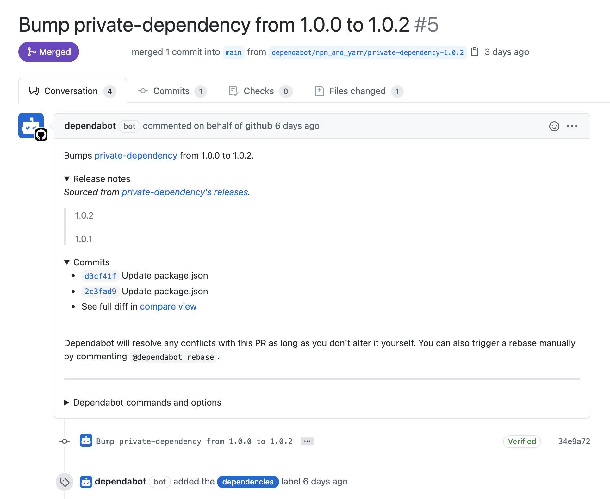

# Overview

Dependabot uses Github Actions and separate environment to run the checks. There are several public resources that can be helpful to review internal implementation details:

- [dependabot/updater-action](https://github.com/dependabot/updater-action) action that is responsible for running Dependabot updates.
- [dependabot/dependabot-core](https://github.com/dependabot/dependabot-core) action that is implemented core logic. Check out the [architecture](https://github.com/dependabot/dependabot-core/#architecture) of `dependabot-core`.
- [dependabot-updater](https://github.com/dependabot/updater-action/blob/627e11f59882ac2b7ac43821f5ea30c9e595888c/docker/Dockerfile.updater) is a Docker image that launches scanning (includes `dependabot-core` as a component).
- [dependabot-update-job-proxy](https://github.com/dependabot/updater-action/blob/627e11f59882ac2b7ac43821f5ea30c9e595888c/docker/Dockerfile.proxy) a Docker image with proxy that authenticates requests to certain Github API endpoints and allows dependabot not to disclose Github API token.

# Code execution

Dependabot is able to gather information about dependencies from the manifests, such as [setup.py](https://docs.python.org/3/distutils/setupscript.html) or [.gemspec](https://guides.rubygems.org/specification-reference/), which can be abused to execute an arbitrary code. Package managers with the [package-ecosystem](https://docs.github.com/en/code-security/supply-chain-security/keeping-your-dependencies-updated-automatically/configuration-options-for-dependency-updates#package-ecosystem) values `bundler`, `mix`, and `pip` can be abused to execute external code in the manifest as part of the version update process. Therfore, if you can poison the manifest, you can execute an arbitrary code while Dependabot is running. 


Check how to abuse manifests to gain code execution in the [Parameters Injection](/Web%20Application/Command%20Injection/parameters-injection.md) page


Dependabot allows developers to prevent code execution by setting [insecure-external-code-execution](https://docs.github.com/en/code-security/supply-chain-security/keeping-your-dependencies-updated-automatically/configuration-options-for-dependency-updates#insecure-external-code-execution) to `deny`. Moreover, Dependabot automatically sets `insecure-external-code-execution` to `deny` and prevents external code execution when a [registries](https://docs.github.com/en/code-security/supply-chain-security/keeping-your-dependencies-updated-automatically/configuration-options-for-dependency-updates#registries) setting is used within an updates configuration. However, it may cause the version update to fail, so developers can override this behaviour by setting `insecure-external-code-execution` to `allow` and allow code execution.

# Disclosure of release notes and commits of private repositories

If Dependabot detects non-updated dependencies, it will create a PR to bump versions of those dependencies. Dependabot adds an additional information about changes, which may contain release notes and a list of commits with missages. You can find an example of such PR in the following screenshot:

However, [Dependabot supports private dependencies](https://github.blog/2021-03-15-dependabot-private-dependencies/) and it will add this data to a PR for a private dependency as well. Therefore, if a public project has private dependencies, Dependabot will disclose release notes and commits of those projects.

# References

- [Writeup: Diving into Dependabot along with a bug in npm](https://blog.tyage.net/posts/2021-06-27-dependabot-rce/)
