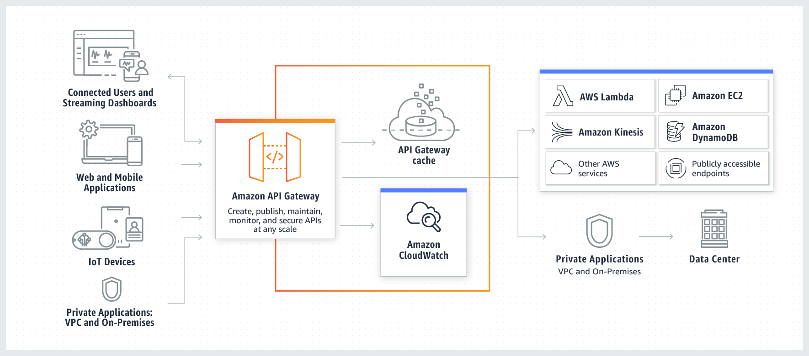
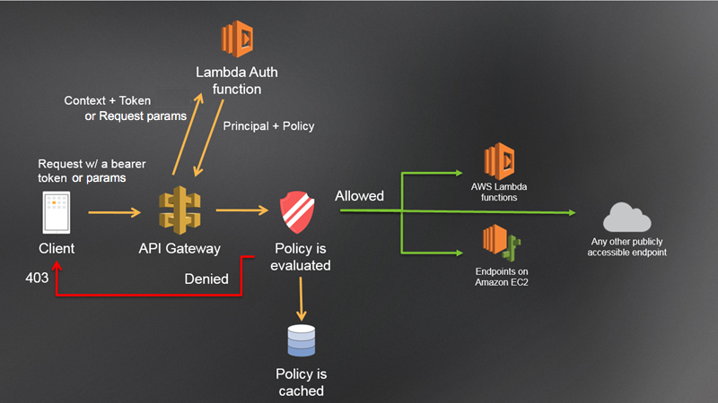
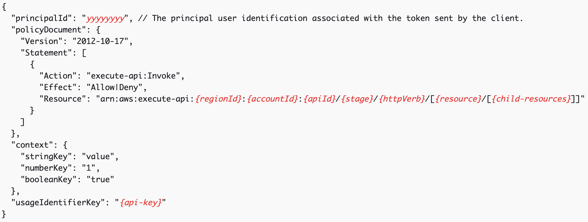
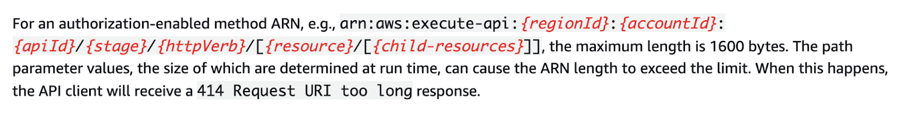
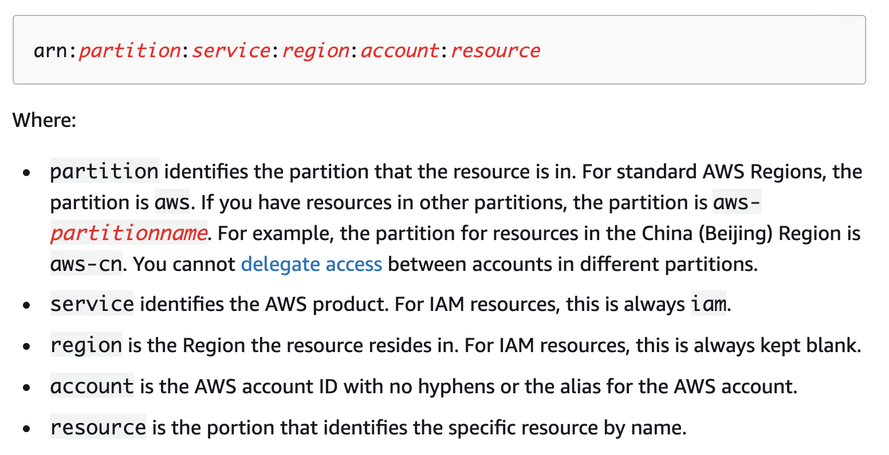
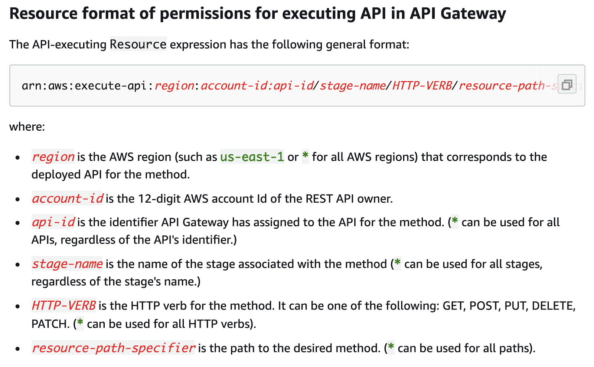
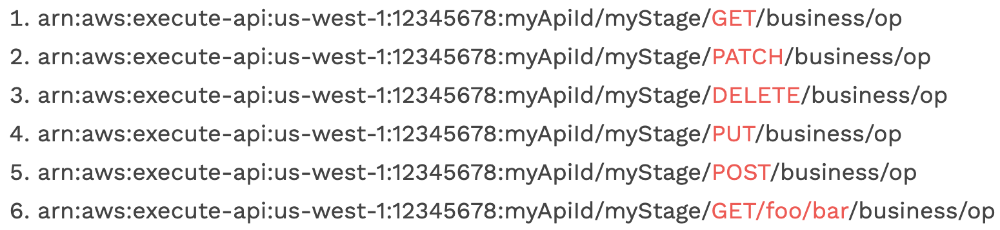

# Amazon API Gateway overview

Amazon API Gateway is an AWS service for creating, publishing, maintaining, monitoring, and securing REST, HTTP, and WebSocket APIs at any scale. API Gateway handles all the tasks involved in accepting and processing up to hundreds of thousands of concurrent API calls, including traffic management, CORS support, authorization and access control, throttling, monitoring, and API version management. In other words, API Gateway is a scalable and serverless reverse proxy service that can route HTTP/HTTPS requests to different implementation back-ends.



## How API Gateway works

The following diagram explains how the API Gateway works:



## Lambda authorizer

[Lambda authorizer](https://docs.aws.amazon.com/apigateway/latest/developerguide/apigateway-use-lambda-authorizer.html) (formerly known as a custom authorizer) is an API Gateway feature that uses a lambda function to control access to API. Lambda authorizer is useful for implementing a custom authorization scheme that uses a bearer token authentication strategy such as OAuth or SAML, or that uses request parameters to determine the caller's identity.

The following diagram illustrates the authorization workflow for Lambda authorizers:



When a client makes a request to one of API's methods, API Gateway calls Lambda authorizer, which takes the caller's identity as input and returns an IAM policy as output. [Output from an Amazon API Gateway Lambda authorizer](https://docs.aws.amazon.com/apigateway/latest/developerguide/api-gateway-lambda-authorizer-output.html) has the following structure:



`policyDocument` property allows the Lambda authorizer to specify which API endpoints this user can or cannot access. `policyDocument` object contains an IAM policy that allows or denies execution of an `execute-api` [action](https://docs.aws.amazon.com/IAM/latest/UserGuide/reference_policies_elements_action.html) on specially formatted [resources](https://docs.aws.amazon.com/IAM/latest/UserGuide/reference_policies_elements_resource.html) that represent each API endpoint:



The [ARNs](https://docs.aws.amazon.com/IAM/latest/UserGuide/reference_identifiers.html#identifiers-arns) in IAM policies have several different parts separated by colons:



The `execute-api` ARN format packs the _API ID, API stage, HTTP verb, and the API resource_ (the URL path) all into the last `resource` part of the ARN. They are separated by slashes, as if they were forming a single logical path in an imaginary file system.


The [documentation](https://docs.aws.amazon.com/apigateway/latest/developerguide/api-gateway-control-access-using-iam-policies-to-invoke-api.html) claim that the API ID, stage name and HTTP verb can be easily replaced by `*` to mean any value for that part of the resource alone:




Wildcard `*` is greedy and expands as much as possible inside each of the colon-separated parts of an ARN (it is the equivalent of `.*` in POSIX regular expressions). The expansion will not stop at the slashes - any `*` is free to expand its matching into the entire last part of the [execute-api ARN](https://docs.aws.amazon.com/apigateway/latest/developerguide/api-gateway-control-access-using-iam-policies-to-invoke-api.html).

Wildcard also matches the empty string.



Each AWS service decides whether matching the resource part of ARNs is case sensitive or case insensitive, see [link](https://acloud.guru/forums/aws-certified-solutions-architect-associate/discussion/-KGQ_3oKHuxKEqAv5EPw/key-names-case-sensitive-or-insensitive-?answer=-KO0jdWjDzmwUANNtSz6).


# Security issues

## Incorrect policyDocument wildcard configuration

The use of wildcards in ANR can lead to the possibility of bypassing access control. Imagine an API that needs to allow a user to access any HTTP verb on a single endpoint `/business/op`. The developer might be tempted to write the `policyDocument` as follows:

```json
{
    "Version": "2012-10-17",
    "Statement": [
        {
            "Action": "execute-api:Invoke",
            "Effect": "Allow",
            "Resource": "anr:aws:execute-api:us-west-1:12345678:myApiId/myStage/*/business/op"
        }
    ]
}
```

All of the following ARNs would be allowed by the example policy. But item 6 most likely would not be expected by a developer that read this part of the documentation.



So having the HTTP verb as a star makes it so that the endpoint resource is no longer anchored to the beginning of the URL path.

# References

- [Security Implications of AWS API Gateway Lambda Authorizers and IAM Wildcard Expansion](https://www.tenchisecurity.com/blog/thefaultinourstars)
