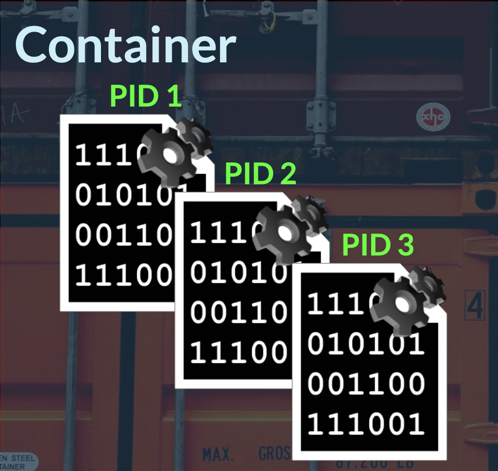
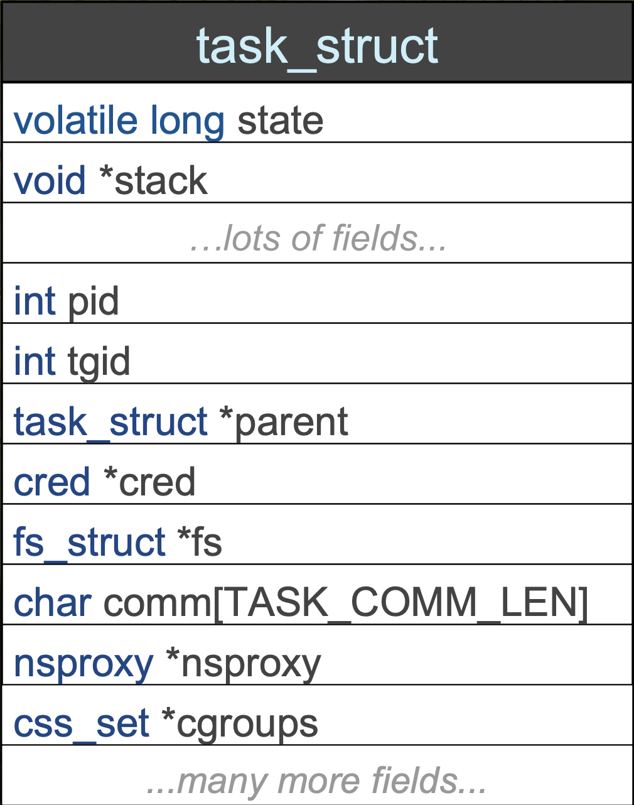
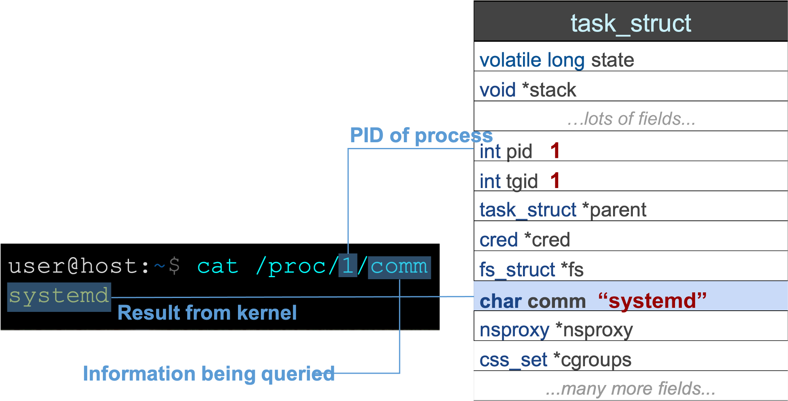
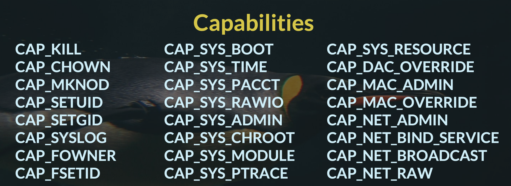
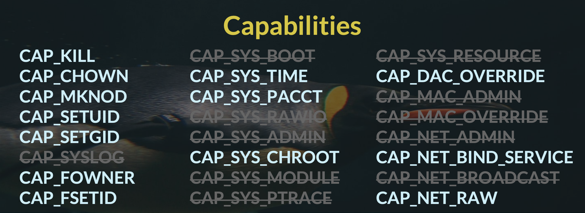
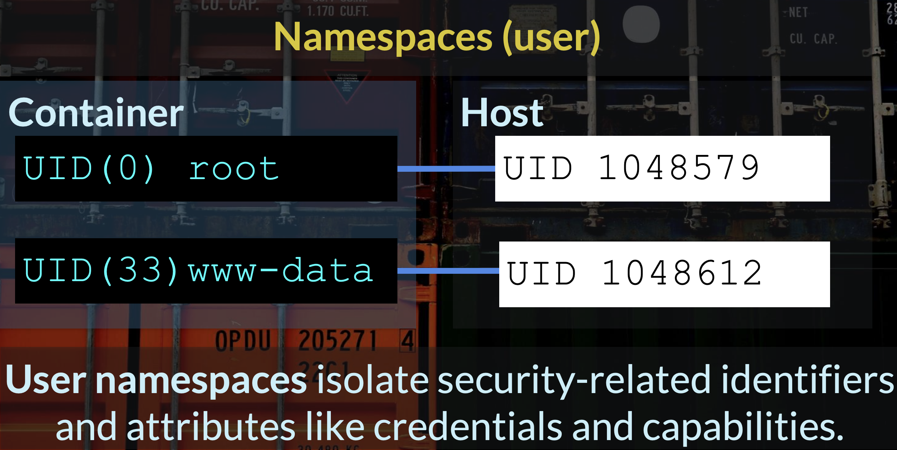
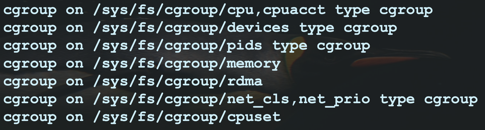
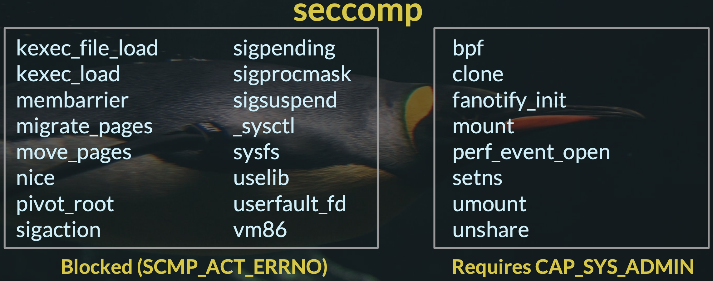
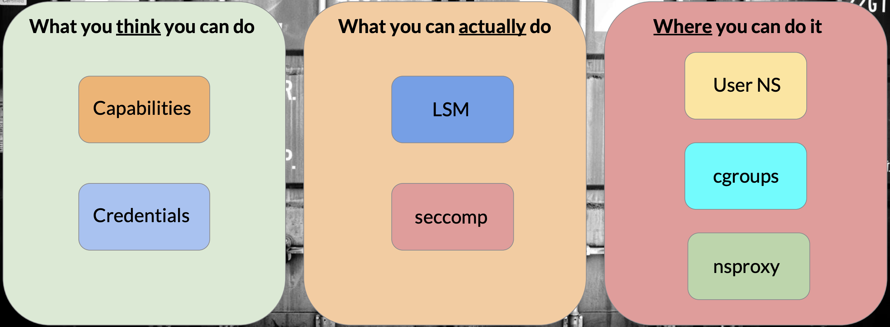

**Container** is a task, or set of tasks, with special properties to isolate the task(s), and restrict access to system resources.



# Process descriptor and the task structure

The kernel stores the list of processes in a circular doubly linked list called the _task list_.


Each element in the task list is a process descriptor of the type `struct task_struct`. The process descriptor contains all the information about a specific process.



## /proc


`/proc` is a special filesystem mount (procfs) for accessing system and process information directly from the kernel by reading "file" entries.



# Properties

## Credentials

[Credentials](https://man7.org/linux/man-pages/man7/credentials.7.html) is process identifiers. Credentials describe the user identity of a task, which determine its permissions for shared resources such as files, semaphores, and shared memory.

All of a task's credentials are held in a refcounted structure of type `struct cred`. Each task points to its credentials by a pointer called `cred` in its `task_struct`.

Traditional UNIX implementations of permissions distinguish two categories:
- privileged processes with user ID of 0 (root)
- every other process

## Capabilities

Since kernel 2.2, Linux divides the privileges associated with superuser into distinct units known as **capabilities**.

These provide vastly more granular control over the task's permissions for privileged operations.

 

Containers are tasks which run should run with a restricted set of capabilities.



## Filesystem

The filesystem root for a container is (usually) isolated from other containers and host's root filesystem via the [pivot_root](https://man7.org/linux/man-pages/man2/pivot_root.2.html) syscall.

The container's root mount is often planted in a container-specialized filesystem, such as AUFS or OverlayFS. In case of OverlayFS, the container's root of `/` really lives in `/var/lib/docker/overlay2`.


## Namespaces

A [namespace](https://man7.org/linux/man-pages/man7/namespaces.7.html) wraps a global system resource in an abstraction that makes it appear to the processes within the namespace that they have their own isolated instance of the global resource. Changes to the global resource are visible to other processes that are members of the namespace, but are invisible to other processes.

There are 8 types of namespaces available on Linux.

| Namespace | Isolates |
| --- | --- |
| Cgroup | Cgroup root directory |
| IPC | System V IPC, POSIX message queues |
| Network | Network devices, stacks, ports, etc. |
| Mount | Mount points |
| PID | Process IDs |
| Time | Boot and monotonic clocks |
| User | User and group IDs |
| UTS | Hostname and NIS domain name |



Creation of new namespaces using [clone(2)](https://man7.org/linux/man-pages/man2/clone.2.html) and [unshare(2)](https://man7.org/linux/man-pages/man2/unshare.2.html) in most cases requires the `CAP_SYS_ADMIN` capability.  User namespaces are the exception: since Linux 3.8, no privilege is required to create a user namespace.

Each process has a `/proc/[pid]/ns/` subdirectory containing one entry for each namespace.

## Cgroups

[Cgroups](https://man7.org/linux/man-pages/man7/cgroups.7.html) is a Linux control groups.

Control groups, usually referred to as cgroups, are a Linux kernel feature which allow processes to be organized into hierarchical groups whose usage of various types of resources can then be limited and monitored. The kernel's cgroup interface is provided through a pseudo-filesystem called **cgroupfs**, where hierarchy is expressed through the directory tree in each mount.



Grouping is implemented in the core cgroup kernel code, while resource tracking and limits are implemented in a set of per-resource-type subsystems (memory, CPU, and so on).

A cgroup filesystem initially contains a single root cgroup, `/`, which all processes belong to. A new cgroup is created by creating a directory in the cgroup filesystem.

```bash
mkdir /sys/fs/cgroup/cpu/cg1
```
           
This creates a new empty cgroup. A process may be moved to this cgroup by writing its PID into the cgroup's `cgroup.procs` file:

```bash
echo $$ > /sys/fs/cgroup/cpu/cg1/cgroup.procs
```

## Linux Security Modules

[AppArmor](https://apparmor.net/) and [SELinux](https://www.redhat.com/en/topics/linux/what-is-selinux) are Linux security modules providing Mandatory Access Control (MAC), where access rules for a program are described by a profile.

Docker and LXC enable a default LSM profile in enforcement mode, which mostly serves to restrict a container's access to sensitive `/proc` and `/sys` entries.

The profile also denies mount syscall.

## seccomp

Since kernel 3.17, Linux has a mechanism for filtering access to system calls through the [seccomp](https://man7.org/linux/man-pages/man2/seccomp.2.html) subsystem. 



# Container security model



# References

- [A Compendium of Container Escapes](https://capsule8.com/assets/ug/us-19-Edwards-Compendium-Of-Container-Escapes.pdf)
