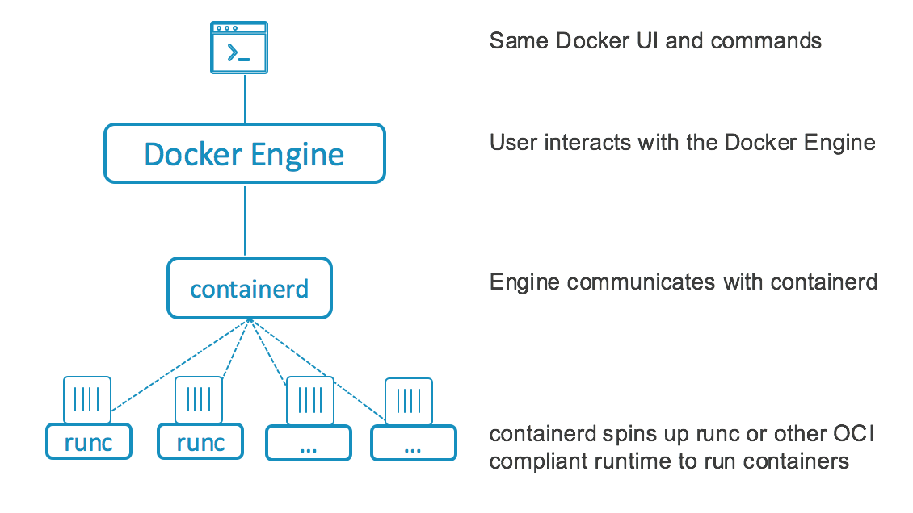
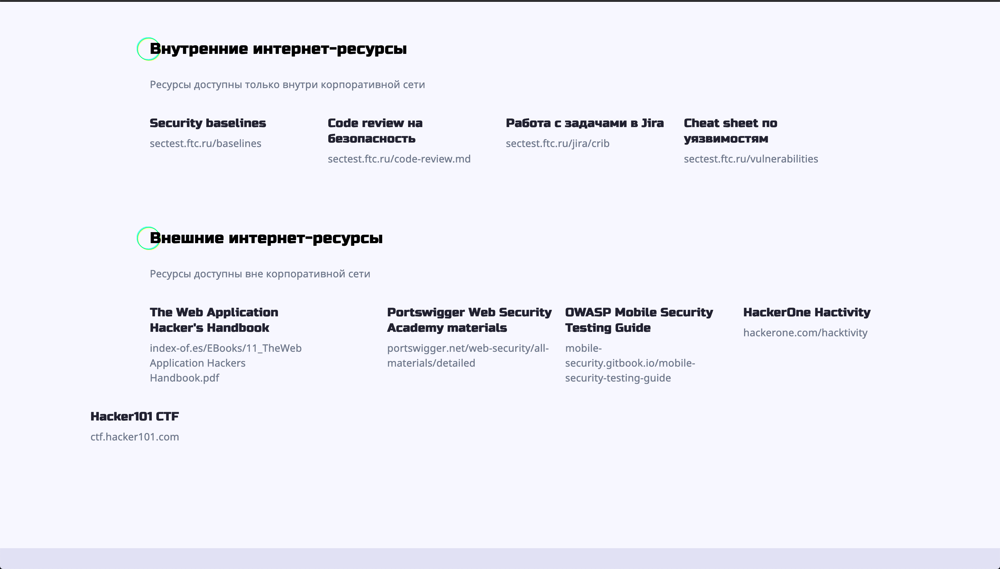

Docker Engine is the heart of the container and what makes the container to run. Docker has a modular design, which means you can swap/customize some of its components.



Docker architecture has five components:
- docker CLI
- dockerd
- containerd
- containerd-shim
- runc

# runc

[runc](https://github.com/opencontainers/runc) is a lightweight CLI wrapper for the `libcontainer` and it is used to spawn and run containers.

You can run your containers without Docker using the CLI only. To do this, you must have a bundle aligned with the OCI standards. A bundle for a container is a directory that includes a specification file named `config.json` and a root filesystem. `config.json` is used to create a container in a particular state.

An example of `config.json`

```json
{  
  "ociVersion": "0.6.0-dev",  
  "platform": {     
    "os": "linux",     
    "arch": "amd64"   
  },   
  "process": {   
    "terminal": true,   
    "args": ["sh"],   
    "env": ["PATH=/usr/local/sbin:/usr/local/bin:/bin", ...]
  ...
}
```

Given the bundle, you can simply run the container with `runc`

```bash
# Creates an empty folder
mkdir ~/mycontainer
cd ~/mycontainer
# Creates rootfs, one way of doing so is to export it re-using docker
mkdir rootfs
docker export $(docker create busybox) | tar -C rootfs -xvf -
# Creates the new specification file named "config.json" for the bundle
runc spec
# Runs the container
runc run mycontainerid
```

Docker is a higher level abstraction over `runc` and `runc` is a CLI for `libcontainer`. Moreover, it is also possible to set the docker to your own runtime `dockerd` daemon [--add-runtime](https://docs.docker.com/engine/reference/commandline/dockerd/).

# containerd

`containerd` is one of the layers in the Docker's modular architecture. When you make a request to `dockerd`, `containerd` manages processes related to image distribution such as pushing/pulling them to/from registries. With the images `containerd` generates an OCI bundle for the container.

`containerd` manages the container lifecycle: it starts, stops, pauses, or deletes it. It also manages image distribution: pushes/pulls the images to/from registry.

> So what do you actually get using containerd?
> You get push and pull functionality as well as image management. You get container lifecycle APIs to create, execute, and manage containers and their tasks. An entire API dedicated to snapshot management. Basically everything that you need to build a container platform without having to deal with the underlying OS details.
> more see [Docker containerd integration](https://www.docker.com/blog/docker-containerd-integration/)

# containerd-shim

`containerd-shim` allows you to have daemonless containers. How this is achieved:
- `containerd` forks an instance of `runc` for each new container
- `runc` process exits after the container is created
- once a container is created by `runc`, `containerd-shim` becomes the new parent for the container process

You can see this by creating a docker container and checking the processes.

```bash
$ docker run -d alpine sleep 30
$ ps fxa | grep dockerd -A 3  
 2239 ?        Ssl    0:28 /usr/bin/dockerd -H fd://
 2397 ?        Ssl    0:19  \_ docker-containerd -l unix:///var/run/docker/libcontainerd/docker-containerd.sock ...
15476 ?        Sl     0:00      \_ docker-containerd-shim 3de8... /var/run/docker/libcontainerd/3da7.. docker-runc  
15494 ?        Ss     0:00          \_ sleep 30
```

That there is no `runc` used as it was replaced by `containerd-shim`.

`containerd-shim` is responsible for `STDIN`/`STDOUT` and for reporting exit status to the Docker daemon.

# dockerd

`dockerd` is a daemon and a server that processes the Docker API requests and then utilizes `containerd` functionality to manage life-cycle of the containers.

# docker CLI

Docker CLI is an one of the ways to talk to Docker server `dockerd`. You can use it to run the docker commands like `docker run` or `docker build`.

# Running container



1. A user uses the docker CLI to execute a command:

    ```bash
    docker container run -it --name <NAME> <IMAGE>:<TAG>
    ```

2. Docker client sends POST request to daemon's API
3. Docker daemon receives instructions and calls `containerd` to start a new container
4. `containerd` creates an OCI bundle from the Docker image
5. `containerd` tells `runc` to create a container using the OCI bundle
6. `runc` interfaces with the OS kernel to create a container
7. Container process starts as a child process
8. `runc` exits after starting the container
9. `containerd-shim` takes over the child process and becomes its parent
10. Container is running!

# References

- [Docker Engine Architecture Under the Hood](https://medium.com/@yeldos/docker-engine-architecture-under-the-hood-741512b340d5)
