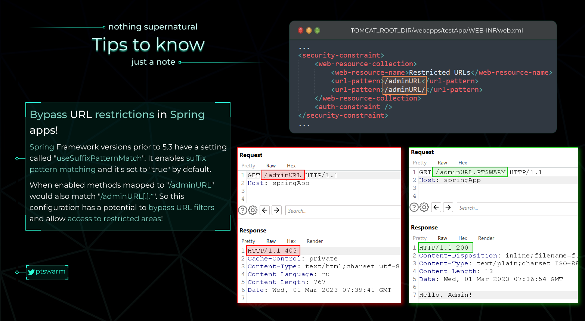

# Exposing routes

Exposing the relevant interfaces and parameter information of a Spring application is not a vulnerability, but it can help to understand an application. Moreover, it can be used while checking for access control vulnerabilities, etc.

Check the following routes to see if an application provides path and parameter information:



Additionally, check the following Spring Boot Actuators-related routes which can expose interface address information (but not parameter-related information):



References:
- [Spring Boot Vulnerability Exploit Check List: Leakage of routing address and interface call details](https://github.com/LandGrey/SpringBootVulExploit#0x01%E8%B7%AF%E7%94%B1%E5%9C%B0%E5%9D%80%E5%8F%8A%E6%8E%A5%E5%8F%A3%E8%B0%83%E7%94%A8%E8%AF%A6%E6%83%85%E6%B3%84%E6%BC%8F)

# Path traversal with /..;/

Spring Boot > 2.2.6 treats `https://website.com/allowed/..;/internal` same as `https://website.com/allowed/../internal`.

This can lead to inconsistency between Spring and middleware. For instance, if an application is deployed behind nginx, you can bypass restrictions on allowed paths. Assume nginx forward all request to `/allowed/` to an application and deny other requests. In this case, a request to `/allowed/../internal` will be blocked, however, `/allowed/..;/internal` is not - nginx will pass it as is to an application and it will hit `/internal`.

References:
- [@0xsapra tweet](https://mobile.twitter.com/0xsapra/status/1468551562712682499)

# useSuffixPatternMatch misconfiguration

Spring Framework versions < 5.3 have a setting called [useSuffixPatternMatch](https://docs.spring.io/spring-framework/docs/current/javadoc-api/org/springframework/web/servlet/config/annotation/PathMatchConfigurer.html) (deprecated at 5.2.4). It enables suffix pattern matching that is set to `true` by default. It means that methods mapped to `/adminURL` would also match `/adminURL[.].*`. As a result, it may lead to a potential bypass of URL filters and allow access to restricted areas.

References:

- [@ptswarm tweet](https://twitter.com/ptswarm/status/1631287479604060161)
