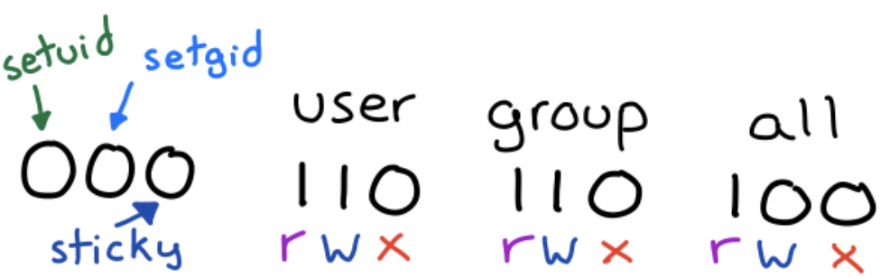
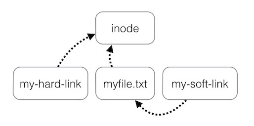
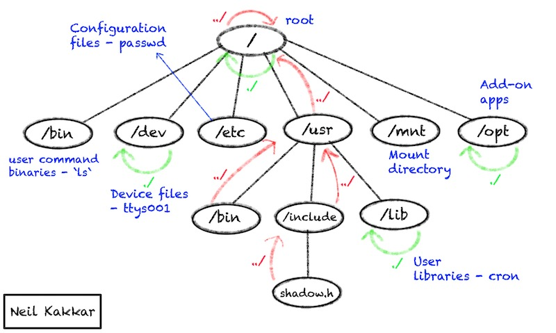


Everything that is not a process is a file


This means a printer, a scanner, a terminal screen, the code of any process - these are all files. Your files on the filesystem is a strings of bytes concatenated together to create something meaningful.


A file is just a stream of data


Directories are files too, they simply contain a list of files and directories present in the current directory, just like a tree. The beauty of this is that you can "open" a directory file to see its contents:

```bash
$ vim .
" ====================================================================
" Netrw Directory Listing                                 (netrw v168)
"   /Users/0xn3va/folder
"   Sorted by name
"   Quick Help: <F1>:help  -:go up dir  D:delete  R:rename  s:sort-by
"   x:special
" ===================================================================
../
./
another_folder/
some_file.txt
some_folder/
```

It is how UNIX stores the current directory. It contains a list of files and directories in the current directory.

# inode


To have a file system, you need a structure to manage it. The file system contains not only data, but also some information about this data, called `metadata`. This includes where the data is stored, who owns it and who can see it. This is what `inode` is a data structure for the file metadata.

```bash
$ ls -li
total 0
287009 drwxr-xr-x   9 0xn3va  staff  288 23 Oct 07:36 another_folder
286999 -rw-r--r--   1 0xn3va  staff  110  9 Oct 11:37 some_file.txt
287002 drwxr-xr-x   5 0xn3va  staff  256 23 Sep 11:46 some_folder
```

Every file has a unique `inode number` (above in the first column) is a the unique identifier for the file while it exists.

## stat

You can use `stat` to looking at this metadata:

```bash
$ stat -LF some_folder
drwxr-xr-x 8 0xn3va staff 256 Feb 05 13:37:00 2021 some_folder
```

- `drwxr-xr-x` is the file permissions
- `8` is the count of hard links
- `0xn3va staff` is the User and Group names; the ownership of files and directories is based on the default uid (user-id) and gid (group-id) of the user who created them
- `256` is the file size, or the number of bytes in the file
- `Feb 05 13:37:00 2021` is the date last modified

# File permissions

Each file has associated permissions which are 12 bytes:



## setuid bit


The `setuid` bit has no effect on directories


The `setuid` bit allows an executable to run with the privileges of the user who owns the file and not with the privileges of the user who launched it. For example, if an executable has the `setuid` bit set and is owned by the root, it will run with root privileges when launch as a normal user.

An example of an executable with the `setuid` permission set is `passwd`, the utility you can use to change your login password. You can verify that by using the `ls` command:

```bash
$ ls -l /usr/bin/passwd
-rwsr-xr-x 1 root root 54256 Mar 26  2019 /usr/bin/passwd
```

You can identify the presence of the `setuid` bit by the presence of the `s` in place of the `x` of the executable bit on the "user" section (see the command output above).

The `s` implies that the executable bit is set, otherwise you would see a capital `S`. This happens when the `setuid` bit is set, but the executable bit is not, showing the user an inconsistency: the `setuid` bit has no effect if the executable bit is not set.

## setgid bit


The `setgid` bit has effect on both files and directories


A file which has the `setgid` bit set is executed with the privileges of the group that owns the file. In other words, the process group-id will be the same as the file.

When `setgid` is used for a directory, files created in that directory will be owned by the parent directory group, not the user who created them. This is often used to ease the sharing of files (files will be modifiable by all the users that are part of a certain group).

```bash
$ ls -l some_folder
drwxrwsr-x 1 0xn3va staff 256 Feb 6 04:37 some_folder
```

You can identify the presence of the `setgid` bit by the presence of the `s` in place of the `x` of the executable bit on the "group" section (see the command output above).

The `s` implies that the executable bit is set, otherwise you would see a capital `S`. This happens when the `setgid` bit is set, but the executable bit is not, showing the user an inconsistency: the `setgid` bit has no effect if the executable bit is not set.

## sticky bit


The `sticky` bit has no effect on files


When `sticky` bit is used for a directory, all files in that directory can only be modified only by their owners.

A typical case in which `sticky` bit is used, involves the `/tmp` directory. Typically it is writable by all users on the system, so to make impossible for one user to delete the files of another one, the sticky bit is set:

It is usually writable by all users on the system, so `sticky` bit is set to prevent one user from modifying or deleting files of another one:

```bash
$ ls -ld /tmp
drwxrwxrwt 2 root wheel 64 Feb 7 08:50 /tmp
```

You can identify the presence of the `sticky` bit by the presence of the `t` in place of the `x` of the executable bit on the "other" section (see the command output above).

The `t` implies that the executable bit is set, otherwise you would see a capital `T`. This happens when the `sticky` bit is set, but the executable bit is not, showing the user an inconsistency: the `sticky` bit has no effect if the executable bit is not set.

## rwx

For files:
- `r` can read
- `w` can write 
- `x` can execute

For directories it is approximately:
- `r` can list files
- `w` can create files
- `x` can `cd` into & modify files

## Entry type

However, if you look at the metadata:

```bash
$ stat -LF
crw--w---- 1 0xn3va tty 16,2 Feb  7 09:29:10 2021 (stdin)
```

You will see that the string with permissions `crw--w----` contains 10 characters. The first one is a special entry type character describes the type of file:
- `b` - block special file
- `c` - character special file
- `d` - directory
- `l` - symbolic link
- `s` - socket link
- `p` - FIFO
- `-` - regular file

## chmod

You can use `chmod` utility to change file permissions. In the backend `chmod` is interacting with the files inode.

Since you need 3 bits to represent each permission, you can convert that to an integer and pass that to `chmod`, for example:

```bash
$ chmod 721 .
# or rwx-w---x
# or all permissions for the owner, write permissions to the group and execute permissions to others
```

The `setuid`, `setgid`, and `sticky` bits are represented respectively by a value of `4`, `2` and `1`, for example:

```bash
# set the setgid bit on the directory
$ chmod 2775 .
```

For more usage examples see [here](/Linux/console-commands.md#chmod)

You can also restrict access to yourself, removing all read, write, and execution permissions for yourself. If the file metadata were stored in the file itself, you would not be able to change permissions again (since you can not write to the file). That is another reason why inodes are cool: they can always be modified by the file owner and root, so you can restore your permissions.

# File linking

Hard links and symbolic links are two different methods of linking to a file on a hard drive. These methods are the part of the file system that defines the file and its location.



## Hard link

`Hard links` are two filenames that point to the same file (you can think of them as file aliases). For example, `.` and `..` are hard links to current and parent directory on the system.

Use `ln` to create a hard link:

```bash
$ ls -li
total 0
1637699 -rw-r--r--  1 0xn3va  wheel  0 Feb  7 10:03 a

# Create x as a hard link to a
$ ln a x

$ ls -li
total 0
1637699 -rw-r--r--  2 0xn3va  wheel  0 Feb  7 10:03 a
1637699 -rw-r--r--  2 0xn3va  wheel  0 Feb  7 10:03 x
```

Note that both files have the same inode number. Modifying `x` or `a` changes the same file.

## Symbolic link

`Symbolic links` are links from one place to another. A symbolic link is a new file, separate from original, that links to the original file.

Use `ln` to create a symbolic link:

```bash
$ ls -li
total 0
1637699 -rw-r--r--  1 0xn3va  wheel  0 Feb  7 10:03 a

# Create y as a symbolic link to a
$ ln -s a y

$ ls -li
total 0
1637699 -rw-r--r--  2 0xn3va  wheel  0 Feb  7 10:03 a
1638321 lrwxr-xr-x  1 0xn3va  wheel  1 Feb  7 10:09 y -> a
```

`y` is a symbolic link, a new small file (see size is 1). Modifying `y` changes `a`. 

# File structure

The file system can be thought of as a tree-like data structure. Each node (inode) has a pointer to its parent, itself, and all of its children. This forms the directory structure.



# Summary

- The file system is built using inodes
- inodes are unique on the file system
- Users are part of the file attributes; this information is stored in inodes
- Multiple file systems can be mounted and abstracted into one logical tree

# References

- [How Unix Works: Become a Better Software Engineer](https://neilkakkar.com/unix.html)
- [Julia's Drawings: Unix permissions](https://drawings.jvns.ca/permissions/)
- [How to use special permissions: the setuid, setgid and sticky bits](https://linuxconfig.org/how-to-use-special-permissions-the-setuid-setgid-and-sticky-bits)