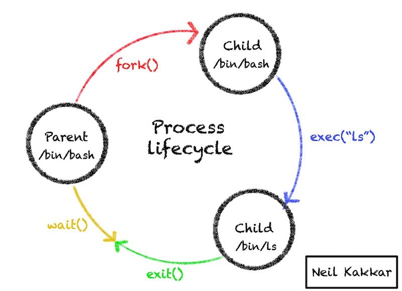

There are three components to remember about a process:
- `Program file` - the code and data
- `Process image` - this stores the stack, variables currently defined, data, address space, and [more](https://tldp.org/LDP/LG/issue23/flower/psimage.html); when it is time to run, the OS knows exactly how to recreate the process using this image
- `Process` - the running program in memory

When a process starts running, it inherits the `user-id` and `group-id` from the parent process. This information controls the level of access to the process. You can use [setuid](/Linux/Overview/file.md#setuid-bit) or [setgid](/Linux/Overview/file.md#setgid-bit) to enable a process to inherit the file owner permissions.

# Attributes

Each process has the following attributes:
- Unique identifier called process-id or `pid`
- Link to the parent process that spawned it

There is a special root parent process called `init`, it usually has `pid` 1. The `ppid` of `init` is 0 (which conventionally means it has no parent). The `pid` 0 corresponds to the kernel scheduler, which is not a user process.

> `systemd` is now replacing `init` on Linux, it solves a few problems with `init` and overall more stable, read more [here](https://www.tecmint.com/systemd-replaces-init-in-linux/)

# Lifecycle

There is a common pattern in UNIX on how processes work:
1. A new child process is created by cloning the existing parent process [fork()](https://man7.org/linux/man-pages/man2/fork.2.html)
2. This new child process calls [exec()](https://man7.org/linux/man-pages/man3/exec.3.html) to replace the parent process running in the child with the process the child wants to run
3. The child process calls [exit()](https://man7.org/linux/man-pages/man3/exit.3.html) to terminate itself; it only passes an exit code out; `0` means success, everything else is an error code
4. The parent process needs to call the [wait()](https://man7.org/linux/man-pages/man2/waitid.2.html) system call to get access to this exit code

This cycle repeats for every process spawned.

There are a few things that might go wrong here:
- What if the parent does not call `wait()`? This results in a `zombie` process - which is a resource leak, since the OS can not clean up processes before their exit code has been consumed by the parent
- What if the parent dies before the child process? This results in an `orphan` process; an `orphan` process is adopted by the `init` process (the special root parent), which then waits on the child process to finish

How can the parent get access to additional information from the child? This is not possible with exit codes. However, there are other ways to do [inter process communication](/Linux/Overview/inter-process-communication.md).

# References

- [How Unix Works: Become a Better Software Engineer](https://neilkakkar.com/unix.html)