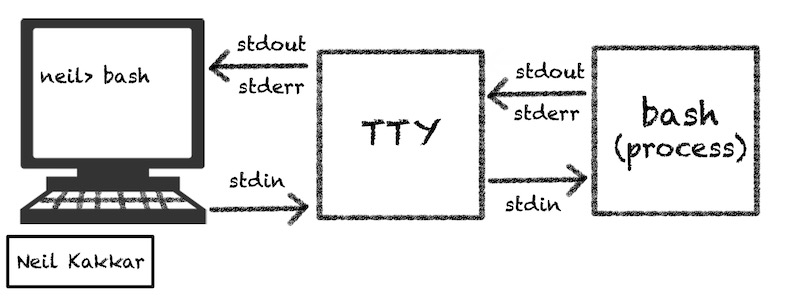
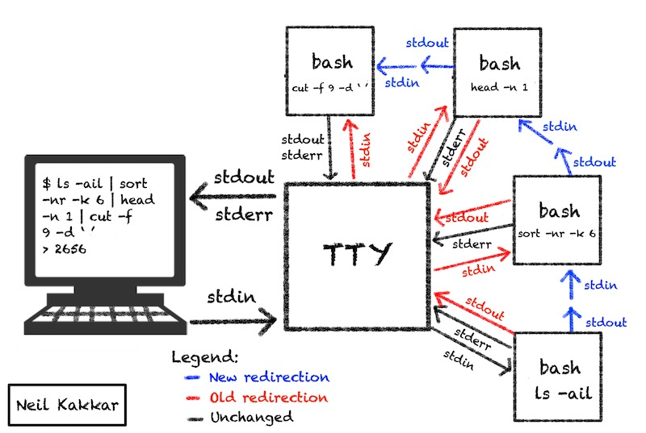

When the shell is started, the OS provides three files for it to work with: `stdin`, `stdout` and `stderr`. When run from the terminal, `stdin` is connected to the keyboard input. What you write is passed to the terminal. This happens via a file called tele typewriter or `tty`. `stdout` and `stderr` is connected to `tty` too, this is why the output and errors of any command you run show up in the terminal.



Every terminal you open gets assigned a new file via `tty`, so that commands from one terminal do not clobber another. You can find out the file your terminal is attached to via the `tty` command:

```bash
$ tty
/dev/pts/0
```

# Pipes


Pipe, `|`, bridges two processes together. It represents the system call to [pipe()](https://man7.org/linux/man-pages/man2/pipe.2.html) and all it does is redirect `stdin` and `stdout` for processes.


The image above is a slight simplification to explain pipe redirection:
- The top bash forks another bash connected to `tty`, which produces the output of `ls`
- Since the top bash was forked from the lower, it inherited the file descriptors of the lower one
- The lower bash did not fork a new process because `echo` is a builtin command



Note that `stderr` is always routed directly to the `tty`. You can switch streams before the pipe and redirect `stderr` instead of `stdout` to the pipe.

```bash
$ ./script.sh 2>&1 >/dev/null
```

# Variables

**Local variables** are ones you can create in a shell. They are local to the shell, thus not passed to children (remember, every non-builtin command is in a new shell which does not have these local variables).

**Environment variables** (`env` vars) are like global variables. They are passed to children. However, changes to the environment variables in child process can not be passed to the parent (remember, there is no communication between child and parent except the exit code).

```bash
$ env
TERM=xterm
TMPDIR=/tmp
PATH=/usr/local/sbin:/usr/local/bin:/usr/sbin:/usr/bin:/sbin:/bin
PWD=/
LANG=en_US.UTF-8
SHLVL=1
HOME=/root
LANGUAGE=en_US:en
LESSOPEN=||/usr/bin/lesspipe.sh %s
_=/bin/env
```

# References

- [How Unix Works: Become a Better Software Engineer](https://neilkakkar.com/unix.html)