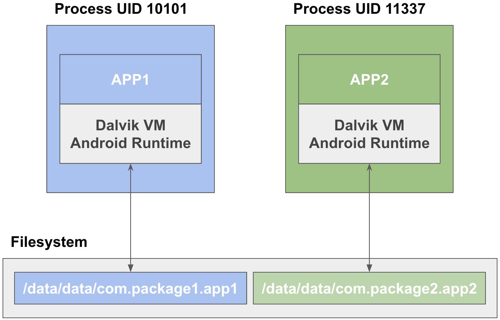

The Android platform takes advantage of the Linux user-based protection to identify and isolate app resources. This isolates apps from each other and protects apps and the system from malicious apps. To do this, Android assigns a unique user ID (UID) to each Android application and runs it in its own process.



Android uses the UID to set up a kernel-level Application Sandbox. The kernel enforces security between apps and the system at the process level through standard Linux facilities such as user and group IDs that are assigned to apps. By default, apps can't interact with each other and have limited access to the OS. The sandbox is simple, auditable, and based on decades-old UNIX-style user separation of processes and file permissions.

You can confirm this by looking at the file system permissions in the `/data/data` folder

```bash
$ ls -la /data/data
drwx------  4 u0_a13    u0_a13    4096 2021-02-01 13:37 com.package1.app1
drwx------  6 u0_a163   u0_a163   4096 2021-02-01 13:39 com.package2.app2
```

Because the Application Sandbox is in the kernel, this security model extends to both native code and OS applications. All of the software above the kernel, such as OS libraries, application framework, application runtime, and all applications, run within the Application Sandbox.

# Protections

Android relies on a number of protections to enforce the application sandbox. These enforcements have been introduced over time and have significantly strengthened the original UID-based discretionary access control (DAC) sandbox. Previous Android releases included the following protections:
- In Android 5.0, [SELinux](https://www.redhat.com/en/topics/linux/what-is-selinux) provided mandatory access control (MAC) separation between the system and apps. However, all third-party apps ran within the same SELinux context so inter-app isolation was primarily enforced by UID DAC.
- In Android 6.0, the [SELinux](https://www.redhat.com/en/topics/linux/what-is-selinux) sandbox was extended to isolate apps across the per-physical-user boundary. In addition, Android also set safer defaults for application data: For apps with `targetSdkVersion >= 24`, default DAC permissions on an app's home dir changed from `751` to `700`. This provided safer default for private app data (although apps may override these defaults).
- In Android 8.0, all apps were set to run with a [seccomp-bpf](https://www.kernel.org/doc/html/v4.16/userspace-api/seccomp_filter.html) filter that limited the syscalls that apps were allowed to use, thus strengthening the app/kernel boundary.
- In Android 9 all non-privileged apps with `targetSdkVersion >= 28` must run in individual [SELinux](https://www.redhat.com/en/topics/linux/what-is-selinux) sandboxes, providing MAC on a per-app basis. This protection improves app separation, prevents overriding safe defaults, and (most significantly) prevents apps from making their data world accessible.
- In Android 10 apps have a limited raw view of the filesystem, with no direct access to paths like `/sdcard/DCIM`. However, apps retain full raw access to their package-specific paths, as returned by any applicable methods, such as `Context.getExternalFilesDir()`.

# References

- [Android Open Source Project: Application Sandbox](https://source.android.com/security/app-sandbox)
- [MSTG: Android - Platform Overview](https://mobile-security.gitbook.io/mobile-security-testing-guide/android-testing-guide/0x05a-platform-overview#the-app-sandbox)