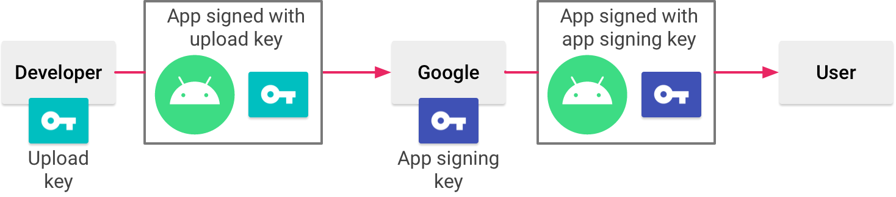
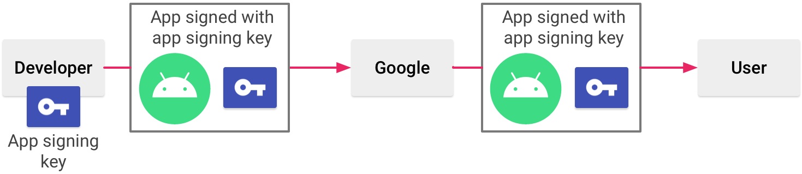

Android allows you to install applications on a device from anywhere (from a website, from any store, etc.). This is possible because the Android ecosystem is open. However, Google Play is the most well-known, trusted, and popular store and Google itself provides it. If users want to install third-party apps from a non-trusted source, they must [explicitly allow this with their device security settings](https://developer.android.com/studio/publish#publishing-unknown).

# Deploying a debug build

At a high level, debug build deployment consists of the following steps:
1. Generating a (or access to) debug keystore and certificate.
2. Signing an application.
3. Installing the application on a device.

If the device is allowed to install applications from non-trusted sources, the application is launched.

When running or debugging your project from the IDE, Android Studio automatically signs your application with a debug certificate generated by the Android SDK tools. The first time you run or debug your project in Android Studio, the IDE automatically creates the debug keystore and certificate in `$HOME/.android/debug.keystore`, and sets the keystore and key passwords.

Because the debug certificate is created by the build tools and is insecure by design, most app stores (including the Google Play Store) do not accept applications signed with a debug certificate for publishing.

# Deploying a release build

At a high level, deployment of a release build to Google Play consists of the following steps:
1. Creating a Google Play developer account.
2. Generating a (or access to) release keystore and certificate.
3. Signing an application.
4. Uploading the application to Google Play.

Whereas other vendors may review and approve apps before they are actually published, Google will simply scan for known malware signatures, this minimizes the time between the beginning of the publishing process and public app availability.

## Management of signing keys

Google Play provides developers two options for managing their signing keys:
- Play App Signing
- Self management

### Play App Signing

With Play App Signing, Google manages and protects developer's app signing key for them and uses it to sign their APKs for distribution.

Play App Signing uses two keys:
- **App signing key** is used to sign APKs that are installed on a user's device. The signing key never changes during the lifetime of an application. The app signing key is private and must be kept secret.
- **Upload key** is used to sign the application bundle or APK before uploading it for app signing with Google Play. The upload key is private and must be kept secret.

### Self management

Developers can manage their own app signing key and keystore. When developers sign their APK, they will sign it locally using their app signing key and upload the signed APK directly to the Google Play Store for distribution.

# References

- [Android Developers: Sign your app](https://developer.android.com/studio/publish/app-signing)
