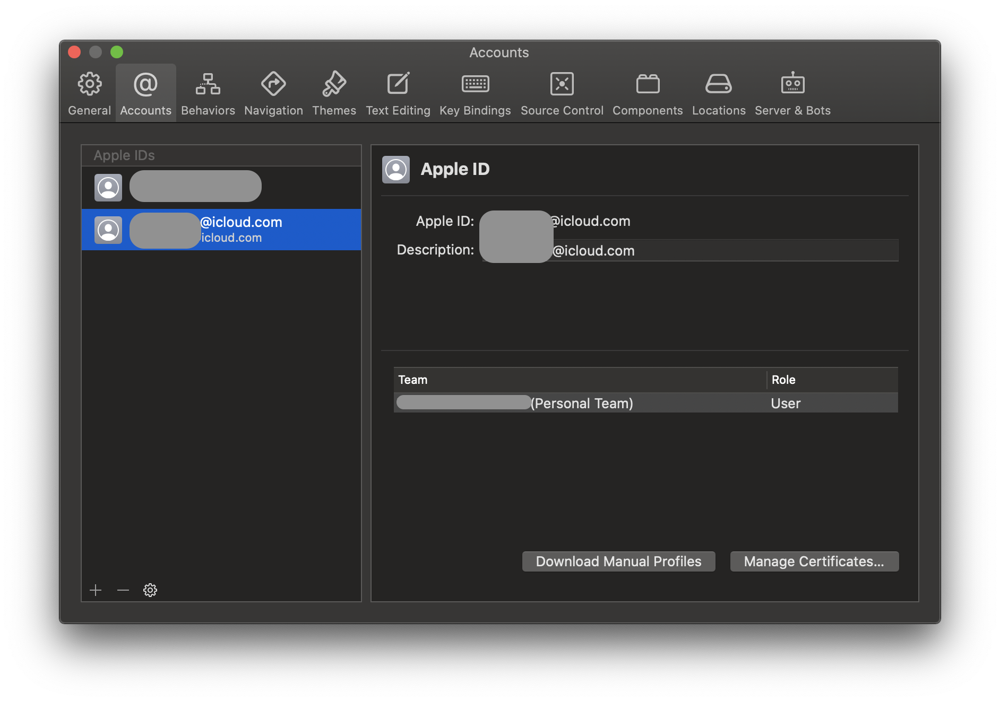
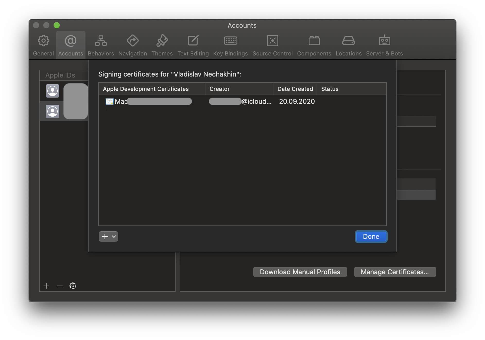
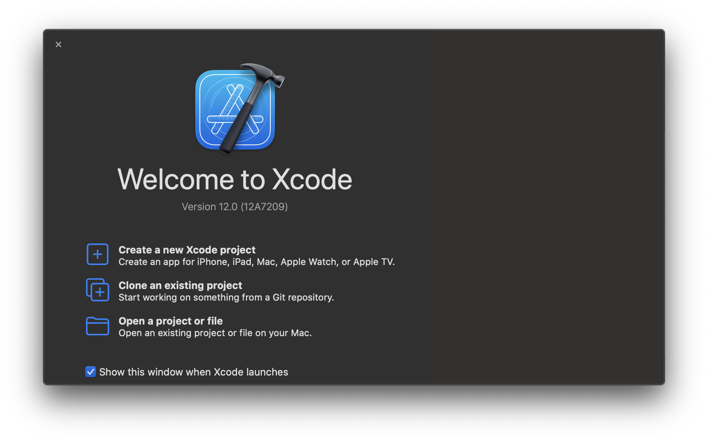
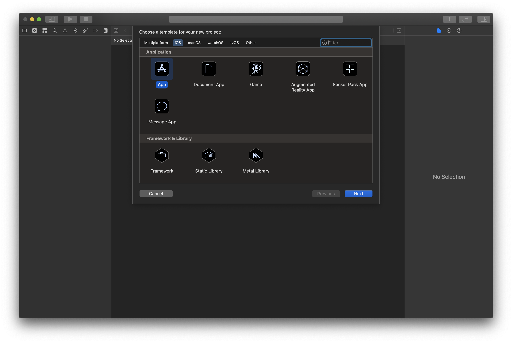
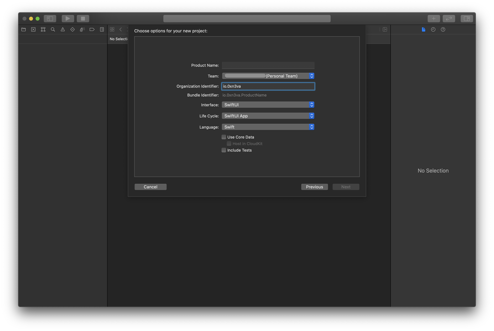
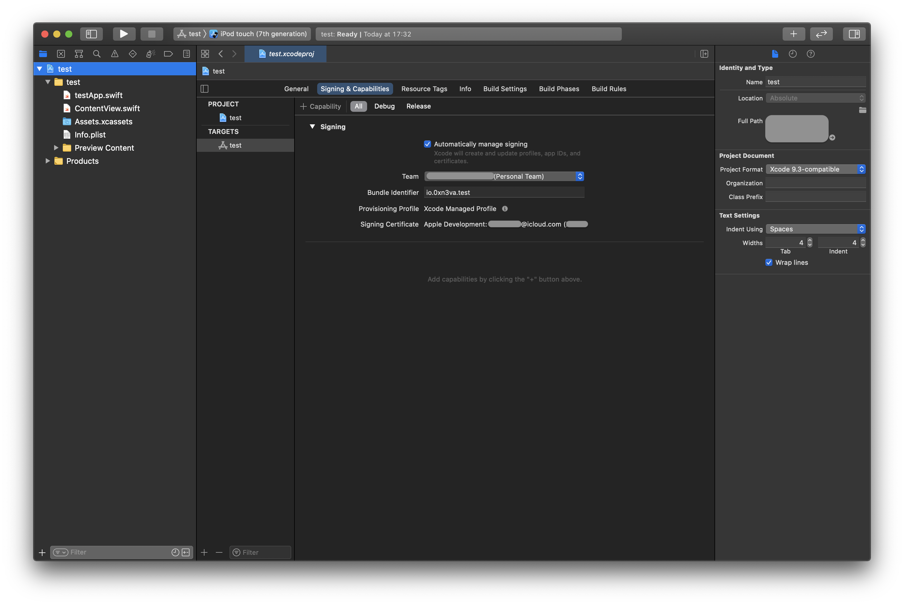
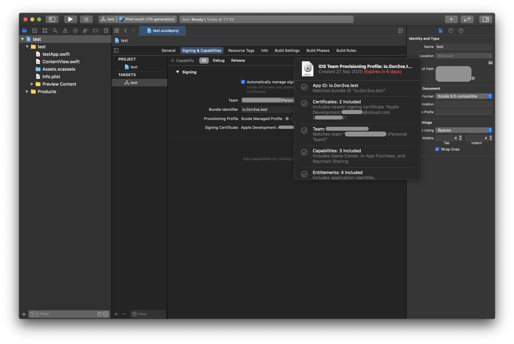

In order to start analyzing and managing the iOS app without jailbreak, the app's IPA itself needs to be patched and code signed to load the FridaGadget.dylib on start. This can be done using the following script:



To patch an IPA though, a few things need to be done in preparation: installing dependencies, obtaining the embedded.mobileprovision file and a code signing certificate from Apple.

# Preparation

## Apple Developer account

First and foremost, you need to register for an Apple Developer account. A free one works fine, but you need to keep in mind that you will only be allowed to run patched applications for 7 days, before repeating the patching/signing/installation process again.

To register:

- Visit [https://developer.apple.com/register/](https://developer.apple.com/register/) and agree to the license agreement.
- Sign in with your AppleID in XCode by browsing to `XCode > Preferences > Accounts` and clicking on the `+` at the bottom left.



- Click on `Manage Certificates` and click on the `+` drop down, selecting `iOS Development`. XCode will generate a new code signing certificate for you to use.



- Click `Done`.

Once you have a developer account signed in to in XCode, you will now be able to sideload applications and run them on iOS devices. You can also check for code signing certificates that are now available in a terminal:

```bash
$ security find-identity -p codesigning -v
```

```
1) 11AA22BB*** "Apple Development: *****@icloud.com (ABCDEF1234)"
     1 valid identities found
```

`11AA22BB***` is code sign identity.

## mobileprovision file

The .mobileprovison file contains some certificate information as well as the entitlements groups for the application. To generate the .mobileprovision file, all you need to do is build and deploy a blank iOS application to a device.

So, to build and deploy a blank iOS application using XCode to get the updated embedded.mobileprovision file you need:

- Start XCode and select `Create a new Xcode project`.



- Select `iOS > App` and click `Next`.



- Fill in a `Product Name` and an `Organization Identifier`, click `Next`.



- Choose where to save the project and finally click on `Create`.
- In the projects root, under the `Signing & Capabilities` tab, ensure that there are no errors with the signing certificate. Most of the time, XCode is pretty verbose with what needs to be done to fix any errors you may encounter, so just take a moment to read.



- When done, ensure your iOS device is plugged in. Select it as the target device in the top left corner, and hit the big play button. This process will compile the blank app for the target device, and update embedded.mobileprovision file.
- In the projects root, under the `Signing & Capabilities` tab pick up the updated embedded.mobileprovision by dragging it behind the file with the gear icon.




Running your blank application for the first time on an iOS device will most probably result in a error that reads something like:

```
Verify the Developer App certificate for your account is trusted on your device.
Open Settings on your device and navigate to General > Device Management,
then select your Developer App certificate to trust it.
```

What this means is that you need to also trust the iTunes account you used to run code on the iOS device you have. Simply navigate to your iOS devices:

`Settings > General > Device Management > iTunes account from the "Developer App" section > Select "Trust"`


## Dependencies

**ipa-patching.sh**

The main script that loads the FridaGadget.dylib, signs the code and deploys the IPA to the device.

```bash
$ git clone https://github.com/0xn3va/ipa-patching.git
```

**brew**

The ipa-patching.sh script to patching an IPA requires [brew](https://github.com/Homebrew/brew)

```bash
$ /bin/bash -c "$(curl -fsSL https://raw.githubusercontent.com/Homebrew/install/master/install.sh)"
```

# Patching

Before patching IPA, you need to set a number of variables in `ipa-patching.sh`, more [here](https://github.com/0xn3va/ipa-patching). 

With all of the above dependencies solved, you can finally patch an IPA. To do this, simply run the script:

```bash
$ cd ipa-patching
$ ./ipa-patching.sh
```

This script will extract the IPA, locate the app binary, patch it to load the FridaGadget.dylib, sign code and deploy it to device.
