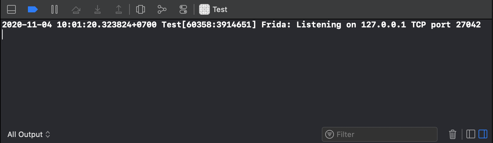

You can use the following toolkit to interact with the patched app:



# Running

After the patched app has been launched, you need to connect to it using objection.

## Connect via USB

- Find out app's PID.

    ```bash
    $ frida-ps -Ua
    ```

    ```
    PID   Name                     Identifier
    ----  -----------------------  ---------------------------------
    1234  MyApp                    com.mycompany.myapp
    ...
    ```

- Start the objection exploration REPL.

    ```bash
    $ objection -g 1234 explore
    ```

## Connect via network

- Find in the console the moment of loading Frida, waiting for a connection.



- Start the objection exploration REPL.

    ```bash
    $ objection -N -h 127.0.0.1 -p 27042 explore
    ```

# Commands

A quick guide to the most used objection's commands.

## Environment

```bash
$ env
```

## Run OS command

```bash
$ !cat Info.plist 
```

## Download file

```bash
$ file download Info.plist
```

## Import Frida scripts

In order to import and **run** the Frida script use the following command:

```bash
$ import "/tmp/frida-script.js"
```
