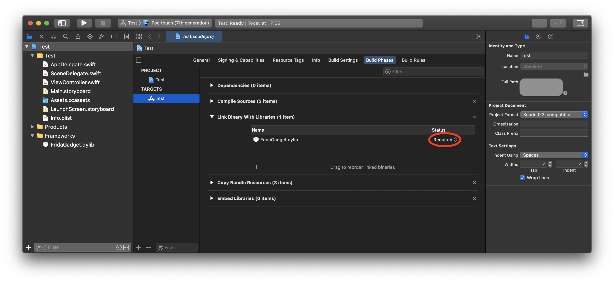
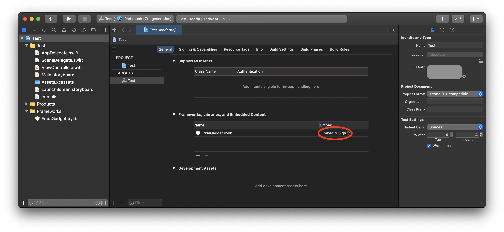

In order to start analyzing and managing an iOS app without jailbreak, the app's source code itself needs to be patched to load the FridaGadget.dylib on start. In these cases, you can simply load the FridaGadget.dylib as part of the Xcode project and deploy it on an iOS device or simulator.

# Add FridaGadget.dylib to project

To add FridaGadget.dylib to project in XCode:
- Create a Frameworks folder in the project root.

    ```bash
    $ mkdir Frameworks
    $ cd Frameworks
    ```

- Download FridaGadget.dylib from [here](https://github.com/frida/frida/releases) and extract it.

    ```bash
    $ curl -Lo FridaGadget.dylib.xz https://github.com/frida/frida/releases/download/<version>/frida-gadget-<version>-ios-universal.dylib.xz
    $ unxz FridaGadget.dylib.xz
    ```

- Go to the project's root and select the `Build Phases`, find the section title `Link Binary With Libraries` and drag the dylib from the Frameworks folder on the left of Xcode to the existing list.



- Go to the project's root and select the `General`, find the section title `Frameworks, Libraries, and Embedded Content` and set FridaGadget.dylib in the `Embed` column to `Embed & Sign`.



# Build & Deploy

You can now build the project and deploy it to an iOS device or simulator.


