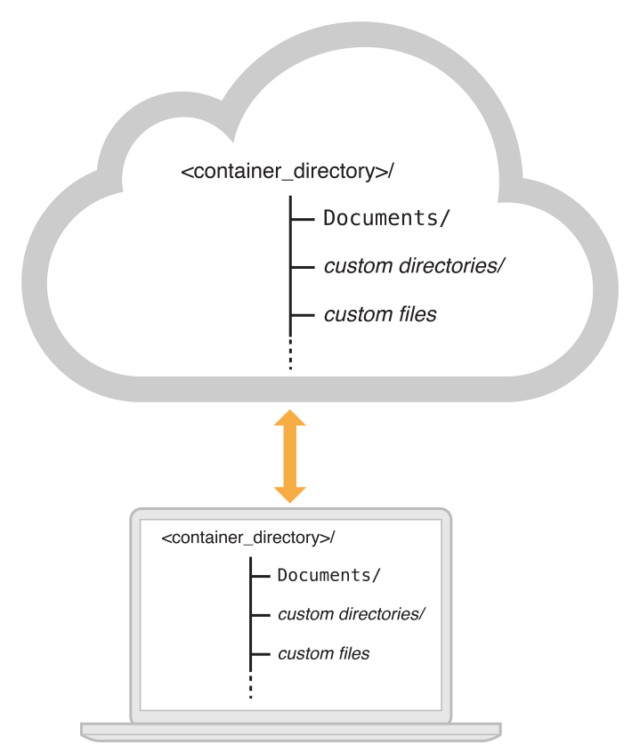

The iOS file system is geared toward apps running on their own. To keep the system simple, users of iOS devices do not have direct access to the file system and apps are expected to follow this convention.

For security purposes, an iOS app's interactions with the file system are limited to the directories inside the app's sandbox directory. During installation of a new app, the installer creates a number of container directories for the app inside the sandbox directory. Each container directory has a specific role. The bundle container directory holds the app's bundle, whereas the data container directory holds data for both the app and the user. The data container directory is further divided into a number of subdirectories that the app can use to sort and organize its data. The app may also request access to additional container directories—for example, the iCloud container—at runtime.


# Bundle container structure

Bundle directory consists of all the files that come along with the application when installed from Apple's App Store or any other source. Much important information can be obtained about the application from the files in these directories. The main components of the Bundle directory of a native iOS application:

| Name | Type | Description |
| --- | --- | --- |
| _CodeSignature | Directory | This directory contains the CodeResources file, which is used to store the signature of all files in the bundle that are signed. |
| Application Binary | File | This file contains the application's executable code. The name of this file is the same as that of the name of the .app directory excluding the extension '.app'. |
| Application Icon | File | These are the icon files of the application. There are multiple icon files (MyAppIcon.png, MyAppIcon@2x.png etc.) for representation of the application on devices with different resolution like iPhone or iPad. |
| Assets.car | File | This file contains Asset catalogs in an optimized format with multiple resolution images for each device that developer uses when create the application. In Xcode, an asset catalog appears as a .xcassets folder. |
| Base.lproj | Directory | This directory contains the .storyboard and .xib files in the development language. Other folders with the .lproj extension are included if developer selects multiple languages. |
| Custom resource files | File | Non-localized resources are placed at the top level directory (MyApp.app) and localized resources are placed in language-specific subdirectories of the application bundle. Resources consist of nib files, images, sound files, configuration files, strings files, and any other custom data files required by the application. |
| embedded.mobileprovision | File | This plist file contains the provisioning profile for an application. In simple words, provisioning profile acts as a link between the device and the developer account. This file contains information such as application creation date, keychain access groups etc. |
| Frameworks | Directory | This directory includes all the dynamic libraries and frameworks used by the application. |
| Info.plist | File | This file is the manifest of the iOS application. It contains information about - Supported Devices, Bundle ID, Display Name, Application Transport Security etc. |
| Launch Images | File | These files (Default-ipad.png, Default@2x-ipad.png etc.) are used as launch screen images before the application launches. They are removed as soon as the application is ready to display the user interface. |
| PkgInfo | File | This file contains a 4-byte package type followed by the 4-byte signature of the application. This file is created the same time as the bundle and it is not necessary for the functioning of an iOS app. |
| PlugIns | Directory | This directory contains the .appex directories with extension packages. |
| SC_Info | Directory | This directory contains keys which are used for decrypting the app's executable. The files in this directory help in integrity checks of the application. |
| Settings.bundle | File | The Settings bundle is a special type of plug-in that contains any application-specific preferences that a developer wants to add to the Settings application. This bundle contains property lists and other resource files to configure and display your preferences. |
| Subdirectories for localized resources | Directory | These are the language-specific project directories (en.lproj, fr.lproj etc.) that help in switching the language of the application from the available languages as desired by the user of the application. |

To find out where the bundle container is located, you can override the implementation of the [application(_:didFinishLaunchingWithOptions:)](https://developer.apple.com/documentation/uikit/uiapplicationdelegate/1622921-application) in the `AppDelegate` class:

```swift
func application(_ application: UIApplication, didFinishLaunchingWithOptions launchOptions: [UIApplicationLaunchOptionsKey: Any]?) -> Bool {
    print(Bundle.main.bundlePath)

    return true
}
```

or you can use Frida:

```javascript
ObjC.classes.NSBundle.mainBundle().bundlePath().toString();
```

You should see the path like `/var/containers/Bundle/Application/<app-GUID>/`.

# Data container structure

Data container or Local Data Storage container is used to store data locally for both the application and the user. This directory is divided into a number of subdirectories that the app can use to sort and organize its data. It is may be used for caching information, offline storing information etc.

Commonly used directories of the data container:

| Name | Description |
| --- | --- |
| Documents | <p>This directory is used to store user-generated content. The contents of this directory can be accessed by the user through file sharing; therefore, this directory should only contain files that can be made available to the user.</p><p>The contents of this directory are backed up by iTunes and iCloud.</p> |
| Documents/Inbox | <p>This directory is used to access files that the app was asked to open by outside entities. Specifically, the Mail program places email attachments associated with app in this directory. Document interaction controllers may also place files in it.</p><p>The app can read and delete files in this directory but cannot create new files or write to existing files.</p><p>The contents of this directory are backed up by iTunes and iCloud.</p> |
| Library | <p>This is the top-level directory for any files that are not user data files.</p><p>**Application Support**. This directory is used to store all app data files except those associated with the user's documents. Sometimes it may also be used to store a modifiable copy of resources contained initially in the app's bundle.</p><p>**Caches**. This directory is used to write any app-specific support files that the application can recreate easily. The data in this directory is mostly the cache for the analytics that can be sent when required and also the server’s responses for delivering quick responses to the user’s queries.This directory also stores the screenshot of the application in the Snapshots directory when it moves to the background in order to improve user experience.</p><p>**Preferences**. This directory contains app-specific preference files. The main file in this directory is the file named .plist which is used by the developers to store information using NSUserDefaults class.</p><p>The contents of the Library directory (with the exception of the Caches subdirectory) are backed up by iTunes and iCloud.</p> |
| tmp | <p>This directory is used to write temporary files that do not need to persist between launches of app. The app should remove files from this directory when they are no longer needed; however, the system may purge this directory when the app is not running.</p><p> The contents of this directory are not backed up by iTunes or iCloud.</p> |
| Storekit | <p>This directory is important only for business perspective. It provides the access to the following:</p><p>**> In-App Purchase**. Offers and promotes in-app purchases for content and services.</p><p>**> Apple Music**. Checks a user's Apple Music capabilities and offers a subscription.</p><p>**> Recommendations and reviews**. Provide recommendations for third-party content and enable users to rate and review your app. |

To find out where the data container is located, you can override the implementation of the [application(_:didFinishLaunchingWithOptions:)](https://developer.apple.com/documentation/uikit/uiapplicationdelegate/1622921-application) in the `AppDelegate` class as shown in the following example:

```swift
func application(_ application: UIApplication, didFinishLaunchingWithOptions launchOptions: [UIApplicationLaunchOptionsKey: Any]?) -> Bool {
    print(NSHomeDirectory())

    return true
}
```

or using Frida:

```javascript
ObjC.classes.NSProcessInfo.processInfo().environment().objectForKey_("HOME").toString();
```

You should see a path like `/var/mobile/Containers/Data/Application/<app-GUID>`.

# iCloud container

This directory contains data that iCloud enabled iOS applications use. The files in this directory are meant to stored and updated by the sources where a user decides to update the file from.



iCloud container consists of usually two parts:
- **Documents**. The files in this directory are meant to be read and updated directly by the user. These files are backed up to iCloud regularly to keep in sync.
- **Data**. These files are not meant to be edited or added directly by the user. Data may be kept in different directories as desired by the developer.

# Resources

- [File System Programming Guide: File System Basics](https://developer.apple.com/library/archive/documentation/FileManagement/Conceptual/FileSystemProgrammingGuide/FileSystemOverview/FileSystemOverview.html)
- [Bundle Programming Guide: Bundle Structures](https://developer.apple.com/library/archive/documentation/CoreFoundation/Conceptual/CFBundles/BundleTypes/BundleTypes.html)
- [iCloud Design Guide: iCloud Fundamentals (Key-Value and Document Storage)](https://developer.apple.com/library/archive/documentation/General/Conceptual/iCloudDesignGuide/Chapters/iCloudFundametals.html)
- [Understanding the structure of an iOS application](https://blog.lucideus.com/2019/04/ios-application-security-part-5.html)
