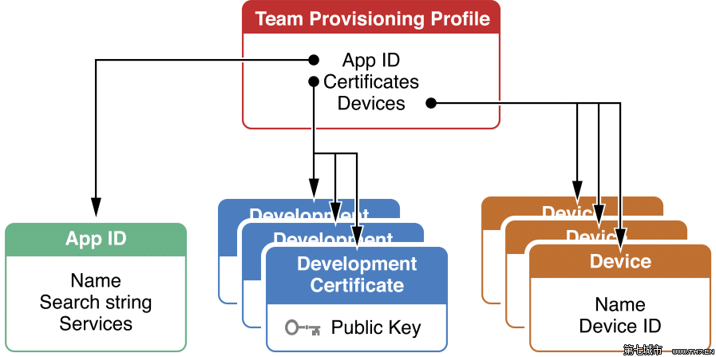

# Provisioning profiles

Unlike Android, you cannot install any app on an iOS device, the app must first be signed by Apple. However, before submitting an app to Apple for approval, the app developer must test it. _The Provisioning profile acts as a link between the device and the developer account._ During development, the developer chooses on which devices the app can run and which app services it can access. The Provisioning profile is downloaded from a developer account and embedded in the app bundle, and the entire bundle is code-signed.

Each Development provisioning profile will contains:
- **Development Certificate**. These are for developers who want to test the app on a physical device while writing code.
- **Unique Device Identifiers**. List of devices that the app can run on.
- **App ID**. An App ID is a two-part string used to identify one or more apps from a single development team (this can include a * wild card to be used for many applications with similar bundle identifiers).



A Development provisioning profile must be installed on each device on which developer wants to run app code. If the information in the Provisioning profile does not match certain criteria, the app will not start.

Devices specified within the Provisioning profile can be used for testing only by those individuals whose iPhone Development Certificates are included in the profile. A single device can contain multiple Provisioning profiles.

## .mobileprovision files structure

The .mobileprovision file has the following structure:
- **File header**, binary data. Looks like it does not contain any useful data.
- **plist** with all project-related information.
- **File footer**, binary data. Looks like that is the file signature.

Ad-Hoc profile plist structure:

```xml
<?xml version="1.0" encoding="UTF-8"?>
<!DOCTYPE plist PUBLIC "-//Apple Computer//DTD PLIST 1.0//EN" "http://www.apple.com/DTDs/PropertyList-1.0.dtd">
<plist version="1.0">
<dict>
  <key>AppIDName</key>
  <string>iOS My App</string>
  <key>ApplicationIdentifierPrefix</key>
  <array>
      <string>29QTLV4HFP</string>
  </array>
  <key>CreationDate</key>
  <date>2019-09-27T22:32:55Z</date>
  <key>Platform</key>
  <array>
    <string>iOS</string>
  </array>
  <key>IsXcodeManaged</key>
  <false/>
  <key>DeveloperCertificates</key>
  <array>
      <data>
      MIIFYTCCBEmgAwIBAgIIYToPcWigCVswDQYJKoZIhvcNAQ
      ...
      uFL3pxVdY562UQ58glSEyw4OlkMFLD5IxGZovLuaULzUtq
      FBO/19kvi29WEdJ0kvwhHa+Ba4WbjdCC3aiusr+qHQ==
      </data>
  </array>
  <key>Entitlements</key>
  <dict>
      <key>application-identifier</key>
      <string>29QTLV4HFP.com.mycompany.myapp</string>
      <key>get-task-allow</key>
      <false/>
      <key>keychain-access-groups</key>
      <array>
          <string>29QTLV4HFP.*</string>
      </array>
  </dict>
  <key>ExpirationDate</key>
  <date>2020-02-10T22:32:55Z</date>
  <key>Name</key>
  <string>MyApp Ad Hoc</string>
  <key>ProvisionedDevices</key>
  <array>
      <string>6d08...2ef8</string>
      <string>effd...0381</string>
      <string>a8b6...c437</string>
  </array>
  <key>TimeToLive</key>
  <integer>136</integer>
  <key>UUID</key>
  <string>C248F364-66BD-45E2-BC7C-D736B9FBC809</string>
  <key>Version</key>
  <integer>1</integer>
</dict>
</plist>
```

The Development and Distribution profiles contain almost the same data with small differences:
- The Development profile is almost identical to the Ad-Hoc profile except of Entitlements.get-task-allow set to true.
- The Distribution profile does not contain the ProvisionedDevices key.

# Deployment process

When you install the application on a device the following things happens:
- The Provisioning profile in the Mac goes to the developer certificate in your keychain.
- Xcode uses the certificate to sign the code.
- Device's UUID is matched with the IDs in the Provisioning profile.
- AppID in the Provisioning profile is matched with the bundle identifier in the app.
- The entitlements required are associated with the App ID.
- The private key used to sign the app matches the public key in the certificate.

If all the above steps are successful the signed binary is sent to the device and is validated against the same Provisioning profile in the app and finally launched. If anyone of these conditions fail, then the app will not install — and you'll see a greyed-out app icon.

# Distribution and Ad-Hoc profiles

The difference between Development and Distribution profiles is that Distribution profiles do not specify any Device IDs. If you want to release an app which should be limited to a number of registered devices, you need to use an Ad-Hoc profile for that.

Distribution profile is used to submit app to the App Store for distribution. After the app is reviewed by apple they sign in the app with their own signature that can run on any device.

# References

- [What is a provisioning profile & code signing in iOS?](https://medium.com/@abhimuralidharan/what-is-a-provisioning-profile-in-ios-77987a7c54c2)
- [.mobileprovision Files Structure and Reading](https://web.archive.org/web/20130502092617/http://idevblog.info/mobileprovision-files-structure-and-reading)
