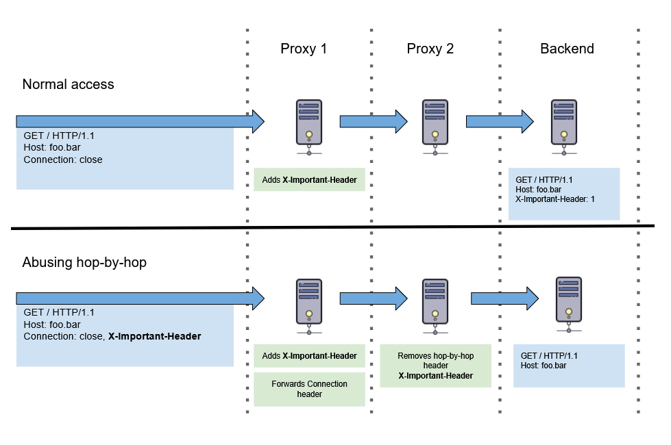

This section covers techniques which can be used to influence web systems and applications in unexpected ways, by abusing HTTP/1.1 hop-by-hop headers. Systems affected by these techniques are likely to have multiple caches/proxies that process requests before reaching a server application.

# Hop-by-hop request headers

The specification [RFC 2612](https://tools.ietf.org/html/rfc2616#section-13.5.1) defines two categories of HTTP headers:

- `End-to-end headers` that are transmitted to the ultimate recipient of a request or response. End-to-end headers in responses **must** be stored as part of a cache entry and **must** be transmitted in any response formed from a cache entry.
- `Hop-by-hop headers` that are meaningful only for a single transport-level connection, and are not stored by caches or forwarded by proxies.

In other words, a hop-by-hop header designed for processing and using by a proxy server that is currently processing a request, unlike an end-to-end header that is designed to be present in a request until the end of the request.

The specification [RFC 2612](https://tools.ietf.org/html/rfc2616#section-13.5.1) defines the following headers as hop-by-hop by default:

- `Keep-Alive`,
- `Transfer-Encoding`,
- `TE`,
- `Connection`,
- `Trailer`,
- `Upgrade`,
- `Proxy-Authorization`,
- `Proxy-Authenticate`.

All other headers defined by HTTP/1.1 are end-to-end headers.

If hop-by-hop headers are found in the request, a compatible proxy server should process or perform actions regardless of what these headers indicate, and not forward them to the next hop.

A request [may also define a custom set of headers to be treated as hop-by-hop](https://tools.ietf.org/html/rfc2616#section-14.10) by adding them to the `Connection` header, like this:

```http
Connection: close, X-Foo, X-Bar
```

A client asks a proxy server to treat `X-Foo` and` X-Bar` as hop-by-hop, which means that a client wants a proxy to remove them from a request before sending it.

# Abusing HTTP hop-by-hop request headers

The `Connection` header itself is the default hop-by-hop header. This implies that a compatible proxy server should not forward a list of custom hop-by-hop headers to the next server in the chain in its `Connection` header when it forwards the request. However, in practice this does not always occur, some systems either forward the entire `Connection` header or copy a hop-by-hop list and add it to their own `Connection` header. For example, most likely HAProxy pass the `Connection` header untouched, the same behavior with Nginx in reverse proxy mode.

The following image shows how abusing hop-by-hop headers may cause problems if a backend expects a `X-Important-Header` and considers its presence in the logical decision.



A quick and easy way to verify that systems are vulnerable to some sort of abuse hop-by-hop request header is to use a `Cookie` header for an endpoint which requires authentication (assuming the target system uses cookie authentication). For example, let's assume that the `/api/users/profile` endpoint returns `200 OK` with information about user. In this case, the following request may return something other than the expected response if a system is vulnerable:

```http
GET /api/users/profile HTTP/1.1
Host: vulnerable-website.com
Cookie: sessionid=...
Connection: close, Cookie
```

To search for more interesting effects, you can use Burp Suite Intruder or a custom script with a list of known headers, like [this one](https://github.com/danielmiessler/SecLists/blob/master/Discovery/Web-Content/BurpSuite-ParamMiner/lowercase-headers).

## Bypass authentication or access control decisions

If an application relies on the presence/absence of any headers when making an authentication/authorization decision, abusing hop-by-hop headers can be used to bypass such implementations.



## Cache poisoning DoS

The impact in this case is very similar to achieved with the usual [Cache Poisoning DoS](https://cpdos.org). However, in this case the method is slightly different - instead of directly using or modifying request headers which create unwanted application state and poison a web cache, hop-by-hop headers are used to create this unwanted state and remove headers on which an application relies in order to function normally.

To exploit Cache Poisoning DoS, it requires:

1. A frontend cache forwards a custom set of hop-by-hop headers, instead of process them.
2. Any intermediate proxies in the chain process the custom set and remove headers.
3. An application considers the presence of these headers and, if they are absent, return an unwanted response, for example, `400 Bad Request` or `501 Not Implemented`.

As a result, web cache before an application will cache this unwanted response and return to other users.

## Fingerprinting services

When looking for hop-by-hop headers, look for differences in the responses that a server sends. Removing technology-specific or stack-specific HTTP headers can cause various side effects that allows collecting more information about an application. The more specific headers, the more accurate an application's fingerprint.

## Masking the source IP address

When a frontend proxy server accepts a user's request, it can add a user's IP address to the `X-Forwarded-For` header, so that a backend knows a user's IP address. However, if you tell a proxy that `X-Forwarded-For` header is hop-by-hop, it will remove the header from the request. So a backend will either never receive a user's IP address, or receive an IP address of an element in elsewhere in the chain.


Remeber that `X-Forwarded-For` header is not the only header for transmitting a user's IP address. `Forwarded`, `X-Real-IP` and etc. can be used as well.


# References

- [Abusing HTTP hop-by-hop request headers](https://nathandavison.com/blog/abusing-http-hop-by-hop-request-headers)
- [Python script to find hop-by-hop header abuse potential against the provided URL](https://gist.github.com/ndavison/298d11b3a77b97c908d63a345d3c624d)
- [Writeup: Worldwide Server-side Cache Poisoning on All Akamai Edge Nodes ($50K+ Bounty Earned)](https://medium.com/@jacopotediosi/worldwide-server-side-cache-poisoning-on-all-akamai-edge-nodes-50k-bounty-earned-f97d80f3922b)