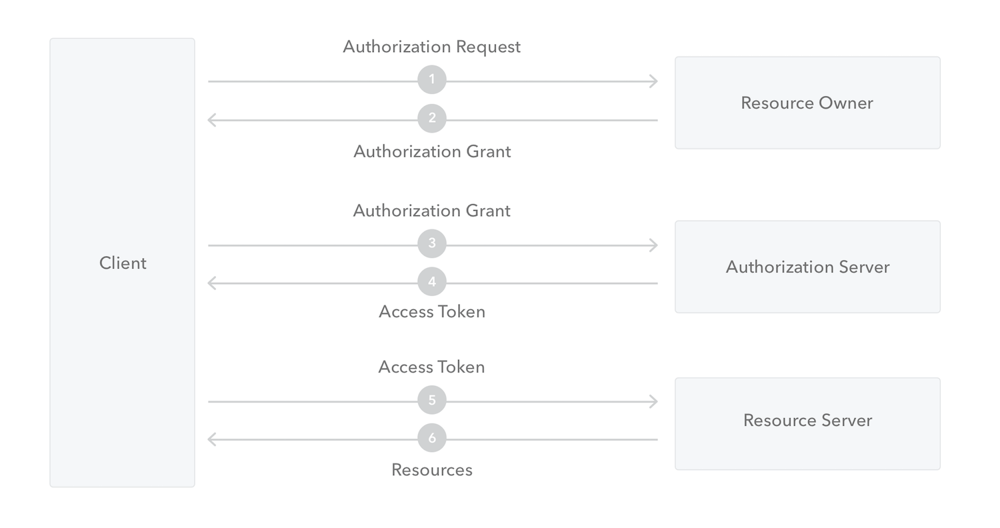
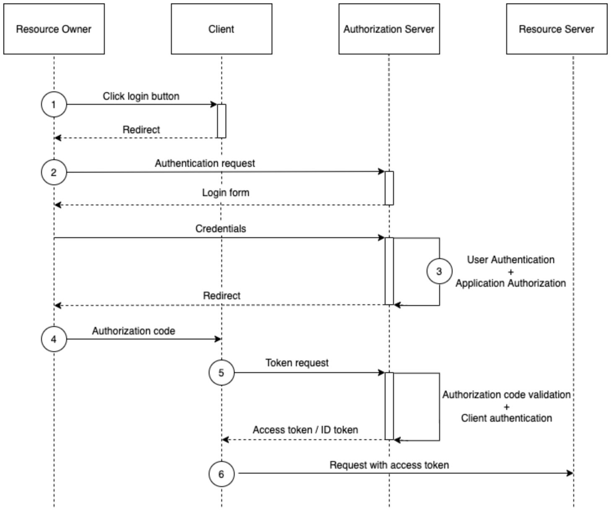
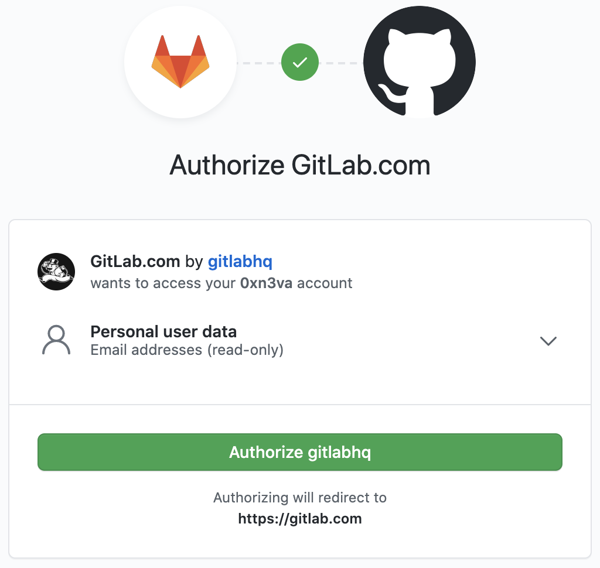

# OAuth 2.0 Authorization Framework

[OAuth 2.0](https://tools.ietf.org/html/rfc6749) is a protocol that allows a user to grant a third-party web site or application access to the user's protected resources, without necessarily revealing their long-term credentials or even their identity.

OAuth introduces an authorization layer and separates the role of the client from that of the resource owner. In OAuth, the client requests access to resources controlled by the resource owner and hosted by the resource server and is issued a different set of credentials than those of the resource owner. Instead of using the resource owner's credentials to access protected resources, the client obtains an `access token`.

> An access token is a credential that can be used by an application to access an API. It informs the API that the bearer of the token has been authorized to access the API and perform specific actions specified by the scope that has been granted.

> An access token can be in any format, but two popular options include opaque strings and JSON Web Tokens (JWT). They should be transmitted to the API as a Bearer credential in an HTTP Authorization header.
 
Access tokens are issued to third-party clients by an authorization server with the approval of the resource owner. The client uses the access token to access the protected resources hosted by the resource server.

The permissions represented by the access token, in OAuth terms are known as `scopes`.

> Scope is a mechanism that defines the specific actions applications can be allowed to do or information that they can request on a user’s behalf.

When an application authenticates with Auth0, it specifies the scopes it wants. If those scopes are authorized by the user, then the access token will represent these authorized scopes. For example, a Contacts API may accept three different authorization levels specifying the corresponding scopes:
- Reading contacts (scope `read:contacts`),
- Creating contacts (scope `create:contacts`),
- Deleting contacts (scope `delete:contacts`).

For more information refer to [Scopes](https://auth0.com/docs/scopes/current).

## OAuth roles

In any OAuth 2.0 flow we can identify the following roles:
- `Resource Owner` - the entity that can grant access to a protected resource. Typically this is the end-user.
- `Resource Server` - the server hosting the protected resources. This is the API you want to access.
- `Client` - the app requesting access to a protected resource on behalf of the Resource Owner.
- `Authorization Server` - the server that authenticates the Resource Owner, and issues Access Tokens after getting proper authorization.

## Protocol flow

OAuth has many "flavors" (called authorization grant types) that you can use. For now we will have a more generic look into the flow.



1. The Application (Client) asks for authorization from the Resource Owner in order to access the resources.
2. Provided that the Resource Owner authorizes this access, the Application receives an Authorization Grant. This is a credential representing the Resource Owner's authorization.
3. The Application requests an Access Token by authenticating with the Authorization Server and giving the Authorization Grant.
4. Provided that the Application is successfully authenticated and the Authorization Grant is valid, the Authorization Server issues an Access Token and sends it to the Application.
5. The Application requests access to the protected resource by the Resource Server, and authenticates by presenting the Access Token.
6. Provided that the Access Token is valid, the Resource Server serves the Application's request.

## Authorization grant types

The [OAuth 2.0 Authorization Framework specification](https://tools.ietf.org/html/rfc6749) defines four flows to get an Access Token. These flows are called grant types. Deciding which one is suited for your case depends mostly on the type of your application.
- [Authorization Code](https://auth0.com/docs/flows/concepts/auth-code) - used by Web Apps executing on a server. This is also used by mobile apps, using the [Proof Key for Code Exchange (PKCE) technique](https://auth0.com/docs/flows/concepts/auth-code-pkce).
- [Implicit](https://auth0.com/docs/flows/concepts/implicit): used by JavaScript-centric apps (Single-Page Applications) executing on the user's browser.
- [Resource Owner](https://auth0.com/docs/api-auth/grant/password) Password Credentials: used by trusted apps.
- [Client Credentials](https://auth0.com/docs/flows/concepts/client-credentials): used for machine-to-machine communication.

The specification also provides an extensibility mechanism for defining additional types.

For details on how each grant type works and when it should be used refer to [API Authorization](https://auth0.com/docs/api-auth).

## OAuth endpoints

OAuth 2.0 utilizes two endpoints:
- Authorization endpoint,
- Token endpoint.

### Authorization endpoint

The authorization endpoint is used to interact with the resource owner and get the authorization to access the protected resource. To better understand this, imagine that you want to log in to a service using your Google account. First, the service redirects you to Google in order to authenticate (if you are not already logged in) and then you will get a consent screen, where you will be asked to authorize the service to access some of your data (protected resources); for example, your email address and your list of contacts.

The request parameters of the authorization endpoint are:
- `response_type` - tells the authorization server which grant to execute,
- `client_id` - the id of the application that asks for authorization,
- `redirect_uri` - holds a URL; a successful response from this endpoint results in a redirect to this URL,
- `scope` - a space-delimited list of permissions that the application requires,
- `state` - an opaque value, used for security purposes; if this request parameter is set in the request, then it is returned to the application as part of the redirect_uri.

#### How response type works

This endpoint is used by the Authorization Code and the Implicit grant types. The authorization server needs to know which grant type the application wants to use, since it affects the kind of credential it will issue:
- For `Authorization Code grant` it will issue an authorization code (which can later be exchanged with an access token),
- For `Implicit grant` it will issue an access token.

An access token is an opaque string (or a JWT) that denotes who has authorized which permissions (scopes) to which application. It is meant to be exchanged with an access token at the `token endpoint`.

To inform the authorization server which grant type to use, the `response_type` request parameter is used as follows:
- For `Authorization Code grant`, use `response_type=code` to include an authorization code,
- For `Implicit grant`, use `response_type=token` to include an access token. An alternative is to set `response_type=id_token token` to include both an access token and an [ID token](https://auth0.com/docs/tokens/concepts/id-tokens).

### Token endpoint

The token endpoint is used by the application in order to get an `access token` or a `refresh token`. It is used by all flows, except for the Implicit Flow (since an access token is issued directly).

> Refresh token is a special kind of token that can be used to obtain a renewed access token. It is useful for renewing expiring access tokens without forcing the user to log in again. Using the refresh token, you can request a new access token at any time until the refresh token is blacklisted.

- In the `Authorization Code Flow`, the application exchanges the authorization code it got from the Authorization endpoint for an access token.
- In the `Client Credentials Flow` and `Resource Owner Password Credentials Flow`, the application authenticates using a set of credentials and then gets an access token.

# Authorization Code Flow

Because regular web apps are server-side apps where the source code is not publicly exposed, they can use the [Authorization Code Flow](https://tools.ietf.org/html/rfc6749#section-4.1), which exchanges an authorization code for a token.

Additional parameters:
- `code` - is the authorization code received from the authorization server,
- `grant_type` - is a parameter that explains what the grant type is, and which token is going to be returned,
- `client_secret` - is a secret known only to the application and the authorization server.

## How it works



1. The user clicks `Login` within the regular web application,
2. The application redirects the user to the login and authorization prompt. The request may look like this:

```http
https://auth-server.com/auth?
    response_type=code
    &client_id=application_client_id
    &redirect_uri=https://application.com/callback
    &scope=read:email
    &state=kYlr93jbdhyguIVF73moq
```

3. The user authenticates using one of the configured login options and may see a consent page listing the permissions the authorization server will give to the regular web application. The consent page may look like this:



4. Once accepted, the authorization server will send a request back to the `redirect_uri` with the `code` and `state` parameters:

```http
https://application.com/callback?code=a68YhewbiYl93TR89hdjYwqP0&state=kYlr93jbdhyguIVF73moq
```

5. The application using the received `code` and its own `client_id` and `client_secret` will make a request for `access_token`:

```http
POST /oauth/access_token
Host: auth-server.com
Contetn-Type: application/json
Content-Length: 157

{"client_id": "application_client_id", "client_secret": "application_client_secret", "code": "a68YhewbiYl93TR89hdjYwqP0", "grant_type": "authorization_code"}
```

6. Finally, the flow is complete and the application will make an API call to the resource server with user `access_token` to access the user data.

# References

- [OAuth 2.0 Authorization Framework](https://auth0.com/docs/protocols/oauth2)
