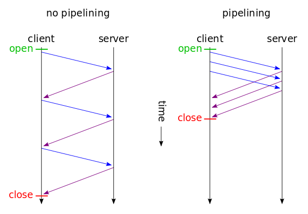

Race condition is architectural vulnerability of a multi-threaded application, in which the application operation depends on the order in which the parts of the code are executed.

# Typical exploitation

In most cases, multi-threaded software is used as a client to check or exploitation the race condition, e.g. Burp Suite Intruder, i.e. one http request is flooded into multiple threads.

This is a fairly working way if the server allows the use of multiple threads to its resource. But the fact is that in some cases this may not be effective.

On the server side each thread establishes a TCP connection, sends data, waits for a response, closes the connection, opens it again, sends data, and so on. At first glance, all data is sent at the same time. But HTTP requests can arrive asynchronously due to many factors, such as delays in delivering packets over the network, the need to establish a secure connection, DNS resolving and many layers of abstraction that data pass through before being sent to a network device. 


# Advanced exploitation

The specification [RFC 7230 6.3.2](https://tools.ietf.org/html/rfc7230#section-6.3.2) defines the HTTP Pipelining technique, which can significantly reduce the loading time of HTTP content. Loading time is reduced by sending multiple HTTP requests over a single TCP connection without waiting for corresponding responses.

This technique can be used to minimize the time between requests.



The key point to HTTP Pipelining is that the web server receives requests sequentially, and processes the responses in the same order. This peculiarity can be used to attack in several steps, when it is necessary to sequentially perform two actions in the minimum amount of time or, for example, to slow down the server in the first request in order to increase the success of the attack.


You can prevent the server from processing your request by loading its DBMS, especially if INSERT / UPDATE is used. Heavier requests can “slow down” your load, so most likely you will win this race.


## Splitting an HTTP request into two parts

The [RFC 7230 2.1](https://tools.ietf.org/html/rfc7230#section-2.1) defines the general appearance of request message beginning with a request-line (method, URI, and protocol version), followed by header fields, an empty line to indicate the end of the header section, and finally a message body containing the payload body (if any). The message body is defined in [Section 3.3](https://tools.ietf.org/html/rfc7230#section-3.3).

The end of the message body is detected based on the `Transfer-Encoding` or `Content-Length` headers. See the cheat sheet to [HTTP Request Smuggling](../HTTP%20Request%20Smuggling/README.md) for more details on using these headers.

If you send the following request from the command line:

```bash
$ echo -ne "GET / HTTP/1.1\r\nHost: website.com\r\n\r\n" | nc website.com 80
```

then you will get a response since the HTTP request will be completed. But this will not happen if you remove the last `\n` character, in this case, the server will wait for the last character before the timeout expires.


Many web servers use `\n` as the line feed character, so it's important not to swap `\r` and ` \n`, otherwise further tricks may not work


Thus, you can simultaneously open many connections to the server, send 99% of your HTTP request and, as soon as it becomes clear that the main part of the data has been sent, send the last byte or several bytes.


This is especially important when it comes to a large POST request, for example, when you need to upload a file. However, this makes sense even with small requests, since the delivery of several bytes is much faster than sending kilobytes of data simultaneously.


You should not only split the request, but also make a delay of several seconds between sending the main and final part of the data. And all because web servers begin to parse requests even before they receive them completely.


# Awesome tricks

## Session capabilities in race condition

The session itself may prevent exploitation of the race condition. For example, in PHP, after `session_start()`, a session file is locked, and its unlocking occurs only at the end of the script (if there was no call of `session_write_close`). If another script that uses the session is called at this moment, it will wait.

To circumvent this capability, you can use a simple trick: to authenticate as many times as necessary. If the web application allows you to create many sessions for one user, just collect all the `PHPSESSID` and assign each request with its own ID.

## Proximity to the server

If the site you want to attack is hosted on AWS, rent a host on AWS. If the server is on DigitalOcean, rent it there. When the main task is to minimize the interval between requests being sent, immediate proximity to the web server will be a plus. In this situation, it is really important which ping to the server is 200 or 10 ms. Moreover, if you are lucky, you can even end up on the same physical server, then the exploitation will be a little easier.

# References

- [Race Condition in Web Applications](https://lab.wallarm.com/race-condition-in-web-applications/amp/)
- [Race Conditions - Exploring the Possibilities](https://pandaonair.com/2020/06/11/race-conditions-exploring-the-possibilities.html)
- [RacePWN - Race Condition framework](https://github.com/racepwn/racepwn)
- [Report: Race Condition allows to redeem multiple times gift cards which leads to free "money"](https://hackerone.com/reports/759247)
